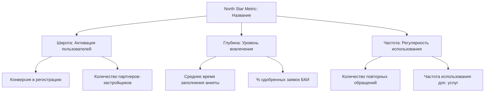

# Метрика Полярной Звезды (North Star Metric)

Создать продуктовую спецификацию фреймворка North Star Metric (NSM) для продукта. Помогает продакту сфокусировать команду на ключевом показателе, который одновременно отражает: ценность продукта для пользователя, уровень вовлечения в продукт и долгосрочные финансовые результаты бизнеса. Предотвращает оптимизацию тщеславных метрик (vanity metrics).

## Процесс

1. **Определи ценность продукта (Core Value).** В какой момент пользователь получает реальную ценность от продукта (например, доехал до места в такси, получил одобрение ипотеки, прослушал песню)?
2. **Сформулируй North Star Metric (NSM).** Метрика должна измерять частоту и глубину доставки этой ценности (например, количество успешных поездок в неделю, объем выданных кредитов в месяц, суммарное время прослушивания музыки).
3. **Декомпозируй NSM на опережающие метрики (Input Metrics).** Раздели на 3-4 ключевых драйвера:
   - *Широта (Breadth):* количество пользователей (активации, новые регистрации).
   - *Глубина (Depth):* уровень вовлечения (среднее число действий на сессию, утилизация фич).
   - *Частота (Frequency):* регулярность использования (DAU/MAU, частота сессий).
4. **Свяжи NSM с финансовыми результатами (Output Metrics).** Как рост NSM конвертируется в выручку, LTV или снижение Churn?
5. **Сохрани вывод** в текущей рабочей директории как `nsm-spec-[название-продукта].md`.

## Формат вывода

```
## Фреймворк North Star Metric: [Название продукта]

### 1. Ценность продукта и Кандидаты в NSM
- **Ядро ценности (Core Value Proposition):** [в чем главная польза продукта для пользователя]
- **Кандидаты в North Star Metric:**
  1. *[Кандидат 1, например: Количество активных пользователей]* — Плюсы/Минусы (почему это тщеславная метрика).
  2. *[Кандидат 2, например: Количество оформленных заявок]* — Плюсы/Минусы.
  3. *[Кандидат 3, выбранная NSM]* — Почему именно она лучше всего отражает ценность и качество.

### 2. Выбранная Метрика Полярной Звезды (NSM)
- **Формулировка NSM:** [название метрики с привязкой ко времени, например: Еженедельный объем успешно выданных ипотечных кредитов через платформу]
- **Почему это работает:** [как рост этой метрики гарантирует, что клиенты довольны, партнеры зарабатывают, а банк получает качественные активы].

### 3. Дерево метрик (Input Metrics)
Драйверы, которые команда может оптимизировать напрямую для роста NSM:



- **Драйвер 1: Широта (Breadth):** [метрики объема аудитории, притока новых пользователей].
- **Драйвер 2: Глубина (Depth):** [метрики качества использования фич, конверсии в ключевые действия].
- **Драйвер 3: Частота (Frequency):** [метрики возвращаемости, интервалы между действиями].

### 4. Связь с бизнес-результатами (Output Metrics)
- **Влияние на выручку (Revenue Link):** [как рост NSM увеличивает маржинальный доход/комиссии/проценты].
- **Влияние на удержание (Retention Link):** [как использование ценности снижает отток клиентов].

### 5. Метрики-ограничители (Guardrail Metrics)
Защитные метрики, которые не должны пострадать при оптимизации NSM:
- *Качество/Риски:* [например, уровень NPL (просрочки) не должен превысить 2.5% при росте выдач].
- *UX/Скорость:* [время ответа техподдержки или доля зависших заявок].
- *Экономика:* [предельная стоимость привлечения клиента CAC].
```

## Правила

- Запрещай использовать в качестве NSM финансовые метрики (выручка, прибыль, GMV) или количество зарегистрированных пользователей (MAU/регистрации). Выручка — это запаздывающий показатель (output), а MAU — тщеславный показатель. NSM должна измерять доставку ценности пользователю.
- Обязательно внедряй защитные метрики (Guardrail Metrics). Оптимизация NSM без ограничений ведет к фроду (например, можно выдать много кредитов, снизив требования к риску, но банк получит дефолтный портфель).
- Дерево метрик должно быть визуализировано через диаграмму Mermaid.
- Пиши на русском языке.

## Метрики

### Универсальное правило метрики
Если вы предлагаете метрику, ответьте на 5 вопросов:
1. **Кто владеет этой метрикой?**
2. **Как часто её смотрим?**
3. **Какие события её считают?**
4. **Какой порог решения?**
5. **Как её можно испортить или накрутить?**