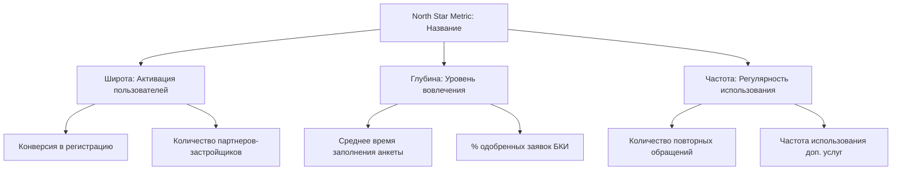

# СКИЛЛ: /prd

# Генератор PRD (Product Requirements Document)

Создать лаконичный, actionable спецификационный документ (PRD) объемом до 2 страниц. Шаблон заставляет продакта принять жесткие решения по целям, скоупу и метрикам, а также поддерживает специальный AI/ML-режим для фич на базе искусственного интеллекта.

## Процесс

1. **Разбери концепт.** Кто целевая аудитория? Какую проблему решаем?
2. **Определи характер фичи.** Если фича использует ИИ/ML (например, автогенерация смет, скоринг, ИИ-ассистент) — включи ML-раздел.
3. **Опиши ML требования (для AI-режима):**
   - *Метрики модели vs. Метрики бизнеса:* укажи целевые Precision/Recall/F1-score модели и свяжи их с бизнес-метриками (например, одобряемость, конверсия).
   - *Обучающая выборка:* источники данных для обучения и разметки.
   - *Флоу отката (Fallback Logic):* что происходит в интерфейсе, когда модель ошибается, галлюцинирует, возвращает низкий уровень уверенности (confidence score) или падает по таймауту (например, показ статической заглушки, ручной выбор, переключение на оператора).
4. **Сформулируй MVP скоуп и границы (What is Out of Scope).**
5. **Сохрани вывод** в текущей рабочей директории как `prd-[название-фичи].md`.

## Формат вывода

```
## Product Requirements Document (PRD): [Название фичи]

### 1. Проблема и Целевая аудитория
- **В чем проблема:** [описание боли пользователя с примером]
- **Кто страдает:** [конкретный сегмент пользователей, а не абстрактное «все»]
- **Как решается сейчас:** альтернативные обходные пути пользователей.

### 2. Описание решения и Сценарии (Scope)
- **Что мы строим:** [суть решения, ключевая ценность]
- **Что мы НЕ строим (Out of Scope):** [критические границы скоупа, отсекающие раздувание требований]
- **Пользовательские сценарии:** последовательный пошаговый флоу работы фичи.

### 3. Требования к AI / ML (ML Requirements)
*(Заполняется только для ИИ-фич)*
- **Задача модели:** [например, классификация сметных позиций]
- **Метрики качества модели:** [минимальный порог точности Precision / Recall / F1]
- **Сценарий отката (Fallback Logic):**
  - Если уверенность модели (confidence) < 80%: [например, не применяем автозаполнение, а просим пользователя заполнить вручную с подсветкой подсказки].
  - При таймауте ответа API модели (> 500мс): [переключаемся на синхронный бэкап-алгоритм поиска по регулярным выражениям].

### 4. Метрики успеха и KPI
- **Первичная бизнес-метрика:** [один главный показатель с целевой цифрой, например: рост конверсии в сделку на +3%]
- **Защитная метрика (Guardrail):** [метрика, которая не должна ухудшиться, например: время загрузки страницы не более 1.5 сек].

### 5. Риски и Открытые вопросы
- **Продуктовые риски:** [риск, что пользователи не поймут фичу; план митигации]
- **Технические риски:** [зависимости от внешних API, производительность бэкенда].
```

## Правила

- Раздел «Что мы НЕ строим» обязателен. PRD без жестких границ скоупа приводит к бесконечной разработке и срыву сроков.
- Для ИИ-фич логика Fallback обязательна. Нельзя запускать нейросети на проде без сценария поведения системы при ошибке модели.
- Метрики успеха должны содержать измеримые цели и цифры, а не абстрактные лозунги.
- Пиши на русском языке.

---

# СКИЛЛ: /user-stories

# Генератор пользовательских историй

Превратить описание фичи в полный набор user story, готовых к спринт-планированию. Каждая история независимо поставляема и имеет тестируемые критерии приёмки.

## Процесс

1. Прочитай и проанализируй описание фичи.
2. Определи эпик и разбей его на независимо поставляемые user story.
3. Для каждой истории напиши критерии приёмки в формате Given/When/Then.
4. Определи граничные случаи и негативные сценарии для каждой истории.
5. Опиши зависимости между историями и внешними системами.
6. Явно определи, что выходит за скоуп.
7. Сохрани результат в текущей рабочей директории как `stories-[название-фичи].md`.

## Формат вывода

### Описание эпика
- Название эпика
- Цель (одно предложение — что этот эпик даёт пользователю?)
- Контекст (почему сейчас, что инициировало эту работу)

### Пользовательские истории

Для каждой истории:

#### История [номер]: [короткое название]

**История:** Как [конкретный тип пользователя], я хочу [конкретное действие], чтобы [измеримый или наблюдаемый результат].

**Приоритет:** Must-have / Should-have / Nice-to-have

**Критерии приёмки:**
- Given [предусловие], When [действие], Then [ожидаемый результат]
- Given [предусловие], When [действие], Then [ожидаемый результат]

**Граничные случаи:**
- Что происходит при [нестандартном условии]?
- Что происходит при [ошибке]?
- Что происходит при [граничном значении]?

**Примечания:** Любые подсказки по реализации или контекст, который нужен команде.

### Зависимости
- Между историями (какие истории должны быть выполнены перед другими)
- Внешние зависимости (API, сервисы, команды, согласования)
- Технические предпосылки

### Вне скоупа
- Фичи или поведения, явно исключённые из эпика
- Смежная работа, которая может возникнуть в обсуждениях, но относится к другому эпику

## Правила

- Каждая история должна быть независимо поставляема. Если история не может быть поставлена без другой — либо объедини их, либо явно укажи зависимость.
- Критерии приёмки должны быть тестируемыми — QA-инженер должен проверить каждый без лишних вопросов.
- Всегда включай негативные сценарии: что происходит при ошибке, таймауте, невалидном вводе, отсутствии прав.
- Пользовательские истории пишутся с точки зрения пользователя, а не системы. «Система валидирует ввод» — не user story.
- Будь конкретен в типе пользователя. «Как пользователь» — слишком расплывчато. «Как администратор workspace с доступом к биллингу» — конкретно.
- Польза в «чтобы» должна быть реальной. «Чтобы использовать функцию» — замкнутый круг. «Чтобы добавлять новых участников без создания тикета в поддержку» — реальная польза.
- Если описание фичи слишком расплывчато — перечисли уточняющие вопросы перед написанием историй.
- Добавляй оценку размера истории (S/M/L) только если контекста достаточно для оценки.
- Пиши на русском языке.

---

# СКИЛЛ: /roadmap

# Генератор роадмапа

Превратить хаотичный список фич, приоритетов или целей в чёткий продуктовый роадмап. Не диаграмма Ганта — стратегический инструмент коммуникации, показывающий что делаем, в каком порядке и почему.

## Процесс

1. **Разбери входные данные.** Разбери список фич, инициатив или целей. Принимай inline-списки, вставленные бэклоги или пути к файлам.
2. **Определи стратегические темы.** Сгруппируй связанные элементы в 3-5 тем (например, «Онбординг», «Монетизация», «Стабильность платформы»). Каждый элемент должен принадлежать теме.
3. **Распредели по временным горизонтам.** Помести каждый элемент в Now (этот квартал), Next (следующий квартал) или Later (будущее / нужна валидация). Основывайся на зависимостях, усилиях и стратегическом приоритете — не только на срочности.
4. **Составь карту зависимостей.** Определи элементы, блокирующие или открывающие другие. Отметь элементы критического пути.
5. **Оцени усилия.** T-shirt sizing: S (< 2 недель), M (2-6 недель), L (6-12 недель), XL (> 12 недель).
6. **Напиши стратегическое обоснование.** Одно предложение на каждый временной горизонт, объясняющее почему такая последовательность имеет смысл.
7. **Сохрани вывод** в текущей рабочей директории как `roadmap-[контекст].md`.

## Формат вывода

### Роадмап: [Продукт/Команда/Контекст]
**Последнее обновление:** [дата]
**Горизонт планирования:** [например, Q2-Q4 2026]
**Допущение по ёмкости:** [если известно, например, 1 команда из 5 инженеров]

---

### Стратегические темы

| Тема | Описание | Ключевая метрика |
|------|----------|-----------------|
| [тема] | [одна строка] | [что сдвинется если тема успешна] |

---

### Now (Этот квартал)
**Обоснование:** [Почему эти элементы первые — одно предложение.]

| Приоритет | Элемент | Тема | Размер | Зависимости | Статус |
|-----------|---------|------|--------|-------------|--------|
| 1 | [элемент] | [тема] | S/M/L/XL | [блокер или «Нет»] | Не начато / В работе |

### Next (Следующий квартал)
**Обоснование:** [Почему эти элементы вторые — одно предложение.]

| Приоритет | Элемент | Тема | Размер | Зависимости | Уверенность |
|-----------|---------|------|--------|-------------|-------------|
| 1 | [элемент] | [тема] | S/M/L/XL | [что должно выйти раньше] | Высокая/Средняя/Низкая |

### Later (Будущее / Нужна валидация)
**Обоснование:** [Почему эти элементы отложены — одно предложение.]

| Элемент | Тема | Размер | Почему позже |
|---------|------|--------|-------------|
| [элемент] | [тема] | S/M/L/XL | [конкретная причина: нужны данные, заблокировано, низкий приоритет и т.д.] |

---

### Карта зависимостей
- [Элемент A] → блокирует [Элемент B] (должен выйти до начала B)
- [Элемент C] → открывает [Элемент D, Элемент E]

### Ключевые компромиссы
- **[Компромисс 1]:** [Что выбрал и от чего отказался. Явно.]
- **[Компромисс 2]:** [Что выбрал и от чего отказался.]

### Что НЕ входит в роадмап
- [Элемент намеренно исключён] — Причина: [почему]

## Правила

- Now/Next/Later — формат по умолчанию. Не используй даты или спринты если пользователь явно не просит.
- Каждый элемент должен принадлежать теме. Если элемент не вписывается ни в одну тему — поставь под сомнение, стоит ли ему быть в роадмапе.
- «Later» — не парковка. У каждого элемента в Later должна быть конкретная причина отсрочки — не просто «низкий приоритет».
- Зависимости должны быть явными. Если Элемент B не может начаться до выхода Элемента A — скажи об этом.
- Раздел «Что НЕ входит в роадмап» обязателен. Роадмап, который ни от чего не отказывается — не роадмап.
- Оценки размеров должны быть последовательными. Если два элемента оба «M» — они должны быть примерно одинакового усилия.
- Не перегружай Now. Если в Now более 5-6 элементов — оспорь это: это не план, это список желаний.
- Если входной список не имеет стратегического контекста — спроси какие 1-2 главные цели команды, прежде чем выстраивать последовательность. Порядок без стратегии — просто список.
- Пиши на русском языке.

---

# СКИЛЛ: /prioritize

# Приоритизация бэклога (Prioritize)

Превратить хаотичный бэклог в ранжированный, защищаемый список приоритетов. Скилл поддерживает классические фреймворки (RICE, ICE, MoSCoW), а также WSJF (для Agile/SAFe) и банковский комплаенс-режим (Regulatory Override).

## Процесс

1. **Собери список фич.** Разбери входные данные (список или путь к файлу).
2. **Выбери фреймворк.**
   - *RICE (по умолчанию):* Reach × Impact × Confidence / Effort.
   - *ICE:* Impact × Confidence × Ease.
   - *MoSCoW:* Must have, Should have, Could have, Won't have.
   - *WSJF (Weighted Shortest Job First):* `CoD / Job Size`, где `CoD` (Cost of Delay) = User Value + Time Criticality + Risk Reduction/Opportunity Enablement.
3. **Примени Regulatory Override (Регуляторный обход).** Выдели фичи, которые обязательны по закону, предписаниям ЦБ РФ или требованиям безопасности/комплаенса (152-ФЗ, 115-ФЗ). Эти фичи автоматически переносятся в категорию P0 (Must Have / Делаем сейчас) в обход любого математического скоринга, с пометкой «Регуляторное требование».
4. **Ранжируй фичи.** Отсортируй по убыванию оценки, с учетом P0-обхода.
5. **Проведи черту отсечения.** Распредели на: Делаем сейчас (этот спринт/квартал), Делаем следующим, Откладываем.
6. **Сохрани вывод** в текущей рабочей директории как `prioritized-backlog-[контекст].md`.

## Формат вывода

```
## Приоритизация бэклога: [Контекст]
- **Фреймворк:** [RICE / ICE / WSJF / MoSCoW]
- **Регуляторный комплаенс:** Включен (фичи с регуляторными требованиями имеют приоритет P0).

### 1. Таблица приоритизации
| Ранг | Фича | Метрики скоринга (Reach/Impact/CoD...) | Оценка / Категория | Статус | Причина приоритета / Примечание |
|------|------|----------------------------------------|--------------------|--------|---------------------------------|
| P0 (1) | [Фича 1] | — | **Regulatory Override** | Делаем сейчас | Требование 152-ФЗ по хранению персональных данных в РФ |
| 2 | [Фича 2] | [Reach=10k, Impact=2, Conf=80%, Eff=2] | 8000 (RICE) | Делаем сейчас | Высокий охват при малых усилиях |
| ... | ... | ... | ... | ... | ... |

### 2. Детализация по категориям (Черта отсечения)
- **Делаем сейчас (этот квартал):** [Список фич с рангом 1-N]
- **Делаем следующим:** [Список фич]
- **Откладываем:** [Список фич]

### 3. Обоснование оценок и компромиссов
- **Топ-приоритеты:** почему эти фичи оказались вверху бэклога.
- **Низкие приоритеты:** почему эти фичи отложены (например, высокая сложность при сомнительном эффекте).
- **Спорные моменты:** фичи с близким скором (разница < 10%), выбор между которыми требует дополнительных качественных аргументов.
```

## Правила

- Фичи, помеченные как Regulatory Override (комплаенс ЦБ РФ, законы РФ), должны идти на самый верх бэклога (P0/Must Have) без математического расчета. Безопасность и юридическая чистота бизнеса важнее продуктовых фич.
- Требуй единого масштаба оценок усилий (человеко-месяцы или Story Points) для всех фич в рамках одного расчета.
- Не допускай субъективного завышения Confidence. Если нет данных исследований или тестов — ставь Confidence = 50% и требуй сначала провести Discovery.
- Пиши на русском языке.

---

# СКИЛЛ: /okr-writer

# Написание OKR

Превратить расплывчатые бизнес-цели в чёткие, измеримые OKR. Никаких тщеславных метрик, заниженных целей, целей которые читаются как задачи.

## Процесс

1. **Разбери цель.** Пойми что бизнес пытается достичь и временной горизонт (по умолчанию: квартал).
2. **Напиши Objective.** Качественный, вдохновляющий, ограниченный по времени. Отвечает на «куда мы хотим прийти?» — а не «что мы будем делать?»
3. **Определи Key Results.** 3-5 измеримых результатов. Каждый должен иметь конкретную цифру. Отвечают на «как мы узнаем что добрались?»
4. **Свяжи с инициативами.** Какие активности будут двигать Key Results? Это фактические рабочие элементы.
5. **Проверь выравнивание.** Как этот OKR связан с компанией или вышестоящей командной целью?
6. **Определи анти-цели.** Что явно вне скоупа? Это предотвращает расширение скоупа и несогласованные усилия.

## Формат вывода

```
## OKR: [Квартал/Период]

### Objective
[Одно предложение. Качественный. Вдохновляющий. Чёткое направление. Ограниченный по времени.]

### Key Results
| # | Key Result | Базовое значение | Цель | Как измерять |
|---|-----------|-----------------|------|-------------|
| KR1 | [Конкретный измеримый результат] | [текущее] | [цель] | [источник данных] |
| KR2 | [Конкретный измеримый результат] | [текущее] | [цель] | [источник данных] |
| KR3 | [Конкретный измеримый результат] | [текущее] | [цель] | [источник данных] |
| KR4 | [Конкретный измеримый результат] | [текущее] | [цель] | [источник данных] |

### Инициативы
| Инициатива | Двигает KR | Ответственный | Усилия |
|-----------|-----------|--------------|--------|
| [Что будем делать] | KR1, KR2 | [команда/человек] | [S/M/L] |
| [Что будем делать] | KR2 | [команда/человек] | [S/M/L] |
| [Что будем делать] | KR3, KR4 | [команда/человек] | [S/M/L] |

### Выравнивание
- **Компанейская цель которую поддерживает:** [Какая вышестоящая цель]
- **Как связано:** [Одно предложение — причинно-следственная связь]

### Анти-цели
- [Чем этот Objective НЕ является]
- [Что мы явно НЕ будем делать в этом квартале]
- [Смежная область которую мы выбираем депривитизировать]
```

## Правила

- Objectives — это результаты, а не выпуски. «Запустить фичу X» — задача. «Стать предпочтительным инструментом для [персоны]» — Objective.
- Key Results должны иметь цифры. «Улучшить удержание» — не KR. «Увеличить 30-дневное удержание с 45% до 55%» — KR.
- Цели должны быть амбициозными, но не безумными. Хороший KR имеет примерно 70% шанс достижения. Если уверен на 100% — цель слишком низкая.
- Каждый KR должен указывать как будет измеряться и откуда берутся данные. Если не можешь измерить — это не KR.
- Максимум 3-5 Key Results. Более 5 означает что Objective слишком широкий — раздели его.
- Инициативы — НЕ Key Results. Инициативы — что ты делаешь. Key Results — что происходит как следствие.
- Анти-цели обязательны. Каждый OKR неявно депривитизирует что-то — назови это явно чтобы предотвратить дрейф.
- Если входная цель слишком расплывчата («вырасти бизнес»), спроси конкретику: какой сегмент, какая метрика, какой временной горизонт.
- Не пиши OKR для более чем одного Objective за раз если явно не просят. Фокус важнее широты.
- Пиши на русском языке.

---

# СКИЛЛ: /decision-doc

# Документ о решении

Превратить неопределённость в структурированное решение. Одна страница, чёткие варианты, явные компромиссы и рекомендация которую можно защитить.

## Процесс

1. **Сформулируй решение.** Что именно мы решаем? Почему сейчас? Что произойдёт если ничего не делать?
2. **Определи ограничения.** Время, бюджет, технические ограничения, зависимости, организационные факторы.
3. **Сгенерируй варианты.** 2-4 реалистичных варианта. Всегда включай «ничего не делать» если это жизнеспособно. Каждый вариант должен быть реально другим, а не вариацией одной идеи.
4. **Оцени каждый вариант.** Плюсы, минусы, оценка усилий, уровень риска и обратимость.
5. **Дай рекомендацию.** Выбери один. Скажи почему. Явно укажи от чего отказываешься.
6. **Определи следующие шаги.** Если одобрено — что происходит в День 1?

## Формат вывода

```
## Решение: [Формулировка решения в одну строку]

### Контекст
[2-3 предложения. Почему это решение важно сейчас. Что его вызвало. Что произойдёт при задержке.]

### Ограничения
- [Ограничение 1]
- [Ограничение 2]
- [Ограничение 3]

### Варианты

#### Вариант A: [Название]
[1-2 предложения описания]
- **Плюсы:** [список]
- **Минусы:** [список]
- **Усилия:** [T-shirt размер + календарное время]
- **Риск:** [Низкий/Средний/Высокий — одно предложение почему]

#### Вариант B: [Название]
[1-2 предложения описания]
- **Плюсы:** [список]
- **Минусы:** [список]
- **Усилия:** [T-shirt размер + календарное время]
- **Риск:** [Низкий/Средний/Высокий — одно предложение почему]

#### Вариант C: [Название] (если применимо)
[та же структура]

### Сравнение
| Критерий | Вариант A | Вариант B | Вариант C |
|----------|-----------|-----------|-----------|
| Скорость получения ценности | [быстро/средне/медленно] | ... | ... |
| Влияние на пользователя | [высокое/среднее/низкое] | ... | ... |
| Усилия | [S/M/L/XL] | ... | ... |
| Риск | [низкий/средний/высокий] | ... | ... |
| Обратимость | [легко/сложно] | ... | ... |

### Рекомендация
**Выбираем Вариант [X].**
[2-3 предложения. Почему этот вариант побеждает. Какой конкретный фактор склоняет чашу весов.]

### От чего мы отказываемся
[Явно. У каждого выбора есть цена. Назови её.]

### Обратимость
[Можем ли мы изменить курс позже? Какой ценой? Когда это станет необратимым?]

### Следующие шаги (если одобрено)
1. [Действие] — [Ответственный] — [Когда]
2. [Действие] — [Ответственный] — [Когда]
3. [Действие] — [Ответственный] — [Когда]
```

## Правила

- Всегда давай рекомендацию. Документ о решении без рекомендации — просто меню. Займи позицию.
- «Ничего не делать» — валидный вариант. Включай его когда бездействие реально жизнеспособно, и честно назови его стоимость.
- Плюсы и минусы должны быть специфичны для этого решения, а не общими. «Быстрый выход на рынок» — плюс только если объяснишь быстрее чего и почему скорость важна здесь.
- Никогда не представляй более 4 вариантов. Если их больше — проблема недостаточно сужена.
- Обратимость обязательна. Необратимые решения заслуживают больше анализа. Обратимые — более быстрых действий.
- Раздел «От чего мы отказываемся» — не опциональный. Решения без признанных компромиссов — не настоящие решения.
- Максимум одна страница. Если документ длиннее 2 страниц — вероятно, это два решения. Раздели.
- Если входные данные слишком расплывчаты для генерации значимых вариантов — задай уточняющие вопросы. Не выдумывай контекст.
- Пиши на русском языке.

---

# СКИЛЛ: /release-notes

# Генератор релизных заметок

Превратить сырые артефакты разработки (git-коммиты, тикеты Jira, чейнджлоги, черновые заметки) в отполированные релизные заметки для пользователей. Пишите для людей, а не для инженеров.

## Процесс

1. Прочитай входные данные — либо из указанного файла, либо из вставленных в аргумент коммитов/тикетов.
2. Если указан путь к git-репозиторию, используй `git log --oneline` (в режиме чтения), чтобы извлечь последние коммиты.
3. Сгруппируй изменения по категориям: Новые фичи, Улучшения, Исправления багов.
4. Переведи каждое техническое изменение на понятный пользователю язык.
5. Определи тон из контекста. Если он не ясен, используй по умолчанию «Формальный B2B».
6. Напиши релизные заметки.
7. Сохрани результат в текущей рабочей директории как `release-notes-[версия-или-дата].md`.

## Формат вывода

### [Название релиза — описательное, а не просто номер версии]
**Версия:** [если применимо]
**Дата:** [дата релиза]

---

#### Новые фичи
Для каждой фичи:
- **[Название фичи]** — Что она делает и почему это важно для пользователя. Не то, как она была устроена внутри.

#### Улучшения
Для каждого улучшения:
- **[Что улучшилось]** — Что именно пользователь заметит в лучшую сторону. Будьте конкретны.

#### Исправления багов
Для каждого исправления:
- **[Что исправлено]** — Опишите проблему, с которой сталкивался пользователь, а не техническую первопричину.

---

#### Внутренние примечания (опционально, только по запросу)
- Технические детали, важные для поддержки, аккаунт-менеджеров или внутренних стейкхолдеров.
- Инструкции по миграции, фича-флаги, процент раскатки.
- Известные проблемы, которые не были исправлены в этом релизе.

## Гид по тональности

**Формальный B2B:**
- Профессиональный, чёткий, лаконичный.
- «Мы добавили...» / «Этот релиз содержит...»
- Подходит для корпоративных клиентов, официальных страниц чейнджлогов.

**Дружелюбный B2C:**
- Тёплый, разговорный, сфокусированный на выгоде.
- «Теперь вы можете...» / «Мы исправили ошибку, из-за которой...»
- Подходит для массовых продуктов, внутриаппных чейнджлогов.

**Внутренний:**
- Прямой, содержит технический контекст.
- Может ссылаться на номера тикетов, фича-флаги, названия команд.
- Подходит для апдейтов в Slack, внутренней базы знаний.

## Правила

- Пишите для ПОЛЬЗОВАТЕЛЕЙ, а не для инженеров. Переводите каждое изменение на язык пользы для человека.
- «Исправлен null pointer exception в сервисе авторизации» превращается в «Исправили проблему, из-за которой некоторые пользователи не могли войти в систему».
- «Рефакторинг модуля оплаты» становится Улучшением только если пользователи заметят разницу (например, скорость проведения платежа) — иначе опустите это.
- Внутренние рефакторинги без видимого эффекта для пользователя должны быть исключены из внешних заметок (при необходимости перенесите во Внутренние примечания).
- Группируйте связанные коммиты в один пункт релизных заметок. Пять коммитов по одной фиче = один буллит.
- Никогда не раскрывайте внутренние названия систем, коды ошибок или детали инфраструктуры в пользовательских разделах.
- Если тон не указан, используйте по умолчанию Формальный B2B.
- Каждый пункт должен отвечать на вопрос: «Почему пользователю должно быть не всё равно?»
- Пиши на русском языке.

---

# СКИЛЛ: /technical-translator

# Технический переводчик

Прочитать технический документ и перевести его на язык продуктовых решений. Не упростить до примитива — а именно перевести. Цель — сохранить глубину и нюансы, сделав материал полезным для принятия решений по продукту.

## Процесс

1. Прочитай технический документ по указанному пути к файлу.
2. Определи ключевые технические концепции, решения и компромиссы.
3. Переведи каждый пункт на язык влияния на продукт и пользователей.
4. Выдели то, что PM обязан понять, отдельно от фонового контекста (nice-to-know).
5. Подсвети решения, которые PM должен принять или на которые должен повлиять.
6. Составь список вопросов, которые PM должен обсудить с разработкой.
7. Сохрани результат в текущей рабочей директории как `translated-[оригинальное-название-файла].md`.

## Формат вывода

### Суть (TL;DR)
1-2 предложения. О чём этот документ и почему это важно для продакт-менеджера?

### Что это значит для продукта
- Как это меняет то, что мы можем построить?
- Открывает ли это новые возможности или, наоборот, закрывает какие-то варианты?
- Влияет ли это на наш роадмап или сроки?
- Есть ли влияние на архитектуру продукта или платформенную стратегию?

### Что это значит для пользователей
- Заметят ли пользователи изменения? (Производительность, изменения в интерфейсе, новые фичи, ломающие изменения)
- Влияет ли это по-разному на разные сегменты пользователей?
- Потребуются ли миграции, будут ли простои или изменения в поведении систем, о которых пользователям важно знать?
- Есть ли влияние на данные пользователей, приватность или безопасность?

### Ключевые решения, которые должен принять PM
Для каждого решения:
- В чём суть решения?
- Какие есть варианты?
- Каковы компромиссы (в терминах продукта и бизнеса, а не технических)?
- Какова рекомендация команды разработки и почему?

### Вопросы к команде разработки
- Уточняющие вопросы, которые PM должен принести на следующую встречу.
- Сценарии формата «Что если...», которые не описаны в документе.
- Вопросы по срокам и ресурсам для валидации.

### Риски
- Технические риски, переведённые на язык последствий для продукта («Если миграция провалится, пользователи столкнутся с X»).
- Риски по срокам.
- Риски зависимостей.
- Допущения в документе, которые могут оказаться неверными.

### Глоссарий (при необходимости)
- Технические термины из документа с простыми определениями на человеческом языке.
- Включай только те термины, с которыми PM столкнется в будущем — пропускай разовый жаргон.

## Правила

- Не упрощай до примитива. Переводи. Продакт должен понимать инженерные нюансы, а не читать размытую версию.
- Чётко отделяй то, что PM ОБЯЗАН понять (влияет на решения), от справочного контекста.
- При описании компромиссов всегда формулируй их с точки зрения влияния на пользователей, сроки или стоимость.
- Если технический документ двусмысленен — подсвети эту двусмысленность, а не пытайся угадать смысл.
- Сохраняй ссылки на структуру исходного документа, чтобы PM мог легко вернуться к первоисточнику при необходимости.
- Если в документе есть код — не копируй его, а объясни, что он делает и почему это важно.
- Никогда не выдумывай продуктовые последствия, которые не подтверждаются техническим текстом.
- Пиши на русском языке.

---

# СКИЛЛ: /launch-checklist

# Генератор чеклиста запуска

Создать полный, специфичный для продукта чеклист запуска из описания продукта или фичи. Охватывает подготовку к запуску, день запуска и после запуска — с ответственными, сроками и блокирующими зависимостями.

## Процесс

1. Прочитай описание продукта или фичи.
2. Определи тип запуска (новый продукт, крупная фича, минорное обновление, бета) для калибровки глубины чеклиста.
3. Сгенерируй чеклист адаптированный под конкретный продукт — не шаблон.
4. Отметь блокирующие элементы против nice-to-have.
5. Включи тайминг (T-2 недели, T-1 неделя, День запуска, T+1 день, T+1 неделя).
6. Сохрани вывод в текущей рабочей директории как `launch-checklist-[название-продукта].md`.

## Формат вывода

### Обзор запуска
- **Продукт/Фича:** [название]
- **Целевая дата запуска:** [дата или TBD]
- **Тип запуска:** Новый продукт / Крупная фича / Минорное обновление / Бета
- **Целевая аудитория:** [конкретно]

---

### Подготовка к запуску (T-2 недели до T-1 день)

Формат каждого элемента: `- [ ] [Конкретный элемент] — **Ответственный:** [роль] — **Блокирует:** Да/Нет — **Срок:** [тайминг]`

#### Внутренняя готовность
Сгенерируй 4-6 элементов специфичных для данного продукта, охватывающих: приёмку от разработки, QA, нагрузочное тестирование (если применимо), стратегию выкатки и план отката. Включай только элементы релевантные для типа запуска.

#### Документация и поддержка
Сгенерируй 3-5 элементов специфичных для данного продукта, охватывающих: пользовательскую документацию, обучение команды поддержки и внутреннюю базу знаний. Адаптируй под модель поддержки продукта.

#### Подготовка коммуникаций
Сгенерируй 3-5 элементов специфичных для данного продукта, охватывающих: релизные заметки, анонсы (каналы зависят от продукта) и обучение сейлз/CS. Включай только каналы релевантные для аудитории данного продукта.

---

### День запуска (T-0)

#### Выкатка
Сгенерируй 3-5 элементов, охватывающих: деплой, верификацию, мониторинг и дежурство. Адаптируй под модель деплоя продукта (поэтапная выкатка, фича-флаги, полный запуск и т.д.).

#### Коммуникации
Сгенерируй 3-5 элементов, охватывающих: публикацию анонсов и оповещение внутренних команд. Включай только каналы релевантные для данного продукта.

#### Мониторинг
Сгенерируй 3-4 элемента, охватывающих: частоту ошибок, производительность, обращения пользователей и объём обращений в поддержку. Ссылайся на конкретные метрики из описания продукта.

---

### После запуска (T+1 день до T+2 недели)

#### Первые 24 часа
Сгенерируй 3-4 элемента, охватывающих: ревью мониторинга, триаж обращений в поддержку, первичную обратную связь и решение о расширении выкатки.

#### Первая неделя
Сгенерируй 4-5 элементов, охватывающих: отслеживание метрик против целей, ревью обратной связи, триаж багов, полную выкатку и ретроспективу.

#### Первые две недели
Сгенерируй 3-4 элемента, охватывающих: ревью метрик со стейкхолдерами, приоритизацию быстрых улучшений, обновление роадмапа и документирование запуска.

---

### Чеклист стейкхолдеров

| Стейкхолдер | Что нужно знать | К какому сроку | Ответственный | Статус |
|------------|----------------|---------------|--------------|--------|
| [Тех. лид] | [Конкретная информация] | [Дата] | [Кто уведомляет] | [ ] |
| [Команда поддержки] | [Конкретная информация] | [Дата] | [Кто уведомляет] | [ ] |
| [Команда продаж] | [Конкретная информация] | [Дата] | [Кто уведомляет] | [ ] |
| [Спонсор проекта] | [Конкретная информация] | [Дата] | [Кто уведомляет] | [ ] |
| [Маркетинг] | [Конкретная информация] | [Дата] | [Кто уведомляет] | [ ] |

## Правила

- Будь специфичен для продукта. «Подготовить маркетинговые материалы» — общее. «Написать анонсный email с акцентом на [конкретную пользу фичи] для [конкретной аудитории]» — специфично.
- Каждый элемент должен иметь чёткого ответственного (не обязательно имя, но роль).
- Чётко отмечай что БЛОКИРУЕТ запуск против nice-to-have. Запуск не должен задерживаться из-за неблокирующих элементов.
- Включай тайминг относительно даты запуска (T-2н, T-1н, T-1д, T-0, T+1д, T+1н).
- Адаптируй глубину под тип запуска. Минорный баг-фикс не требует полного GTM чеклиста. Новый продукт — требует.
- Чеклист стейкхолдеров должен включать конкретную информацию на каждого стейкхолдера, а не просто «проинформировать их».
- Если описание продукта слишком расплывчато для генерации специфичных элементов — сначала перечисли какая информация нужна.
- Пиши на русском языке.

---

# СКИЛЛ: /meeting-prep

# Подготовка к встрече

Создать чёткий однострашничный бриф чтобы все вошли в синхроне и вышли с решениями. Встречи без подготовки — просто групповая терапия.

## Процесс

1. **Разбери контекст встречи.** Пойми тему, кто вероятно будет присутствовать и что инициировало встречу.
2. **Определи цель.** С чем группа должна выйти? Решение, выравнивание, план или переданная информация.
3. **Сгенерируй ключевые вопросы.** 3-5 конкретных вопросов, на которые должна ответить встреча. Не открытые («мысли по X?»), а чёткие («выбираем A или B?»).
4. **Определи предварительный материал.** Что участникам нужно знать до встречи чтобы не тратить время на введение в контекст.
5. **Перечисли ожидаемые решения.** Какие выборы будут сделаны на этой встрече и у кого финальное слово.
6. **Установи паркинг.** Какие темы смежные, но явно вне скоупа данной встречи.

## Формат вывода

```
## Бриф встречи: [Тема]
**Дата:** [если указана] | **Продолжительность:** [если указана] | **Тип:** [Решение / Выравнивание / Брейнсторм / Ревью]

### Контекст
[1-2 предложения. Почему эта встреча происходит сейчас. Что её инициировало.]

### Цель
Выйти со встречи с: [конкретный результат — решение по X, выравнивание по Y, план по Z]

### Ключевые вопросы для ответа
1. [Конкретный, отвечаемый вопрос]
2. [Конкретный, отвечаемый вопрос]
3. [Конкретный, отвечаемый вопрос]
4. [Конкретный, отвечаемый вопрос] (если нужно)
5. [Конкретный, отвечаемый вопрос] (если нужно)

### Предварительный материал
Участники должны ознакомиться до встречи:
- [Документ/данные/контекст + почему это важно]
- [Документ/данные/контекст + почему это важно]
- [Ключевая цифра или факт, который нужно иметь в голове]

### Ожидаемые решения
| Решение | Варианты | Принимающий решение |
|---------|----------|---------------------|
| [Что нужно решить] | [A vs. B vs. C] | [У кого финальное слово] |
| [Что нужно решить] | [A vs. B] | [У кого финальное слово] |

### Паркинг (НЕ обсуждать)
- [Тема которая уведёт встречу в сторону]
- [Смежная но отдельная проблема — запланировать отдельную встречу]
- [Интересно, но не срочно]

### Предлагаемая повестка (если указано время)
| Время | Тема | Ведущий |
|-------|------|---------|
| [5 мин] | Контекст + цель | [фасилитатор] |
| [15 мин] | [Ключевой вопрос 1-2] | [ответственный человек] |
| [15 мин] | [Ключевой вопрос 3-4] | [ответственный человек] |
| [10 мин] | Решение + следующие шаги | [фасилитатор] |
| [5 мин] | Итоги + action items | [фасилитатор] |
```

## Правила

- Цель должна быть конкретной. «Обсудить роадмап» — не цель. «Решить приоритеты Q3 и назначить ответственных» — цель.
- Ключевые вопросы должны быть отвечаемыми на встрече. Если вопрос требует исследования которое не проведено — он относится к предварительному материалу как action item, а не к встрече.
- Каждая встреча должна иметь хотя бы одно ожидаемое решение. Если нет решений — поставь под сомнение нужна ли встреча вообще или лучше email. Скажи это явно.
- Паркинг — не опциональный. У каждой встречи есть риск расширения скоупа. Назови вероятные отступления заранее.
- Предварительный материал должен быть конкретным. «Прочитать документ» — бесполезно. «Прочитать разделы 2-3 PRD, сфокусироваться на таблице компромиссов» — полезно.
- Весь бриф — одна страница. Если длиннее — скоуп встречи слишком широкий, предложи разбить.
- Если входные данные — только название встречи без контекста, задай 2-3 уточняющих вопроса вместо угадывания.
- Предлагай распределение времени только если продолжительность встречи указана.
- Пиши на русском языке.

---

# СКИЛЛ: /metrics-analyzer

# Анализатор метрик (Metrics Analyzer)

Превратить сырые данные о поведении пользователей или транзакциях в понятные инсайты. Скилл поддерживает стандартный анализ данных (тренды, сегменты, аномалии), а также специализированный финтех/банковский режим для работы с кредитным портфелем, фрод-активностью и сезонными колебаниями спроса.

## Процесс

1. **Загрузи и разбери данные.** (Прочитай CSV-файл или разбери текст с помощью Python/Pandas).
2. **Включи финтех-фильтры (при наличии финансовых данных):**
   - *Сезонность (Seasonality):* учитывай классические сезонные колебания (например, падение транзакций в начале января, пик выдачи кредитов и ипотеки в декабре перед закрытием года, сезонные просадки летом).
   - *Фрод-всплески (Fraud Spikes):* ищи аномальные пики транзакций с высоким процентом отказов (chargeback) или возвратов, резкий рост мелких транзакций (признак брутфорса/кардинга) или нетипичные гео-переходы.
   - *Группировка кредитных когорт (Vintage Cohorts):* группируй кредиты/карты по месяцу выдачи (выдачи января, выдачи февраля) для анализа накопленной просрочки (NPL) и окупаемости.
3. **Обнаружь общие тренды и аномалии.** Рассчитай отклонения более чем на 2 стандартных отклонения от среднего значения.
4. **Сформулируй 3 actionable инсайта** с рекомендациями для бизнеса и продукта.
5. **Сохрани вывод** в текущей рабочей директории как `metrics-analysis-[дата].md`.

## Формат вывода

```
## Анализ метрик: [Контекст данных]
- **Диапазон данных:** [Дата старта] по [Дата окончания]
- **Специфика анализа:** [Стандартный / Финтех-анализ]

### 1. Ключевые показатели и Тренды
| Метрика | Текущее значение | Предыдущий период | Отклонение (MoM / YoY) | Оценка тренда |
|---------|------------------|-------------------|------------------------|---------------|
| [метрика] | [X] | [Y] | [+/-Z%] | [Рост / Падение / Стабильно] |

### 2. Аномалии и Фрод-мониторинг
- **Детекция аномалий:** [описание всплесков/падений, выходящих за границы 2-х стандартных отклонений].
- **Фрод-сигналы (для транзакционных данных):** [обнаружены ли всплески возвратов, дублирующиеся платежи, аномалии по картам/IP].

### 3. Сезонный анализ и Когортные сдвиги
- **Влияние сезонности:** [оценка влияния времени года/праздников на метрики; например, «Текущий спад выдач на 15% в январе соответствует исторической сезонности праздничных дней, паники нет»].
- **Винтажный анализ (Vintage / Cohort):** [как ведут себя когорты по дате выдачи кредитов; качество портфеля на Month 3, Month 6].

### 4. Топ-3 Actionable инсайта
1. **[Заголовок инсайта]:** [Что показывают данные] — [Почему это важно] — [Предлагаемое действие для команды продукта]
2. **[Заголовок инсайта]:** [Что показывают данные] — [Почему это важно] — [Предлагаемое действие]
3. **[Заголовок инсайта]:** [Что показывают данные] — [Почему это важно] — [Предлагаемое действие]
```

## Правила

- Не делай выводов на глаз. Всегда запускай скрипты на Python (Pandas/NumPy) для подсчета средних, медиан, стандартных отклонений и изменений MoM/YoY.
- Всегда разделяй реальное ухудшение метрик и сезонные колебания. Уменьшение объема транзакций в первой половине января — это нормальная сезонность ритейла и банкинга, а не признак сбоя продукта.
- Финтех-инсайты должны содержать защитные рекомендации. Нельзя рекомендовать «упростить скоринг для роста конверсии», не указав риск роста просрочки (NPL) и маржинальных потерь.
- Пиши на русском языке.

---

# СКИЛЛ: /retro-facilitator

# Фасилитатор ретроспектив

Два режима: ГЕНЕРАЦИЯ доски ретроспектив с подсказками или СИНТЕЗ сырых заметок с ретро в темы и конкретные действия (экшены). Ретроспективы без последующих действий — это просто сессии жалоб.

## Процесс

### Определение режима
- Если на входе название формата (4Ls, start-stop-continue, sailboat) → режим ГЕНЕРАЦИИ.
- Если на входе вставленные заметки, буллиты или сырой фидбек → режим СИНТЕЗА.
- Если неясно — спроси.

### Режим ГЕНЕРАЦИИ
1. **Выбери формат.** Определи, какой формат ретроспектив нужен пользователю.
2. **Создай разделы.** Построй структуру доски для этого формата с описаниями разделов.
3. **Добавь стартовые вопросы.** 2-3 наводящих вопроса на раздел, чтобы запустить обсуждение.
4. **Добавь советы по фасилитации.** Как эффективно провести каждый раздел.
5. **Предложи тайм-план.** По умолчанию на основе 60-минутной встречи.

### Режим СИНТЕЗА
1. **Собери заметки.** Прочитай все сырые входные данные — стикеры, списки, свободный текст.
2. **Сгруппируй по темам.** Объедини связанные пункты. Назови каждую тему понятно и ёмко.
3. **Приоритезируй темы.** Ранжируй по частоте (сколько людей упомянули) и влиянию (как сильно влияет на команду).
4. **Сформируй экшены (action items).** У каждого действия должно быть: что сделать, кто делает и к какому сроку.
5. **Выяви паттерны.** Если доступен контекст прошлых ретро — отметь повторяющиеся темы.

## Формат вывода

### Режим ГЕНЕРАЦИИ
```
## Доска ретро: [Название формата]
**Продолжительность:** 60 минут | **Размер команды:** [скорректировать, если указано]

### Обзор формата
[2-3 предложения, объясняющие этот формат ретро и когда его лучше использовать.]

### Раздел 1: [Название]
**Что сюда писать:** [описание]
**Стартовые вопросы:**
- [Конкретный вопрос для начала дискуссии]
- [Конкретный вопрос для начала дискуссии]
- [Конкретный вопрос для начала дискуссии]
**Совет по фасилитации:** [Как модерировать этот раздел]

### Раздел 2: [Название]
[та же структура]

### Раздел 3: [Название]
[та же структура]

### Раздел 4: [Название] (если применимо)
[та же структура]

### Тайм-план встречи
| Этап | Длительность | Примечания |
|------|--------------|------------|
| Чекин | 5 мин | Быстрый круг — охарактеризовать спринт одним словом |
| Молчаливое написание | 10 мин | Все молча пишут карточки/стикеры |
| Группировка и обсуждение | 25 мин | Чтение, кластеризация, голосование за топ-темы |
| План действий (экшены) | 15 min | Назначение ответственных и дедлайнов |
| Чекаут | 5 мин | Один главный инсайт от каждого |

### Советы фасилитатору
- [Совет по созданию психологической безопасности]
- [Совет по удержанию продуктивного русла дискуссии]
- [Совет по обязательному закреплению экшенов]
```

### Режим СИНТЕЗА
```
## Синтез ретроспективы: [Дата/Спринт]

### Темы (ранжированы по частоте + влиянию)

#### Тема 1: [Название] (упомянули [N] человек)
- [Сгруппированный пункт заметок]
- [Сгруппированный пункт заметок]
- [Сгруппированный пункт заметок]
**Первопричина (Root cause):** [Гипотеза первопричины в одно предложение]

#### Тема 2: [Название] (упомянули [N] человек)
- [Сгруппированный пункт заметок]
- [Сгруппированный пункт заметок]
**Первопричина (Root cause):** [Гипотеза первопричины в одно предложение]

#### Тема 3: [Название]
[та же структура]

### План действий (Action Items)
| # | Экшен (Конкретное действие) | Ответственный | Срок | Тема |
|---|-----------------------------|---------------|------|------|
| 1 | [Конкретная, понятная задача] | [имя/роль] | [дата] | Тема 1 |
| 2 | [Конкретная, понятная задача] | [имя/роль] | [дата] | Тема 2 |
| 3 | [Конкретная, понятная задача] | [имя/роль] | [дата] | Тема 1 |

### Паттерны (если есть данные прошлых ретро)
- **Повторяющиеся проблемы:** [Тема, которая возникает снова] — предыдущие экшены не сработали.
- **Новое:** [Тема, возникшая впервые] — требует прицельного внимания.
- **Решено:** [Тема прошлого ретро, которая не возникла сейчас] — экшены сработали.

### Здоровье команды (Сигнал)
[Резюме в одно предложение: динамика команды идёт вверх, вниз или стабильна на основе этих заметок?]
```

## Поддерживаемые форматы

### 4Ls
- **Loved (Что понравилось):** Что шло отлично и что мы хотим продолжать делать.
- **Learned (Чему научились):** Что мы открыли для себя или какие инсайты получили.
- **Lacked (Чего не хватало):** Чего не хватало или было недостаточно.
- **Longed For (Чего хотелось бы):** Что мы очень хотели бы иметь на будущее.

### Start-Stop-Continue
- **Start (Начать):** Что нам стоит начать делать.
- **Stop (Прекратить):** Что нам нужно перестать делать.
- **Continue (Продолжать):** Что отлично работает и это надо закрепить.

### Sailboat (Парусник)
- **Ветер (что двигает нас):** Силы, толкающие нас вперёд.
- **Якорь (что тормозит нас):** Что замедляет наш прогресс.
- **Рифы (риски впереди):** Препятствия, которые могут нам навредить.
- **Остров (цель):** Куда мы стремимся добраться.

## Правила

- В режиме ГЕНЕРАЦИИ стартовые вопросы должны быть адаптированы под контекст команды, если он предоставлен. Шаблонные вопросы типа «Что шло хорошо?» впустую тратят время людей.
- В режиме СИНТЕЗА у каждой темы должен быть хотя бы один экшен. Тема без действия — просто констатация факта.
- Экшены должны быть конкретными и иметь владельца. «Улучшить коммуникацию» — не экшен. «Запланировать ежедневный 15-минутный синк на следующие 2 недели — владелец [Имя]» — экшен.
- Не выделяйте более 5 тем при синтезе. Если их больше — объедините мелкие.
- Максимум 5 экшенов на выходе. Команды, уходящие с ретро с 10 задачами, выполняют ноль.
- Всегда выводите сигнал здоровья команды в режиме синтеза. Ретроспекция нужна для непрерывных улучшений — отслеживайте вектор.
- Если заметки слишком скудные для синтеза (менее 5 пунктов) — скажите об этом прямо и укажите, что команде необходимо развивать психологическую безопасность для честного фидбека.
- Пиши на русском языке.

---

# СКИЛЛ: /stakeholder-update

# Апдейт для стейкхолдеров

Превратить разрозненные заметки в чёткое обновление для стейкхолдеров. Руководители просматривают бегло — каждое предложение должно заслуживать своего места.

## Процесс

1. **Разбери сырые заметки.** Прочитай входные данные — заметки встреч, маркированные списки, вставленные Slack-треды, статус-апдейты — всё что предоставил пользователь.
2. **Определи формат.** По умолчанию — email. Пользователь может запросить: email, Slack-сообщение или тезисы для презентации. Адаптируй тон и структуру соответственно.
3. **Извлеки ключевую информацию.** Категоризируй всё в: прогресс (что выпущено/продвинулось), блокеры (где застряли/нужна помощь), необходимые решения (конкретные запросы) и предстоящие приоритеты.
4. **Напиши TL;DR.** Максимум два предложения. Самое важное и единственное что нужно от читателя.
5. **Структурируй апдейт.** Следуй формату вывода для выбранного носителя.
6. **Квантифицируй.** Заменяй расплывчатые формулировки конкретикой. «Хороший прогресс» становится «выпустили 3 из 5 запланированных фич».

## Формат вывода

### Формат Email (по умолчанию)
```
Тема: Апдейт [Проект/Команда] — [Дата или Спринт]

**TL;DR:** [Два предложения. Что произошло + что нужно.]

**Прогресс**
- [Что выпущено или продвинулось — конкретно]
- [Что выпущено или продвинулось]
- [Что выпущено или продвинулось]

**Блокеры**
- [Что застряло] — Нужна [конкретная помощь] от [конкретного человека/команды]
- [Что застряло] — Нужна [конкретная помощь]

**Необходимые решения**
- [Конкретный вопрос требующий да/нет или выбора] — Дедлайн: [дата]
- [Конкретный вопрос] — Дедлайн: [дата]

**На следующей неделе**
- [Приоритет 1]
- [Приоритет 2]
- [Приоритет 3]
```

### Формат Slack
```
*Апдейт [Проект] — [Дата]*

*TL;DR:* [Два предложения]

*Выпущено:* [маркированный список]
*Заблокировано:* [маркированный список с конкретными запросами]
*Нужно от вас:* [решения или действия с дедлайнами]
```

### Формат тезисов для презентации
```
[Содержание заголовочного слайда]
- Ключевая метрика: [число]
- Выпущено: [список]
- В срок / Под угрозой / Заблокировано: [статус]
- Необходимое решение: [одна строка]
```

## Правила

- TL;DR — самая важная часть. Многие читатели остановятся на ней. Сделай её весомой.
- Никакого жаргона. Если технический термин необходим — добавь пояснение в скобках.
- Будь конкретен. «Прогресс по API» — бесполезно. «4/6 эндпоинтов API готовы, оставшиеся 2 заблокированы миграцией сервиса авторизации» — полезно.
- Квантифицируй всё возможное. Цифры, проценты, даты, количества.
- Блокеры должны включать что нужно и от кого. Блокер без запроса — просто жалоба.
- Необходимые решения должны быть сформулированы как конкретные вопросы с вариантами если возможно, а не как открытые проблемы.
- Краткость. Email: до 200 слов. Slack: до 100 слов. Презентация: до 50 слов.
- Не добавляй мнения, которых нет в сырых заметках. Синтезируй, не приукрашивай.
- Если сырых заметок недостаточно для значимого апдейта — скажи об этом и запроси больше контекста, а не добавляй воду.
- Пиши на русском языке.

---

# СКИЛЛ: /product-teardown

# Разбор продукта (Product Teardown)

Вы — старший продуктовый аналитик. Пользователь передаёт вам название продукта, URL или описание. Ваша задача — подготовить структурированный разбор (teardown).

## Процесс

1. **Исследуй продукт** — используй WebSearch и WebFetch, чтобы собрать информацию о продукте, его рынке, конкурентах и пользователях.
2. **Проанализируй** — разложи продукт на его ключевые компоненты.
3. **Напиши разбор** — структурировано, кратко, с выраженной позицией (opinionated).

## Формат вывода

### [Название продукта] — Разбор продукта

**Суть (One-liner):** Что делает этот продукт, в одном предложении.

**Целевой пользователь:** Кто конкретно этим пользуется и почему.

**Ключевая петля (Core loop):** Основной сценарий действий пользователя, который удерживает его (например: создать → поделиться → получить фидбек → создать больше).

**Бизнес-модель:** Как продукт зарабатывает деньги. Уровни подписок/тарифы, если применимо.

**Ключевые продуктовые решения:**
- Список из 3-5 примечательных UX- или продуктовых решений и ПОЧЕМУ они работают (или нет).

**Двигатель роста (Growth engine):** Как привлекает пользователей (виральность, контент, продажи, реклама, PLG). Что работает лучше всего.

**Рв (Moat / Защитный барьер):** Что делает продукт защищённым от конкурентов. Сетевые эффекты, данные, бренд, стоимость переключения — или ничего.

**Слабые стороны:** 2-3 реальные уязвимости. Не общие фразы, а конкретные для этого продукта.

**Если бы я был PM:** 1-2 вещи, которые вы бы изменили или построили в следующую очередь, с обоснованием.

## Правила

- Будьте категоричны и имейте позицию (be opinionated). «Всё зависит от контекста» — это не анализ.
- Используйте конкретные примеры из продукта, а не общие абстрактные утверждения.
- Если нет прямого доступа к URL, работайте с тем, что удаётся найти через поиск.
- Объём разбора — максимум 1-2 страницы. Плотность важнее длины.
- Пиши на русском языке.

---

# СКИЛЛ: /ab-test-design

# Дизайн A/B-теста и ML-экспериментов (ab-test-design)

Спроектировать план продуктового эксперимента или тестирования ML-модели. Скилл помогает продакту поставить гипотезу, выбрать первичную и защитную метрики, рассчитать размер выборки и длительность, а также спроектировать логику теневого тестирования (shadow testing) и раскатки Champion/Challenger для алгоритмов искусственного интеллекта.

## Процесс

1. **Уточни тип эксперимента.**
   - *Классический A/B-тест:* сравнение интерфейсов или логики на пользователях.
   - *ML-эксперимент:* сравнение моделей рекомендаций, ранжирования или скоринга.
2. **Сформулируй гипотезу.** Используй шаблон: `Если мы [изменение/модель], то [метрика] [направление] на [величина] потому что [причинно-следственная связь]`.
3. **Определи метрики.** Выбери одну первичную метрику (решение о победе), 2-3 вторичные и 2-3 защитные (метрики стабильности, крашей, ошибок ML).
4. **Спроектируй ML-варианты (для ML-тестов):**
   - *Shadow Testing (Теневой тест):* запуск новой модели на проде в режиме «записи» — она считает скоры/рекомендации в фоне, но пользователю показывается старая логика. Оценка оффлайн-метрик на реальном потоке данных.
   - *Champion/Challenger:* раскат трафика на старую базовую модель (Champion) и новые экспериментальные модели (Challengers) в реальном времени.
5. **Оцени размер выборки и длительность.** На основе MDE (Minimum Detectable Effect), базовой конверсии и дневного трафика.
6. **Сохрани вывод** в текущей рабочей директории как `ab-test-design-[контекст].md`.

## Формат вывода

```
## Дизайн эксперимента: [Название]
- **Тип теста:** [Классический A/B / ML-эксперимент]

### 1. Гипотеза
Если мы [изменение / внедрим модель X], то [первичная метрика] [направление] на [X%] потому что [причина].

### 2. Метрики теста
- **Первичная метрика:** [одна главная метрика, например: Ср. чек по выдаче ипотеки]
- **Вторичные метрики:** [конверсия в сделку, утилизация лимита]
- **Защитные метрики (Guardrail):** [для ML: latency модели p95 < 200мс, доля ошибок модели 5xx < 0.1%, уровень просрочки NPL < 2.5%]

### 3. Схема раската и Варианты (Rollout Strategy)
- **Контроль (Champion):** [текущее состояние / текущая модель ранжирования]
- **Тест (Challenger):** [новое решение / новая ML-модель]
- **Режим тестирования:**
  - *Shadow Testing (если применимо):* [описание теневого сбора данных: пишем логи новой модели 7 дней, оцениваем оффлайн Precision/Recall на реальных заявках без влияния на клиентов].
  - *Сплит-тест:* [доля распределения трафика, например, 90/10 для новой сложной ML-модели на старте].

### 4. Размер выборки и Длительность
- **Минимально обнаруживаемый эффект (MDE):** [X%]
- **Базовая конверсия/значение:** [Y%]
- **Размер выборки на вариант:** [N пользователей/заявок]
- **Продолжительность теста:** [X дней / недель] при дневном трафике [Y].

### 5. Риски и критерии досрочной остановки
- **Критерий экстренного отключения (Kill Switch):** [например, падение одобряемости кредитов более чем на 5% или рост ошибок модели].
- **Проблема подглядывания (P-peeking):** запрет на принятие решений до набора полной выборки.
```

## Правила

- Только одна первичная метрика для принятия решения. Попытка оптимизировать 5 метрик одновременно ведет к ложноположительным результатам.
- Для ML-моделей защитные метрики производительности (latency, error rate) обязательны. Тяжелая модель с высокой точностью, но увеличивающая время ответа (latency) на 1 секунду, убьет конверсию в покупку.
- Если MDE слишком мал, а трафик низкий (тест будет идти > 4 недель), требуй пересмотра дизайна (увеличить MDE, выбрать прокси-метрику с более высокой частотой событий).
- Пиши на русском языке.

---

# СКИЛЛ: /user-interview-prep

# Подготовка к пользовательскому интервью

Создать структурированный исследовательский бриф и гайд интервью, которым PM может воспользоваться немедленно. Цель — войти в интервью с чёткими гипотезами, непредвзятыми вопросами и планом учиться — а не подтверждать.

## Процесс

1. **Уточни цель исследования** — Перефразируй входные данные как один тестируемый исследовательский вопрос. Если входные данные расплывчаты — заостри их. Хорошая цель исследования начинается с «Понять...» или «Открыть...» — никогда с «Валидировать...» или «Подтвердить...».
2. **Выяви допущения** — Перечисли 3-5 гипотез, которые PM, вероятно, несёт в это исследование. Это вещи, которые нужно протестировать, а не подтвердить.
3. **Спроектируй ход интервью** — Структурируй 30-минутное интервью с разминкой, основным исследованием и завершением. У каждого раздела есть цель и распределение времени.
4. **Напиши вопросы** — Генерируй открытые, не наводящие вопросы. Следуй принципам «Маминого теста»: спрашивай об их жизни, а не о твоей идее. Спрашивай о прошлом, а не о гипотетическом будущем.
5. **Добавь заметки для наблюдения** — Отметь на что обращать внимание помимо слов: язык тела, нерешительность, обходные пути которые они упоминают, эмоциональные сигналы.

## Формат вывода

### Цель исследования
Одно предложение. Чёткая, конкретная, обучаемая.

### Гипотезы для тестирования

| # | Гипотеза | Как узнаем, что правда | Как узнаем, что неправда |
|---|----------|----------------------|------------------------|
| 1 | ... | ... | ... |
| 2 | ... | ... | ... |
| 3 | ... | ... | ... |

### Гайд интервью

**Разминка (5 мин)** — Установи контакт, пойми контекст.
- Вопрос 1
- Вопрос 2

**Основное исследование (20 мин)** — Погрузись в пространство проблемы.
- Вопрос 3
- Вопрос 4
- ...

**Завершение (5 мин)** — Захвати пропущенное, получи рекомендации.
- Вопрос N
- «Есть ли что-то, о чём я должен был спросить, но не спросил?»

### На что обращать внимание
Маркированный список поведенческих сигналов, нерешительности или обходных путей, которые нужно отмечать во время интервью.

### Анти-паттерны, которых нужно избегать
Маркированный список типичных ошибок интервьюера специфичных для данной темы (наводящие вопросы, представление решений и т.д.).

## Правила

- Никогда не пиши вопрос, начинающийся с «Вы бы...» или «Как вы думаете, стали бы вы...». Они приглашают к гипотетическим ответам. Спрашивай о прошлом поведении.
- Каждый вопрос должен пройти «Мамин тест»: получишь ли честные, полезные данные даже если спросишь маму?
- Не более 12 вопросов всего. Качество важнее количества — каждый вопрос должен заслуживать своего места.
- Включи как минимум 2 уточняющих вопроса на каждый основной (например, «Расскажи подробнее», «Что произошло дальше?»).
- Весь вывод должен занимать не более 2 страниц. PM должен иметь возможность распечатать и взять на интервью.
- Будь opinionated: если гипотеза кажется слабой или не поддающейся тестированию — скажи об этом и предложи лучшую.
- Не включай вопросы о продукте или решении PM. Это исследование о понимании проблемы.
- Пиши на русском языке.

---

# СКИЛЛ: /customer-journey-map

# Проектирование CJM (customer-journey-map)

Разработать детальную карту пути пользователя (Customer Journey Map), фиксирующую все точки контакта, барьеры, мысли и эмоции на каждом шаге взаимодействия с продуктом.

## Процесс
1. **Определи целевую персону и сценарий.** (Например: застройщик ИЖС хочет аккредитоваться в банке).
2. **Опиши этапы пути.** Осознание -> Поиск -> Регистрация -> Первая сделка -> Удержание.
3. **Зафиксируй для каждого шага:** действия пользователя, каналы связи, боли/барьеры, мысли пользователя и идеи по улучшению (продуктовые гипотезы).

## Формат вывода
```
## Customer Journey Map: [Персона - Сценарий]

### 1. Этап 1: Регистрация компании
- **Действия:** заполнение анкеты на сайте банка.
- **Боли и Барьеры:** форма требует 15 файлов-сканов устава и паспортов директоров. Нет сохранения черновика.
- **Мысли клиента:** «Почему так сложно? Я лучше пойду в другой банк».
- **Идея улучшения:** добавить автозаполнение реквизитов по ИНН и сохранение черновика заявки.
```

---

# СКИЛЛ: /discovery-sprint

# Дискавери спринт (discovery-sprint)

Спроектировать план и артефакты 2-недельного Discovery-спринта для валидации сложной идеи продукта перед передачей в разработку.

## Процесс
1. **Неделя 1: Качественные исследования.** Интервью с пользователями, сбор болей, анализ конкурентов.
2. **Неделя 2: Прототипирование и тесты.** Создание кликабельного прототипа, юзабилити-тесты на 5 респондентах, выводы.
3. **Критерии выхода (Exit Criteria):** решение Build (строим) или No-build (отказываемся).

## Формат вывода
```
## План Discovery Спринта: [Тема]

### 1. Цели и Вопросы исследования
- Какую боль решает фича? Действительно ли она острая?
- Готовы ли пользователи платить за нее?

### 2. Расписание по дням
- **День 1-3:** 8 интервью с клиентами (ICP).
- **День 4-6:** Отрисовка Figma прототипа MVP.
- **День 7-9:** Коридорные и юзабилити-тесты.
- **День 10:** Презентация результатов и решение Build/No-Build.
```

---

# СКИЛЛ: /persona

# Генератор персон (Persona / Buying Committee)

Создать пользовательские персоны, которые реально влияют на продуктовые решения. Скилл поддерживает B2C-персоны (фокус на целях и болях) и B2B-режим, описывающий структуру Закупочного комитета (Buying Committee) компании-клиента.

## Процесс

1. **Определи модель персон.**
   - *B2C / Малый бизнес:* 2-4 индивидуальные персоны, принимающие решения самостоятельно.
   - *B2B Enterprise:* Закупочный комитет (команда людей с разными интересами внутри одной организации).
2. **Спроектируй B2B Закупочный комитет (для B2B-режима):**
   - **Economic Buyer (Экономический покупатель):** кто держит бюджет и принимает финальное финансовое решение (например, CFO, генеральный директор). Интересует ROI, экономия, окупаемость.
   - **Champion (Чемпион / Лоббист):** кто страдает без нашего продукта больше всего и будет защищать наше внедрение внутри компании (например, руководитель отдела операций). Интересует удобство и скорость.
   - **Blocker (Блокер):** кто может заблокировать сделку по формальным критериям (ИБ, юристы, комплаенс). Интересует безопасность, лицензии, отсутствие рисков.
   - **End User (Конечный пользователь):** кто будет ежедневно работать в интерфейсе (сборщики, менеджеры, бухгалтеры). Интересует простота и отсутствие лишних кликов.
3. **Определи цели, боли и паттерны поведения для каждого профиля.**
4. **Опиши влияние на продукт (Product Impact).** Какие требования к интерфейсу или функционалу диктует этот профиль (например, ИБ требует SSO и 2FA, а Экономический покупатель — гибкий дашборд отчетности по затратам).
5. **Сохрани вывод** в текущей рабочей директории как `personas-[контекст].md`.

## Формат вывода

```
## Пользовательские персоны / Закупочный комитет: [Название продукта]
- **Режим:** [B2C Персоны / B2B Закупочный комитет]

### 1. Карта Закупочного комитета (B2B Buying Committee)
*(Заполняется для B2B-режима)*

| Роль в комитете | Кто это в компании | Ключевая боль / Интерес | Чего боится (Блокирующий фактор) | Влияние на требования к продукту (Product Impact) |
|-----------------|---------------------|--------------------------|----------------------------------|----------------------------------------------------|
| **Economic Buyer** | Финансовый директор | Долго окупаются ИТ-инструменты | Скрытые расходы, превышение TCO | Требует детального дашборда ROI и гибкой тарификации |
| **Champion** | Руководитель ИЖС | Задержки по сделкам, рутина | Срыв сроков сдачи объектов | Требует личного кабинета с авто-раскрытием эскроу |
| **Blocker** | Директор по ИБ | Утечка перс. данных клиентов | Штрафы 152-ФЗ, взломы | Требует авторизации через Active Directory / AD, логирование всех действий |
| **End User** | Сметчик / Менеджер | Тратит 3 часа на загрузку смет | Сложный, непонятный интерфейс | Требует автозаполнения полей и drag-and-drop загрузки файлов |

### 2. Детализация ключевой персоны (Deep Dive)
- **Описательное имя:** [например, Александр, Руководитель ИЖС (Champion)]
- **Краткое резюме:** [Кто они в одном предложении].
- **Паттерны поведения:** [частота работы с продуктом, техническая грамотность, используемые устройства].
- **Ключевая цитата:**
  > «[Фраза, отражающая главную боль или ценность]»

### 3. Анти-персона (Анти-профиль)
- **Кто это:** [профиль компании/пользователя, для которых мы НЕ строим продукт]
- **Почему:** [стратегическое обоснование отказа от обслуживания данного сегмента].
```

## Правила

- В B2B-продуктах запрещено ориентироваться только на конечного пользователя (End User). Если продукт удобен сборщику, но ИБ-директор (Blocker) видит в нем угрозу утечки данных, продукт никогда не будет куплен. Проектируй требования всех участников комитета.
- Избегай демографической шелухи («хобби», «семейное положение») в продуктовых персонах, если это напрямую не влияет на использование софта. Фокусируйся на ролях, полномочиях и болях.
- Раздел «Анти-персона» обязателен — он удерживает команду от раздувания скоупа продукта под нецелевые запросы.
- Пиши на русском языке.

---

# СКИЛЛ: /feedback-analyzer

# Анализатор обратной связи

Взять сырую, хаотичную обратную связь пользователей и превратить в структурированные, actionable инсайты. Работает с вставленным текстом, CSV-файлами или любым текстовым дампом обратной связи.

## Процесс

1. **Загрузи обратную связь** — Если указан путь к файлу — прочитай его. Если CSV — разбери через Bash (csvtool, awk или python). Если вставленный текст — разбей по логическим записям (одна на строку или по абзацам).
2. **Классифицируй каждую запись** — Для каждой записи обратной связи назначь:
   - **Тема** (например, «Онбординг», «Ценообразование», «Производительность», «Отсутствующая фича»)
   - **Тональность** (Позитивная / Нейтральная / Негативная)
   - **Срочность** (Высокая / Средняя / Низкая — на основе интенсивности языка и частоты)
   - **Тип** (Баг-репорт / Запрос фичи / Жалоба / Похвала / Вопрос)
3. **Агрегируй паттерны** — Подсчитай темы, вычисли распределение тональности, определи топ повторяющихся проблем.
4. **Выяви инсайты** — Найди неочевидные паттерны: коррелирующие темы, изменения тональности, сигналы риска оттока или возможности расширения.
5. **Напиши рекомендации** — Переведи паттерны в конкретные следующие шаги для PM.

## Формат вывода

### Сводная статистика
- Всего записей обратной связи: X
- Распределение тональности: X% позитивных, X% нейтральных, X% негативных
- Топ тема: [тема] (X упоминаний)
- Диапазон дат (если доступен): [диапазон]

### Таблица тем

| Тема | Кол-во | Тональность (avg) | Срочность | Пример цитаты |
|------|--------|------------------|-----------|--------------|
| ... | ... | ... | ... | «...» |

### Топ-3 паттерна
Нумерованный список. Каждый паттерн включает: что это, почему важно и насколько уверены (на основе объёма).

### Рекомендуемые действия

| Приоритет | Действие | Основание | Ожидаемый эффект |
|-----------|----------|-----------|-----------------|
| P0 | ... | ... | ... |
| P1 | ... | ... | ... |
| P2 | ... | ... | ... |

### Классифицированные сырые данные
Если менее 50 записей — включи полную таблицу с классификацией каждой записи. Если более 50 — сохрани в файл и укажи путь.

## Правила

- Не добавляй мнений от себя. Классифицируй что сказали пользователи, а не что ты думаешь они имели в виду.
- Если запись обратной связи касается нескольких тем — назначь доминирующую, но отметь вторичную.
- Срочность основана на интенсивности языка («сломано», «не могу использовать», «блокирует» = Высокая) и частоте, а не на твоём мнении о важности.
- Минимум 3 темы. Если вся обратная связь сводится к одной теме — раздели её на подтемы.
- Всегда включай хотя бы одну дословную цитату на тему. Реальные слова важнее сводок.
- Объём анализа — не более 2 страниц. Таблица классифицированных данных может быть длиннее при необходимости.
- Будь opinionated в рекомендациях: скажи PM что делать первым и почему, а не просто перечисляй варианты.
- Если объём обратной связи слишком мал для выводов (менее 5 записей) — скажи об этом явно и отметь какие паттерны являются слабыми сигналами.
- Пиши на русском языке.

---

# СКИЛЛ: /competitor-scan

# Анализ конкурентов

Провести быстрый анализ конкурентного ландшафта. Цель — дать PM чёткую картину: кто играет в этом пространстве, как позиционируется и где есть возможности.

## Процесс

1. **Разбери входные данные** — Извлеки ключевой рынок/продукт для анализа. Определи категорию, целевого клиента и ключевое ценностное предложение.
2. **Исследуй конкурентов** — Используй WebSearch для поиска прямых конкурентов (та же категория, тот же клиент) и косвенных (другой подход, та же задача). Цель — 5-8 конкурентов. Проверяй страницы продуктов, ценообразования и свежие материалы через WebFetch при необходимости.
3. **Проанализируй позиционирование** — Для каждого конкурента определи: на кого они нацелены, с чем выходят, как ценят и на что жалуются пользователи.
4. **Составь карту ландшафта** — Определи две наиболее дифференцирующие оси этого рынка (например, self-serve vs. enterprise, горизонтальный vs. вертикальный). Опиши положение каждого игрока.
5. **Найди пробелы** — Ищи недообслуживаемые сегменты, недостающие фичи, которые регулярно упоминаются в отзывах, или ценовые ниши, которые никто не покрывает.
6. **Синтезируй** — Напиши краткий конкурентный бриф.

## Формат вывода

### Обзор рынка
Один абзац: что это за рынок, оценочная зрелость (развивающийся / растущий / зрелый / снижающийся) и доминирующая бизнес-модель.

### Таблица конкурентов

| Конкурент | Позиционирование | Целевой клиент | Сильные стороны | Слабые стороны | Модель ценообразования |
|-----------|-----------------|---------------|----------------|---------------|----------------------|
| ... | ... | ... | ... | ... | ... |

### Карта позиционирования
Опиши выбранные две оси и положение каждого конкурента. Используй текстовый 2x2 если это улучшает ясность.

### Возможности в белом пространстве
Маркированный список из 3-5 пробелов или недообслуживаемых областей с однострочным объяснением каждого.

### Ключевой вывод
Один абзац: единственный наиболее важный инсайт, который PM должен вынести.

## Правила

- Приоритизируй прямых конкурентов над косвенными. В сомнительных случаях включай, но помечай как косвенных.
- Всегда проверяй страницы с ценообразованием — «Связаться с нами» — валидные данные, отмечай как enterprise/непрозрачное ценообразование.
- Не выдумывай данные. Если не можешь найти достоверную информацию о конкуренте — скажи об этом явно.
- Весь вывод должен занимать не более 2 страниц. Плотность важнее длины.
- Будь opinionated: ранжируй конкурентов по уровню угрозы, называй кто побеждает и почему.
- Если на рынке менее 3 конкурентов — отметь это как голубой океан и перенеси фокус на смежные рынки и субституты.
- Пиши на русском языке.

---

# СКИЛЛ: /icp-definition

# Профиль идеального клиента (Ideal Customer Profile / B2B ICP)

Создать детальную спецификацию профиля идеального клиента (ICP) для B2B-продукта или B2B2C-платформы. Помогает продакту сфокусировать маркетинг и продажи (Outbound/Inbound Sales) на тех компаниях, которые получают максимальную ценность от продукта, покупают быстрее всего, платят больше всего и не уходят в отток (low churn).

## Процесс

1. **Раздели понятия ICP и Persona.**
   - *ICP (Ideal Customer Profile):* описание **компании** (фирмографика, технографика), которая является идеальным покупателем.
   - *Persona:* описание конкретных **людей** внутри этой компании (Decision Maker, Экономический покупатель, Блокер, Пользователь).
2. **Опиши фирмографику (Firmographics).** Размер компании (выручка, количество сотрудников), сфера деятельности (индустрия), географическое положение, бизнес-модель (B2B/B2C).
3. **Опиши технографику (Technographics).** Какой технологический стек использует компания? (Например: CRM 1С, база данных Postgres, облачные сервера РФ, интеграции с внешними API).
4. **Выяви поведенческие сигналы (Buying Signals / Triggers).** Какие события сигнализируют о том, что компания готова купить продукт прямо сейчас? (Например: получение лицензии застройщика, старт нового строительного объекта, активный наем определенных специалистов).
5. **Спроектируй профиль негативного ICP (Negative ICP).** Каких клиентов мы сознательно исключаем из фокуса продаж, так как стоимость их поддержки или интеграции превышает LTV (например, микро-агентства, застройщики без ИНН РФ).
6. **Сохрани вывод** в текущей рабочей директории как `icp-definition-[название-продукта].md`.

## Формат вывода

```
## Профиль идеального клиента (ICP): [Название B2B-продукта]

### 1. Фирмографические характеристики (Firmographics)
Параметры компании, которая идеально подходит под наш продукт:

| Параметр | Идеальное значение (ICP) | Минимальный порог входа | Обоснование |
|----------|--------------------------|-------------------------|-------------|
| **Индустрия** | Девелопмент загородной недвижимости (ИЖС) | Строительство / Девелопмент | Только у них есть острая боль с эскроу-счетами ИЖС |
| **Выручка** | От 500 млн до 5 млрд руб./год | От 100 млн руб./год | У мелких застройщиков нет бюджетов на автоматизацию |
| **Штат** | От 50 до 300 сотрудников | От 15 сотрудников | Есть выделенный IT-отдел или технический директор |
| **География** | Московская обл., Ленинградская обл., Краснодарский край | РФ | Регионы с максимальным объемом загородного строительства |

### 2. Технологический стек и Зрелость (Technographics)
- **Используемые системы:** [например, CRM 1С, Битрикс24, наличие собственного IT-отдела или подрядчика].
- **Требования к интеграции:** [компания должна уметь работать с внешними API REST / gRPC для бесшовного раскрытия счетов].

### 3. Сигналы к покупке (Buying Triggers)
События в компании, указывающие на острую потребность в решении:
- Запуск нового масштабного проекта ИЖС в Московском регионе.
- Публикация вакансий на позицию «Интегратор 1С» или «IT-директор».
- Получение предписания от банка-кредитора о необходимости ускорить работу со счетами проектного финансирования.

### 4. Негативный профиль (Negative ICP)
Компании, с которыми мы не работаем или ставим в низший приоритет:
- Микро-подрядчики (строят 1-2 дома в год вручную) — нет процессов для автоматизации, высокий Churn.
- Застройщики многоквартирных домов (МКД) — у них другие процессы и другие интеграции (например, проектное финансирование крупных масштабов через другие ИТ-системы).
- Компании без юрлица в РФ или с заблокированными счетами ФНС.

### 5. Метрики валидации ICP
- **Sales Cycle Length (Длина цикла продаж):** время от первого контакта до подписания договора в целевой группе ICP (должно быть в 2-3 раза ниже, чем вне ICP).
- **Win Rate:** % выигранных сделок у компаний, соответствующих ICP (целевой показатель > 30-40%).
- **LTV / CAC:** соотношение ценности и затрат на привлечение внутри ICP.
```

## Правила

- Запрещай формулировать B2B ICP как описание человека. ICP в B2B — это всегда описание **организации**. Описание человека (например, «Иван, 40 лет, IT-директор») — это персона-модель, которая проектируется отдельно.
- Обязательно прописывай Negative ICP. Без него отдел продаж будет тратить время на мелких нецелевых клиентов с высокой стоимостью поддержки и нулевым LTV.
- Сигналы к покупке (Buying Triggers) должны быть проверяемыми внешними источниками (вакансии на HeadHunter, госреестры, новости о финансировании).
- Пиши на русском языке.

---

# СКИЛЛ: /market-sizing

# Оценка размера рынка

Создать строгую оценку TAM/SAM/SOM, которую PM может использовать в питч-деке, стратегическом документе или инвестиционном меморандуме. Цель — защищаемые цифры с прозрачными допущениями, а не раздутые тщеславные метрики.

## Процесс

1. **Определи рынок** — Перефразируй входные данные как чёткое определение рынка: какая продуктовая категория, кто покупатель, какая проблема решается. Разграничь широкий рынок и конкретный сегмент.
2. **Найди данные** — Используй WebSearch для поиска отраслевых отчётов, публичных отчётностей, оценок аналитиков, данных переписей и любых достоверных источников. Приоритизируй свежие данные (последние 2 года). Указывай каждый источник.
3. **Рассчитай TAM (Total Addressable Market)** — Используй подход сверху вниз (размер из отраслевого отчёта) И снизу вверх (количество потенциальных клиентов × средний доход на клиента) если возможно. Если оба метода дают разные числа — покажи оба и объясни разрыв.
4. **Рассчитай SAM (Serviceable Addressable Market)** — Применяй географические, сегментные и операционные фильтры. Будь конкретен о том, что исключено и почему.
5. **Рассчитай SOM (Serviceable Obtainable Market)** — Оцени реалистичный захват рынка в первые 1-3 года. Учитывай конкуренцию, подход к выходу на рынок и бенчмарки роста сопоставимых компаний.
6. **Проверь допущения на прочность** — Предоставь диапазон (консервативный / базовый / оптимистичный) хотя бы для SOM.

## Формат вывода

### Определение рынка
Один абзац: какой рынок, кто покупает, какая проблема, географический охват.

### TAM (Общий адресуемый рынок)

**Сверху вниз:** $X на основе [источник]. Расчёт: [покажи математику].
**Снизу вверх:** $X на основе [количество клиентов] × [ARPU]. Расчёт: [покажи математику].
**Выбранный TAM:** $X — [объясни которой оценке доверяешь больше и почему].

### SAM (Обслуживаемый адресуемый рынок)

**Применённые фильтры:**
- Географический: [фильтр]
- Сегментный: [фильтр]
- Другое: [фильтр]

**SAM:** $X ([X%] от TAM). Расчёт: [покажи математику].

### SOM (Обслуживаемый получаемый рынок)

| Сценарий | SOM | Допущения |
|----------|-----|-----------|
| Консервативный | $X | ... |
| Базовый | $X | ... |
| Оптимистичный | $X | ... |

**Методология:** [объясни как оценивал долю захвата — бенчмарки сопоставимых компаний, логика доли рынка и т.д.]

### Ключевые допущения

| # | Допущение | Влияние если неверно | Уверенность |
|---|-----------|---------------------|-------------|
| 1 | ... | ... | Высокая/Средняя/Низкая |
| 2 | ... | ... | Высокая/Средняя/Низкая |

### Источники
Нумерованный список каждого использованного источника с URL где доступно.

### Уровень уверенности
Один абзац: общая уверенность в этих числах (Высокая / Средняя / Низкая) и что повысит уверенность (например, «первичное исследование с 20 целевыми покупателями валидирует допущение по ARPU»).

## Правила

- Всегда показывай математику. Каждое число должно отслеживаться до источника или расчёта.
- Никогда не используй единственную точку данных без перекрёстной проверки. Если существует только один источник — отмечай как низкую уверенность.
- Оценки снизу вверх как правило надёжнее оценок сверху вниз для нишевых рынков. Говори об этом когда релевантно.
- SOM должен быть основан на реальности: темпы роста сопоставимых компаний, типичное проникновение на рынок для данной GTM-модели и т.д. Не берёт произвольный процент от SAM.
- Округляй числа соответственно. Не пиши «4 237 891 ₽» — пиши «4,2 млн ₽». Ложная точность подрывает доверие.
- Весь вывод должен занимать не более 2 страниц. Инвесторы и руководители просматривают бегло — сделай каждую строку ценной.
- Будь opinionated: если рынок слишком мал для венчурного бизнеса — скажи об этом. Если оценка зависит от шаткого допущения — назови его.
- Если не можешь найти надёжные данные для критического входного параметра — отметь это и укажи плейсхолдер-диапазон вместо угадывания.
- Пиши на русском языке.

---

# СКИЛЛ: /positioning-statement

# Позиционирование продукта (Positioning Statement)

Создать детальное позиционирование продукта или новой линейки продуктов на основе классического фреймворка Джеффри Мура (Geoffrey Moore's Crossing the Chasm). Помогает продакту сформулировать, какую нишу занимает продукт в сознании целевого потребителя, от каких конкурентов отстраивается и за счет чего доказывает свою полезность.

## Процесс

1. **Определи целевого клиента (Target Customer) и его боль (The Statement of Need).** Для кого предназначен продукт и какую острую проблему он закрывает?
2. **Определи категорию продукта (Product Category / Frame of Reference).** В какую "коробку" в голове у пользователя должен лечь продукт? (Например: CRM для застройщиков, ERP для малого бизнеса, фитнес-трекер).
3. **Опиши ключевую ценность (Key Benefit) и Точку отличия (Point of Difference).** Какое главное преимущество получает клиент? В чем наше радикальное отличие от существующих на рынке решений?
4. **Сформулируй причину верить (Reason to Believe - RTB).** Какие факты, технологии или кейсы доказывают, что мы действительно можем доставить эту ценность (например, интеграция с Госуслугами, наличие лицензии ЦБ РФ, алгоритм собственной разработки)?
5. **Собери финальное позиционирование по формуле Джеффри Мура:**
   *   **Для** [целевой клиент]
   *   **Который** [описание боли/потребности]
   *   **Продукт** [название] — это [категория продукта]
   *   **Который** [ключевая ценность/решение боли]
   *   **В отличие от** [главный конкурент/альтернатива]
   *   **Наш продукт** [уникальное отличие/Point of Difference].
6. **Сохрани вывод** в текущей рабочей директории как `positioning-[название-продукта].md`.

## Формат вывода

```
## Позиционирование продукта: [Название продукта]

### 1. Целевой клиент и Контекст боли (Target & Need)
- **Целевая аудитория (Target Segment):** [описание сегмента, его характеристики]
- **Ключевая потребность/проблема:** [что болит у клиента, почему текущие решения не устраивают]

### 2. Система координат и Категория (Frame of Reference)
- **Категория продукта:** [куда мы себя относим, например: «Цифровая платформа безопасных расчетов для сделок с недвижимостью»]
- **Ближайшие альтернативы в голове клиента:** [с чем нас будут сравнивать по умолчанию: бумажные аккредитивы в банке, наличные в ячейке, юристы-посредники].

### 3. Точки отличия и Reason to Believe (Points of Difference & RTB)
- **Точки отличия (Point of Difference - POD):** [наше ключевое преимущество, которое нельзя легко скопировать конкурентам; например: автоматическая проверка прав собственности через Госуслуги без ручных выписок].
- **Причины верить (Reason to Believe - RTB):**
  - *Техническое доказательство:* прямая интеграция со СМЭВ и Росреестром.
  - *Институциональное доказательство:* банк-эскроу агент первого уровня по классификации ЦБ РФ.
  - *Социальное доказательство:* через платформу уже проведено более 50 000 сделок ИЖС.

### 4. Формулировка позиционирования по Джеффри Муру
- **Для:** [целевой клиент]
- **Который:** [описание потребности/проблемы]
- **Наш продукт [Название]:** это [категория продукта]
- **Который:** [ключевая ценность]
- **В отличие от:** [главный конкурент/альтернатива]
- **Наше решение:** [Point of Difference].

*Пример заполненного шаблона:*
> **Для** застройщиков загородной недвижимости, **которые** теряют недели на получение денег после сдачи дома из-за бумажной волокиты с раскрытием эскроу-счетов, **наш сервис Escrow-Online** — это цифровая платформа интеграции банка и девелопера, **которая** автоматически раскрывает счета за 24 часа после регистрации сделки в Росреестре. **В отличие от** классических банковских аккредитивов, требующих личного визита сторон и ручной проверки документов юристами, **наше решение** работает полностью удаленно через API и СМЭВ без участия человека.

### 5. Метрики проверки позиционирования (Validation KPIs)
- **Message Resonance (Резонанс месседжа):** CTR рекламных объявлений с разным позиционированием в A/B-тестах.
- **Willingness to Pay (Готовность платить):** конверсия из знакомства с УТП в заявку по разным ценовым тарифам.
- **Competitor Win Rate:** доля сделок, выигранных у ключевых конкурентов после изменения позиционирования.
```

## Правила

- Запрещай использовать размытые категории продуктов. Если категория сформулирована как «экосистема для всего» или «инновационный софт для бизнеса» — пользователь не поймет, что это. Категория должна быть понятной и знакомой (Frame of Reference).
- Отстройка от конкурентов должна быть честной и конкретной. Избегай формулировок «мы лучше всех». Назови конкретную альтернативу (например, ручной сбор документов) и покажи конкретное преимущество (автоматизация через API).
- Reason to Believe должен основываться на проверяемых фактах или технологиях, а не на субъективных оценках.
- Пиши на русском языке.

---

# СКИЛЛ: /funnel-analysis

# Анализ воронки конверсии (funnel-analysis)

Провести детальную диагностику воронки (от первого посещения до целевого действия), выявить узкие места (bottlenecks) и предложить гипотезы для оптимизации конверсии.

## Процесс
1. **Картируй воронку.** Пропиши конверсию между каждым шагом (абсолютную и относительную).
2. **Определи шаг с максимальной потерей (Drop-off).**
3. **Сформулируй 3 UX/продуктовые гипотезы падения.**
4. **Предложи план экспериментов.**

## Формат вывода
```
## Анализ продуктовой воронки: [Контекст]

### 1. Метрики воронки
| Шаг | Действие | Абс. конверсия | Относ. конверсия |
|---|---|---|---|
| 1 | Визит лендинга | 100% | — |
| 2 | Клик на регистрацию | 45% | 45% |
| 3 | Заполнение полей | 12% | 26.6% (Критический дроп) |
| 4 | Успешная активация | 10% | 83.3% |

### 2. Гипотезы причин падения на Шаге [X]
- **Гипотеза 1:** Требуется привязка карты на этапе регистрации (высокий барьер страха).
- **План теста:** Перенести привязку карты на этап совершения первой сделки.
```

---

# СКИЛЛ: /onboarding-audit

# Аудит онбординга (onboarding-audit)

Проанализировать и оптимизировать первый пользовательский опыт (FTUX) для ускорения достижения "Ага-момента" (первой реальной ценности продукта).

## Процесс
1. **Зафиксируй текущие шаги онбординга.** Количество экранов, форм, кликов.
2. **Установи "Ага-момент".** (Например: сметчик загрузил свою смету и получил PDF-выгрузку).
3. **Опиши барьеры (Friction points).** Длинные инструкции, обязательные настройки до начала работы.

## Формат вывода
```
## Аудит онбординга: [Продукт]
- **Текущий путь (FTUX):** [шаги]
- **Болевые точки (Friction):** [где пользователи уходят]
- **Рекомендации по редизайну:** [упрощение воронки онбординга].
```

---

# СКИЛЛ: /north-star-metric

# Метрика Полярной Звезды (North Star Metric)

Создать продуктовую спецификацию фреймворка North Star Metric (NSM) для продукта. Помогает продакту сфокусировать команду на ключевом показателе, который одновременно отражает: ценность продукта для пользователя, уровень вовлечения в продукт и долгосрочные финансовые результаты бизнеса. Предотвращает оптимизацию тщеславных метрик (vanity metrics).

## Процесс

1. **Определи ценность продукта (Core Value).** В какой момент пользователь получает реальную ценность от продукта (например, доехал до места в такси, получил одобрение ипотеки, прослушал песню)?
2. **Сформулируй North Star Metric (NSM).** Метрика должна измерять частоту и глубину доставки этой ценности (например, количество успешных поездок в неделю, объем выданных кредитов в месяц, суммарное время прослушивания музыки).
3. **Декомпозируй NSM на опережающие метрики (Input Metrics).** Раздели на 3-4 ключевых драйвера:
   - *Широта (Breadth):* количество пользователей (активации, новые регистрации).
   - *Глубина (Depth):* уровень вовлечения (среднее число действий на сессию, утилизация фич).
   - *Частота (Frequency):* регулярность использования (DAU/MAU, частота сессий).
4. **Свяжи NSM с финансовыми результатами (Output Metrics).** Как рост NSM конвертируется в выручку, LTV или снижение Churn?
5. **Сохрани вывод** в текущей рабочей директории как `nsm-spec-[название-продукта].md`.

## Формат вывода

```
## Фреймворк North Star Metric: [Название продукта]

### 1. Ценность продукта и Кандидаты в NSM
- **Ядро ценности (Core Value Proposition):** [в чем главная польза продукта для пользователя]
- **Кандидаты в North Star Metric:**
  1. *[Кандидат 1, например: Количество активных пользователей]* — Плюсы/Минусы (почему это тщеславная метрика).
  2. *[Кандидат 2, например: Количество оформленных заявок]* — Плюсы/Минусы.
  3. *[Кандидат 3, выбранная NSM]* — Почему именно она лучше всего отражает ценность и качество.

### 2. Выбранная Метрика Полярной Звезды (NSM)
- **Формулировка NSM:** [название метрики с привязкой ко времени, например: Еженедельный объем успешно выданных ипотечных кредитов через платформу]
- **Почему это работает:** [как рост этой метрики гарантирует, что клиенты довольны, партнеры зарабатывают, а банк получает качественные активы].

### 3. Дерево метрик (Input Metrics)
Драйверы, которые команда может оптимизировать напрямую для роста NSM:



- **Драйвер 1: Широта (Breadth):** [метрики объема аудитории, притока новых пользователей].
- **Драйвер 2: Глубина (Depth):** [метрики качества использования фич, конверсии в ключевые действия].
- **Драйвер 3: Частота (Frequency):** [метрики возвращаемости, интервалы между действиями].

### 4. Связь с бизнес-результатами (Output Metrics)
- **Влияние на выручку (Revenue Link):** [как рост NSM увеличивает маржинальный доход/комиссии/проценты].
- **Влияние на удержание (Retention Link):** [как использование ценности снижает отток клиентов].

### 5. Метрики-ограничители (Guardrail Metrics)
Защитные метрики, которые не должны пострадать при оптимизации NSM:
- *Качество/Риски:* [например, уровень NPL (просрочки) не должен превысить 2.5% при росте выдач].
- *UX/Скорость:* [время ответа техподдержки или доля зависших заявок].
- *Экономика:* [предельная стоимость привлечения клиента CAC].
```

## Правила

- Запрещай использовать в качестве NSM финансовые метрики (выручка, прибыль, GMV) или количество зарегистрированных пользователей (MAU/регистрации). Выручка — это запаздывающий показатель (output), а MAU — тщеславный показатель. NSM должна измерять доставку ценности пользователю.
- Обязательно внедряй защитные метрики (Guardrail Metrics). Оптимизация NSM без ограничений ведет к фроду (например, можно выдать много кредитов, снизив требования к риску, но банк получит дефолтный портфель).
- Дерево метрик должно быть визуализировано через диаграмму Mermaid.
- Пиши на русском языке.

---

# СКИЛЛ: /hypothesis-tree

# Дерево гипотез (hypothesis-tree)

Построить структурированное дерево гипотез (Hypothesis Tree) для декомпозиции глобальной бизнес-цели на конкретные продуктовые ставки (bets) и эксперименты.

## Процесс
1. **Зафиксируй бизнес-цель (KPI/OKR).** (Например: увеличить выручку на 20% за квартал).
2. **Декомпозируй на математические драйверы.** `Выручка = Трафик × Конверсия × Средний чек`.
3. **Сформулируй продуктовые ставки (Bets) для каждого драйвера.**
4. **Опиши гипотезы и тесты.**

## Формат вывода
```
## Дерево гипотез: [Бизнес-цель]

### 1. Бизнес-цель (Core Goal)
- **Рост выручки направления ИЖС на +25% за Q3.**

### 2. Декомпозиция по драйверам
- **Драйвер 1: Рост конверсии из заявки в выдачу эскроу (CR)**
  - *Ставка:* Автоматизация проверки Росреестра.
    - **Гипотеза 1.1:** Если мы подключим СМЭВ для автопроверки сделки, то время согласования снизится с 5 дней до 1 дня, что повысит CR на 4%.
```

---

# СКИЛЛ: /jobs-to-be-done

# JTBD-исследования (Jobs-to-be-Done)

Создать детальную спецификацию требований для исследования потребностей пользователей на основе методологии Jobs-to-be-Done (JTBD). Помогает продакту понять глубинную мотивацию клиентов (на какую «работу» они «нанимают» продукт), спроектировать вопросы для Switch-интервью, разложить силы влияния на решение о покупке и составить карту шагов пользователя (Job Map).

## Процесс

1. **Определи основную «Работу» (Core Job).** Сформулируй главную задачу, которую пытается решить пользователь (не через функции продукта, а через его прогресс в жизни).
2. **Спроектируй структуру Switch-интервью.** Подготовь вопросы для выявления пути пользователя от первой мысли до покупки и смены старого решения на новое.
3. **Проанализируй силы влияния (4 Forces Framework).**
   - *Push (Толкающие силы):* проблемы с текущим решением.
   - *Pull (Притягивающие силы):* привлекательность нового решения.
   - *Anxiety (Тревоги):* страхи перед новым решением.
   - *Habit (Привычки):* привязанность к старому решению.
4. **Сформулируй формулы «Работы» (Job Statements).**
   - Шаблон: `Когда [ситуация/контекст], я хочу [действие/решение], чтобы [желаемый результат/прогресс]`.
5. **Построй карту выполнения работы (Job Map).** (Определение цели → Поиск вариантов → Подготовка → Запуск → Выполнение → Контроль → Завершение).
6. **Сохрани вывод** в текущей рабочей директории как `jtbd-spec-[контекст].md`.

## Формат вывода

```
## JTBD-анализ продукта: [Название продукта]

### 1. Главная работа пользователя (Core Job to be Done)
- **Формулировка Core Job:** [какой прогресс совершает пользователь с помощью продукта, например: «Надежно и без стресса купить загородный дом, не боясь потерять задаток из-за отказа банка»]
- **Составляющие работы:**
  - *Функциональный аспект:* [конкретное действие, сбор доков, расчет цен].
  - *Эмоциональный аспект:* [чувство безопасности, отсутствие паники при сделке].
  - *Социальный аспект:* [как пользователь выглядит в глазах семьи/коллег].

### 2. Сценарий Switch-интервью (Глубинное интервью)
Скрипт вопросов для интервью с клиентами, которые недавно купили/сменили продукт:
- **Точка старта (Timeline):** «Вспомните момент, когда вы впервые подумали о покупке... Что произошло в этот день?»
- **Поиск альтернатив:** «Какие варианты вы рассматривали? Что пробовали до нашего продукта?»
- **Момент покупки:** «Опишите день, когда вы совершили покупку. Где вы находились? Что вас подтолкнуло?»
- **Опыт использования:** «Как прошла первая сделка? Были ли моменты сомнений?»

### 3. Модель четырех сил (Forces of Progress)
Анализ факторов, влияющих на переход к нашему продукту:

| Силы перехода (Прогресс) | Силы сопротивления (Стагнация) |
|-------------------------|---------------------------------|
| **Push (Толкает старое):**<br>- [недовольство текущим банком]<br>- [ручная бумажная волокита] | **Anxiety (Тревога перед новым):**<br>- [страх сбоя в цифровом эскроу]<br>- [недоверие онлайн-оценке залога] |
| **Pull (Притягивает новое):**<br>- [быстрое онлайн-одобрение ИЖС]<br>- [интеграция застройщика в один клик] | **Habit (Привычка к старому):**<br>- [привык носить документы лично в отделение]<br>- [сложно менять паттерны поведения] |

### 4. Формулировки работ (Job Stories / Statements)
- **Job Story 1 (Новички):**
  - *Когда:* [описание ситуации]
  - *Я хочу:* [действие]
  - *Чтобы:* [желаемый результат]
- **Job Story 2 (Профессионалы/Партнеры):**
  - *Когда:* [описание ситуации]
  - *Я хочу:* [действие]
  - *Чтобы:* [желаемый результат]

### 5. Карта работы (Job Map)
Этапы, которые проходит пользователь для решения своей задачи (независимо от нашего продукта):
1. **Определение цели (Define):** [пользователь определяет критерии выбора дома].
2. **Поиск вариантов (Locate):** [поиск объявлений на классифайдах].
3. **Подготовка (Prepare):** [сбор первоначального взноса, документов].
4. **Запуск (Confirm):** [подача заявки на ипотеку, аккредитация застройщика].
5. **Выполнение (Execute):** [проведение сделки через СБР].
6. **Контроль результатов (Monitor):** [отслеживание раскрытия эскроу-счета].
7. **Завершение (Modify/Conclude):** [получение ключей, оформление собственности].
```

## Правила

- Запрещай формулировать «работу» через функции продукта (например, не «Я хочу калькулятор ипотеки», а «Я хочу понять, могу ли я позволить себе покупку этого дома»).
- Обязательно разделяй работу на функциональные, эмоциональные и социальные аспекты. Эмоциональные барьеры (страхи, неуверенность) часто мешают покупке сильнее, чем функциональные недостатки.
- Включай модель четырех сил в каждый анализ — без проработки тревог (Anxiety) и привычек (Habit) новый продукт не сможет перетянуть пользователей со старого решения.
- Пиши на русском языке.

---

# СКИЛЛ: /feature-flag-strategy

# Управление фича-флагами (Feature Flag Strategy)

Создать детальную спецификацию требований для релиза продукта с использованием фича-флагов (feature toggles). Помогает продакту и команде разработки безопасно раскатывать функционал, минимизировать риски сбоев на проде за счет канареечных релизов (canary deployment), настраивать таргетинг фич на отдельные сегменты пользователей и управлять техническим долгом по очистке старых флагов.

## Процесс

1. **Определи тип и жизненный цикл флага.** (Релизный флаг (временный для выкатки), операционный флаг (kill switch для нагрузки), экспериментальный флаг (для A/B тестов)).
2. **Спроектируй этапы раската (Rollout Phases).**
   - *Этап 1:* Внутренний тест (dogfooding / dev-окружение).
   - *Этап 2:* Альфа/Бета тест (закрытая группа лояльных пользователей).
   - *Этап 3:* Канареечный релиз (1% -> 5% -> 10% -> 25% -> 50% пользователей).
   - *Этап 4:* Полный раскат (100% General Availability).
3. **Опиши логику таргетирования (Targeting Rules).** По каким признакам разделяем пользователей? (Регион/гео, версия приложения, ID партнера/застройщика, платформа iOS/Android).
4. **Спроектируй план отката (Kill Switch & Emergency Plan).** Какие метрики стабильности мониторим (CPU, 5xx ошибки, краши приложения, падение целевых конверсий)? Кто и как имеет право мгновенно выключить флаг при аварии?
5. **Создай план очистки кода (Sunset & Clean-up Plan).** Как и когда удаляем флаг из кода после 100% раската фичи, чтобы не плодить технический долг.
6. **Сохрани вывод** в текущей рабочей директории как `feature-flag-[название-фичи].md`.

## Формат вывода

```
## Стратегия выкатки фичи через фича-флаги: [Название фичи]

### 1. Описание фича-флага и Классификация
- **Технический ключ флага:** `feature.mortgage.escrow.auto-release`
- **Тип флага:** Релизный (Release Toggle) / Экспериментальный / Операционный.
- **Состояние по умолчанию:** Выключен (FALSE) для всех пользователей.

### 2. Этапы выкатки и Расписание (Rollout Plan)
План постепенного раската фичи:

| Этап | Доля аудитории (%) | Целевая когорта / Ограничения | Длительность | Критерии перехода к следующему шагу |
|------|--------------------|-------------------------------|--------------|--------------------------------------|
| 1. Dogfooding | 100% (Dev) | Внутренние сотрудники банка | 3 дня | Отсутствие критических багов (Blockers) |
| 2. Beta | 5% | Пилотные застройщики региона X | 7 дней | Положительный фидбек, отсутствие ошибок API |
| 3. Canary 1 | 10% | Случайные пользователи РФ | 3 дня | Мониторинг логов и крашей |
| 4. Canary 2 | 50% | Случайные пользователи РФ | 3 дня | Метрики стабильности системы в норме |
| 5. GA | 100% | Все пользователи системы | Постоянно | Переход к фазе очистки кода |

### 3. Правила таргетирования (Targeting Rules)
- **Условия включения флага (Targeting Group):**
  - Версия приложения: `>= 4.12.0`
  - Гео: [только Москва и Московская область на этапах 1-3]
  - Тип застройщика: [аккредитованные партнеры с рейтингом А]

### 4. Аварийный план и Метрики стабильности (Kill Switch)
- **Метрики отката (Rollback Triggers):**
  - Рост 5xx ошибок на эндпоинтах `/api/v1/escrow/*` более чем на 0.5%.
  - Рост числа обращений в поддержку с темой «Ошибка раскрытия эскроу» более чем на 3 в час.
  - Рост крашей приложения на iOS/Android.
- **Инструкция экстренного отключения:** выключение флага в панели управления (например, LaunchDarkly/GitLab/собственный админ-кабинет) происходит мгновенно без повторного деплоя кода. Время реакции системы на смену флага — до 30 секунд.

### 5. План очистки кода (Sunset & Clean-up)
- **Владелец задачи по удалению:** [Продакт-менеджер совместно с Техлидом команды].
- **Критерии готовности к удалению:** фича работает на 100% пользователей в течение 14 дней без инцидентов.
- **План действий:** заведение задачи в Jira/Trello на удаление ветвления `if (feature.flag) {} else {}` и удаление самого ключа из базы конфигураций флагов. Срок — не позднее окончания следующего спринта после 100% раската.
```

## Правила

- Запрещай запуск крупных архитектурных или высокорискованных фич без фича-флагов. Любое изменение в критических воронках (оплата, регистрация, скоринг) должно иметь рубильник аварийного отключения (Kill Switch).
- Sunset-план (план очистки) обязателен. Накопление старых флагов в коде ведет к спагетти-коду, усложнению тестирования и росту технического долга.
- При планировании релизов требуй описания правил таргетирования по версиям приложений (особенно для мобильных платформ iOS/Android, где у пользователей могут быть установлены старые версии).
- Пиши на русском языке.

---

# СКИЛЛ: /competitive-moat

# Продуктовый ров (competitive-moat)

Провести аудит стратегической защищенности продукта от копирования конкурентами (Competitive Moat / Защитные барьеры). Скилл помогает продакту проанализировать сильные стороны бизнеса по классической классификации рвов (сетевые эффекты, издержки переключения, ценовые преимущества, нематериальные активы) и разработать дорожную карту усиления защиты продукта.

## Процесс

1. **Идентифицируй тип конкурентного рва (Moat Types).**
   - *High Switching Costs (Высокие издержки переключения):* насколько сложно клиенту уйти к конкуренту? (например, интеграция API банка в CRM застройщика делает уход крайне болезненным — нужно переписывать код).
   - *Network Effects (Сетевые эффекты):* увеличивается ли ценность продукта при росте числа пользователей? (например, больше покупателей на маркетплейсе привлекает больше продавцов).
   - *Data Moat (Защищенность данных):* уникальные данные, которые накапливает продукт и которые улучшают алгоритмы (например, история кредитных сделок улучшает скоринг, который не скопировать конкурентам).
   - *Brand / Systemic advantages:* лицензии ЦБ РФ, эксклюзивные партнерства.
2. **Оцени глубину рва (Moat Rating).** Оценка по шкале: Нет рва (No Moat), Узкий ров (Narrow Moat), Широкий ров (Wide Moat).
3. **Разработай стратегию укрепления защиты.** Что включить в роадмап для повышения лояльности и усложнения миграции клиентов (внедрение SSO, кастомная аналитика, долгосрочные контракты с дисконтом, проприетарные алгоритмы).
4. **Сохрани вывод** в текущей рабочей директории как `competitive-moat-[название-продукта].md`.

## Формат вывода

```
## Стратегический аудит защищенности: [Название продукта]

### 1. Карта Конкурентного рва (Moat Matrix)
Анализ защитных барьеров бизнеса:

| Тип рва | Текущее состояние в продукте | Сила барьера (Нет / Узкий / Широкий) | Как это мешает конкурентам копировать нас |
|---------|-----------------------------|--------------------------------------|-------------------------------------------|
| **Издержки переключения (Switching Costs)** | Прямая API-интеграция личного кабинета банка в ERP застройщиков | **Широкий ров** | Чтобы сменить банк-партнер, девелоперу нужно остановить продажи и переписать IT-контур интеграции смет. |
| **Сетевые эффекты (Network Effects)** | Двусторонняя база партнеров (банки <-> застройщики <-> оценщики) | **Узкий ров** | Привлечение новых оценщиков повышает скорость сделок, что привлекает новых застройщиков. |
| **Данные (Data Moat)** | Накопленная история оценки залогов и дефолтов подрядчиков за 5 лет | **Широкий ров** | Наша риск-модель скоринга одобряет кредиты на 20% точнее, так как у новых игроков нет этих данных для обучения ML. |
| **Системные преимущества** | Наличие лицензий ЦБ РФ, статус официального эскроу-агента | **Широкий ров** | Получение лицензии и статуса занимает годы и требует миллиардных капиталов. |

### 2. Оценка уязвимостей (Moat Vulnerabilities)
Где конкуренты могут пробить нашу защиту:
- *Технологическая уязвимость:* если конкурент предложит бесплатную интеграцию силами своих разработчиков, это снизит барьер переключения.
- *Ценовая уязвимость:* демпинг комиссий по эскроу со стороны крупнейших банков.

### 3. Дорожная карта укрепления рва (Strategic Recommendations)
1. **Повышение липкости (Stickiness):** разработать модуль автогенерации налоговой отчетности для застройщиков прямо внутри нашего кабинета. Это еще сильнее привяжет их к нашей системе.
2. **Эксклюзивность данных:** запатентовать алгоритм машинного зрения для проверки смет и сделать его закрытым API.
3. **Экосистемный бандлинг:** объединить ипотеку, страхование и оценку залогов в единый пакет с дисконтом, который невозможно повторить моно-сервисам.
```

## Правила

- Оспаривай иллюзию защищенности за счет «уникального интерфейса» или «лучшего дизайна». Любой интерфейс копируется конкурентами за 2-4 недели. Конкурентный ров должен строиться на системных факторах (данные, сетевые эффекты, интеграции, лицензии).
- Стратегия укрепления рва должна быть привязана к продуктовому бэклогу (конкретные фичи/интеграции), а не состоять из общих фраз маркетинга.
- Пиши на русском языке.

---

# СКИЛЛ: /localization-strategy

# Стратегия локализации (localization-strategy)

Спроектировать план адаптации продукта при выходе на новый зарубежный рынок или в новый регион РФ с учетом регуляторных, культурных и платежных особенностей.

## Процесс
1. **Проанализируй регуляторные требования (Compliance).** Локальные законы о персональных данных, налогах (НДС), лицензировании.
2. **Адаптируй интерфейс и месседжи.** Язык, форматы дат/времени, культурный контекст.
3. **Интегрируй локальные платежные методы.** Местные платежные шлюзы, валюты, налоги.

## Формат вывода
```
## План локализации продукта: [Целевой рынок]
- **Правовые требования:** хранение данных граждан на серверах внутри целевой страны.
- **Платежная интеграция:** подключение локальных платежных методов (например, Pix для Бразилии).
- **Адаптация UX:** изменение валюты по умолчанию, перевод личного кабинета.
```

---

# СКИЛЛ: /incident-pm-role

# Роль PM при инцидентах (incident-pm-role)

Создать регламент действий продакт-менеджера во время сбоя/аварии на проде (Incident Management) и шаблон разбора инцидента (Postmortem) для предотвращения повторений.

## Процесс
1. **Определи критичность инцидента (Severity).** Sev-1 (лежит авторизация или платежи — всё горит), Sev-2 (сломана важная фича), Sev-3 (косметический баг).
2. **Опиши регламент коммуникаций.** Внутренний чат инцидента, статус-апдейты для стейкхолдеров каждые 30 минут, внешнее информирование клиентов (status page).
3. **Создай Postmortem.**
   - Хронология событий.
   - Корневая причина (Root Cause).
   - Список задач на предотвращение в будущем (Action Items).

## Формат вывода
```
## Регламент инцидента и Постмортем: [Название сбоя]
- **Критичность:** Sev-1.

### 1. Хронология (Incident Timeline)
- **12:00:** Обнаружен всплеск ошибок 500 на платежном шлюзе.
- **12:10:** PM собрал инцидент-чат, подключили тимлида бэкенда.
- **12:45:** Выпущен хотфикс, баг устранен.

### 2. Корневая причина (Root Cause)
- Изменение структуры JSON в API банка-партнера без уведомления (ломающее изменение).

### 3. Список задач (Prevention Action Items)
- [ ] Настроить алерты в Grafana на рост ошибок API банка.
- [ ] Переписать интеграцию на отказоустойчивую с бэкап-сценарием.
```

---

# СКИЛЛ: /ai-feature-spec

# Спецификация AI-фичи

Создать структурированную спецификацию требований для интеграции искусственного интеллекта или машинного обучения в продукт. Цель — связать технические параметры модели с реальной продуктовой ценностью и минимизировать риски неопределённости AI.

## Процесс

1. **Разбери задачу.** Прочитай описание фичи. Выдели: какую пользовательскую проблему решает AI, почему нельзя решить эвристикой/кодом, и каков источник данных.
2. **Переведи продуктовую задачу в ML-задачу.** (Например: классификация, регрессия, ранжирование, генерация).
3. **Определи метрики качества.** Раздели на ML-метрики (Accuracy, F1-score, precision/recall, ROC-AUC) и продуктовые метрики (увеличение конверсии, сокращение времени, CTR).
4. **Спроектируй логику обхода ошибок (Fallback).** Что делает система, если модель выдает низкую уверенность, ошибается или недоступна?
5. **Опиши сценарий разметки / HITL (Human-in-the-loop).** Нужна ли ручная валидация ответов, как собирается обратная связь для дообучения модели?
6. **Сохрани вывод** в текущей рабочей директории как `ai-spec-[название-фичи].md`.

## Формат вывода

```
## Спецификация AI-фичи: [Название]

### 1. Продуктовая и ML-постановка
- **Какую боль решает AI:** [конкретно]
- **Почему именно ML:** [почему обычный алгоритм/правила не подходят]
- **Тип ML-задачи:** [например, бинарная классификация спама / генерация текста]
- **Входные данные (Inputs):** [какие данные подаются на вход модели]
- **Выходные данные (Outputs):** [что модель возвращает]

### 2. Метрики успеха (Метрики модели vs. Бизнес-метрики)
| Метрика | Тип | Целевое значение | Метод измерения |
|---------|-----|------------------|-----------------|
| [Бизнес-метрика, например, CTR] | Продуктовая | [например, +15%] | A/B-тест |
| [ML-метрика, например, Precision] | Модель | [например, >= 92%] | Offline validation |
| [ML-метрика, например, Latency] | Производительность | [например, p95 < 200ms] | Нагрузочный тест |

### 3. Fallback & Edge Cases (Логика обхода ошибок)
- **Порог уверенности (Confidence Threshold):** при каком значении скора модели мы доверяем результату (например, > 0.85).
- **Сценарий при низкой уверенности:** [что показываем пользователю — дефолтный ответ, скрываем фичу, просим ввести вручную]
- **Сценарий отказа (Service Downgrade/Offline):** что происходит, если ML-сервис недоступен (таймаут).
- **Ограничения модели (Guardrails):** фильтрация нежелательного контента, ограничение длины вывода, галлюцинации.

### 4. Данные и Обучение (Data & Feedback Loop)
- **Источник данных для обучения:** [где берем исторические данные]
- **Разметка данных:** [кто размечает данные и как — вендор, пользователи, разметчики]
- **Обратная связь (Feedback Loop):** как продукт собирает неявные (клики) и явные (лайки/дизлайки) сигналы от пользователя для улучшения модели.

### 5. HITL (Human-in-the-loop)
- **Где нужен человек:** [например, модерация сгенерированного ответа перед отправкой клиенту]
- **Интерфейс модератора:** [кратко — где человек видит и подтверждает действия AI]
- **SLA модератора:** [сколько времени есть на ручную проверку]

### 6. Чек-лист приемки (Acceptance Criteria)
- [ ] Модель протестирована на оффлайн-датасете, метрика [название] выше целевой.
- [ ] Отработаны сценарии падения ML-сервиса (сервер отвечает ошибкой/таймаутом).
- [ ] Настроена отправка логов предсказаний и фидбека пользователей в DWH.
- [ ] Модераторы обучены работе с интерфейсом проверки.
```

## Правила

- Не позволяй писать спецификации без Fallback-логики. AI ошибается всегда — PM обязан спроектировать поведение продукта при ошибке.
- Требуй разграничения ML-метрик и бизнес-метрик. Модель со 100% точностью бесполезна, если она тормозит интерфейс на 5 секунд и портит UX.
- Исключай фразы «модель должна работать идеально». Оперируй вероятностями и доверительными интервалами.
- Описывай сбор обратной связи как обязательную часть фичи. Без обратной связи модель нельзя будет улучшить.
- Пиши на русском языке.

---

# СКИЛЛ: /api-product-spec

# API как продукт (api-product-spec)

Создать продуктовую спецификацию для API или интеграционного решения (B2B API, open banking API, партнерские интеграции). Скилл помогает продакту спроектировать решение с точки зрения разработчиков-партнеров (Developer Experience - DX), определить уровни доступности и лимиты запросов (rate limits), прописать правила версионирования и требования к документации/песочнице (sandbox).

## Процесс

1. **Опиши сценарии разработчиков (Developer Use Cases).** Зачем внешние разработчики будут вызывать наши методы? Какую задачу их бизнеса это решает?
2. **Определи SLA и требования к производительности.**
   - *Доступность (Uptime):* целевой показатель (например, 99.9%).
   - *Время ответа (Latency):* требования к p95 / p99 времени отклика (например, < 200мс).
3. **Разработай лимиты запросов (Rate Limits & Throttling).** Сколько запросов может совершить один клиент в секунду/минуту (RPS/RPM) для предотвращения DDOS и перегрузки баз данных. Напиши логику обработки превышений лимитов (ошибка 429 Too Many Requests).
4. **Спроектируй правила версионирования и обратной совместимости.** Версионирование через URL (например, `/v1/`, `/v2/`) или заголовки. План поддержки устаревших версий (deprecation policy).
5. **Опиши требования к Developer Experience (DX).** Требования к интерактивной песочнице (Sandbox), тестовым данным, SDK, автогенерации документации Swagger / OpenAPI.
6. **Сохрани вывод** в текущей рабочей директории как `api-spec-[название-продукта].md`.

## Формат вывода

```
## Спецификация API-продукта: [Название API]

### 1. Сценарии использования (Developer Use Cases)
- **Основной сценарий:** [например, автопроверка статуса сделки Росреестра]
  - *Кто вызывает:* внешняя CRM застройщика.
  - *Частота:* при каждом изменении статуса сделки.
  - *Ценность:* застройщик видит факт регистрации онлайн и автоматически отправляет документы на раскрытие эскроу-счетов.

### 2. Метрики производительности и SLA
- **Целевая доступность (Uptime SLA):** 99.95% (не более 22 минут простоя в месяц).
- **Latency (Время отклика):**
  - p50: < 100 мс.
  - p95: < 300 мс.
  - p99: < 800 мс (максимально допустимое трение).

### 3. Лимиты запросов и Тарификация (Rate Limits & Quotas)
- **Базовый лимит (Rate Limit):** до 10 запросов в секунду (RPS) на одну организацию.
- **Действие при превышении:** возврат HTTP 429 Too Many Requests с заголовком `Retry-After`.
- **Квоты (Quotas):** до 100 000 вызовов в месяц включено в тариф Pro, далее 1.5 руб. за вызов.

### 4. Версионирование и Депрекация (Versioning Policy)
- **Формат версий:** Версионирование через URL пути (`https://api.bank.ru/v1/escrow/`).
- **Обратная совместимость:** добавление новых опциональных полей в JSON-ответ не считается ломающим изменением. Удаление полей или изменение типов — ломающее изменение (требует новой мажорной версии `/v2/`).
- **Срок поддержки старых версий (Deprecation window):** 6 месяцев с момента релиза новой мажорной версии.

### 5. Требования к Developer Experience (DX)
- **Песочница (Sandbox):** наличие изолированной тестовой среды с фиктивными данными (тестовые ИНН, тестовые сделки Росреестра) для проверки интеграции без реальных счетов.
- **Интерактивная дока:** автогенерация Swagger UI / Redoc на основе спецификации OpenAPI 3.0.
- **Коды ошибок:** стандартизированный формат ответов об ошибках:
  ```json
  {
    "error_code": "ESCROW_LOCKED",
    "message": "Счет эскроу заблокирован судебным решением",
    "timestamp": "2026-07-09T15:12:00Z"
  }
  ```
```

## Правила

- Запрещай запускать API без тестовой песочницы (Sandbox). Заставлять разработчиков интегрироваться и тестировать запросы сразу на реальных базах данных или деньгах — грубейшее нарушение DX, приводящее к сбоям и затягиванию интеграции на месяцы.
- Всегда явно прописывай лимиты запросов (Rate Limits). Без них любой кривой цикл в коде партнера положит ваши сервера базы данных.
- Пиши на русском языке.

---

# СКИЛЛ: /data-product-spec

# Продукты данных (data-product-spec)

Спроектировать спецификацию для внутреннего или внешнего Data Product (витрины данных, аналитические пайплайны, API данных).

## Процесс
1. **Определи потребителей данных (Data Consumers).** (Аналитики, ML-модели, бизнес-стейкхолдеры).
2. **Пропиши SLA по качеству данных (Data Quality SLA).** Допустимая задержка обновления (freshness), полнота (completeness), уникальность строк.
3. **Спроектируй Data Lineage.** Источники данных -> Пайплайн обработки -> Финальная витрина.

## Формат вывода
```
## Спецификация Data Product: [Название витрины]
- **Потребители:** Скоринговая ML-модель банка.
- **SLA по качеству данных:** Freshness < 15 минут, null-значения в ключевых полях < 0.01%.
- **Data Lineage:** [схема источников].
```

---

# СКИЛЛ: /ecosystem-design

# Проектирование экосистемы (ecosystem-design)

Разработать продуктовую стратегию объединения разрозненных сервисов компании в единую экосистему (SuperApp, единая подписка, кросс-продуктовый кэшбэк).

## Процесс
1. **Спроектируй ядро экосистемы.** Единая авторизация (Ecosystem ID), единый профиль и платежные данные.
2. **Сформулируй правила синергии.** Как использование сервиса А стимулирует конверсию в сервис Б (например: поездки на такси дают баллы на доставку еды).
3. **Минимизируй каннибализацию.**

## Формат вывода
```
## Дизайн экосистемы: [Название]
- **Ядро экосистемы:** Единый ID авторизации на базе ЕСИА/Номера телефона.
- **Механика лояльности:** Кросс-продуктовый кэшбэк баллами.
- **Экосистемный бандл подписки:** [описание состава подписки].
```

---

# СКИЛЛ: /hw-sw-roadmap

# Синхронизация HW и SW (hw-sw-roadmap)

Разработать интегрированную дорожную карту для IoT-продуктов или электроники, координируя циклы разработки физического устройства (Hardware) и прошивки/мобильного приложения (Software).

## Процесс
1. **Определи аппаратные ограничения (HW Constraints).** Заказ компонентов, производство плат (PCB), сертификация устройств.
2. **Синхронизируй фазы разработки.** EVT (инженерный тест), DVT (дизайнерский тест), PVT (предсерийный выпуск) с релизами прошивок и мобильного приложения.
3. **Опиши зависимости.** Какие фичи софта требуют наличия конкретных сенсоров в железе.

## Формат вывода
```
## Интегрированная IoT дорожная карта: [Название устройства]
- **Фаза железа (HW):** DVT тестирование плат (завершение к [Дата]).
- **Зависимость софта:** релиз функции Bluetooth-авторизации в приложении привязан к завершению прошивки v1.2.
```

---

# СКИЛЛ: /llm-product-design

# Проектирование LLM-продуктов

Создать детальную спецификацию требований для интеграции генеративного искусственного интеллекта на базе LLM (Large Language Models) в продукт. Скилл помогает продакту спроектировать надежный пользовательский опыт, выбрать правильную архитектуру работы с контекстом, сбалансировать стоимость запросов и скорость генерации, и настроить систему оценки результатов модели (LLM Eval).

## Процесс

1. **Определи юзкейс и его критичность.** (Внутренний саппорт-ассистент, умный поиск по базе знаний, генератор маркетинговых текстов, чат-бот для конечных клиентов).
2. **Спроектируй архитектуру данных (RAG vs. Fine-Tuning).** Как модель получает доступ к актуальным внутренним знаниям компании? (По умолчанию — RAG (Retrieval-Augmented Generation) как самый дешевый и надежный способ борьбы с галлюцинациями).
3. **Рассчитай экономику и производительность (Cost vs. Latency).**
   - Какая модель выбрана (проприетарная GPT-4/Claude vs. локальная Llama/YandexGPT)?
   - Оцени длину контекста (Context Window) и затраты на 1000 токенов.
   - Спроектируй UX для компенсации высокой задержки (Stream-вывод текста по токенам, лоадеры).
4. **Опиши Prompt-стратегию и системный промпт.** Какова роль (Persona) модели? Какие ограничения (System Instructions) и формат ответа (JSON/Markdown) задаются.
5. **Настрой метрики оценки качества (LLM Evaluation).** Как измерить, что модель отвечает корректно? Метрики: фактологичность (groundedness), релевантность запросу (answer relevance), токсичность/безопасность (safety).
6. **Сохрани вывод** в текущей рабочей директории как `llm-spec-[название-продукта].md`.

## Формат вывода

```
## Спецификация LLM-продукта: [Название]

### 1. Архитектура работы с контекстом (RAG Architecture)
- **Способ обогащения знаниями:** RAG (поиск релевантных кусков из векторной БД перед генерацией) / Fine-tuning (дообучение весов).
- **Источник знаний (Knowledge Base):** [база доков, API транзакций, история переписки].
- **Векторная БД и чанкинг:** [как разбиваем тексты на части (chunks) и где храним векторные представления (embeddings)].

### 2. Prompt-инжиниринг и Ограничения
- **Системные инструкции (System Prompt):**
  - *Роль (Persona):* [например, «Ты — вежливый ассистент поддержки банка...»]
  - *Правила ответа:* [«Отвечай только на основе предоставленного контекста. Если информации нет в контексте, ответь "Я не знаю"»]
  - *Ограничения безопасности:* [запрет на обсуждение конкурентов, раскрытие системного промпта, политических тем].
- **Форматирование вывода:** [Markdown-разметка, списки, ссылки на оригинальные источники доков].

### 3. Экономика и Производительность (Cost & Latency)
- **Модель генерации:** [например, GPT-4o-mini / YandexGPT Pro]
- **Расчет стоимости запроса:** [средний токенаж на входе (Input Tokens) + выходе (Output Tokens) × стоимость 1M токенов = стоимость одной сессии].
- **Борьба с задержкой (Latency UX):** streaming-вывод текста (token streaming), скелетоны, прогресс-бары.

### 4. Метрики качества генерации (LLM Evaluation)
Как оцениваем качество ответов в оффлайне и онлайне:

| Метрика оценки | Что измеряет | Как измеряется | Целевое значение |
|----------------|--------------|----------------|------------------|
| **Factuality / Groundedness** | Наличие галлюцинаций (соответствие контексту) | LLM-as-a-judge / Ручная проверка | >= 95% |
| **Answer Relevance** | Релевантность ответа исходному вопросу | Cosine similarity / LLM-as-a-judge | >= 90% |
| **Safety / Toxicity** | Отсутствие токсичности и вредных советов | Авто-фильтры модерации контента | 100% |

### 5. UI/UX Сценарии и Feedback Loop
- **Сбор явного фидбека:** кнопки 👍 / 👎 рядом с каждым ответом модели.
- **Сценарий доработки ответа (Human-in-the-loop):** [возможность переключить на оператора-человека, если пользователь ставит дизлайк или задает сложный вопрос].
- **Логирование ошибок:** отправка логов сессий с дизлайками в пул разметки для ручного анализа.
```

## Правила

- Запрещай использование LLM без жестких ограничений в системном промпте (System Prompt). Модель без ограничений начнет придумывать несуществующие тарифы или законы (галлюцинация). Инструкция «Отвечай только на основе предоставленного контекста» обязательна.
- Streaming (потоковый вывод по токенам) обязателен для любого пользовательского чат-интерфейса на базе LLM. Ждать 5-8 секунд пустой экран, пока модель сгенерирует весь ответ целиком — это критический дефект UX.
- Обязательно требуй разграничения ролей. Модель не должна обещать клиенту юридических решений или финансовых компенсаций.
- Пиши на русском языке.

---

# СКИЛЛ: /platform-strategy

# Стратегия Платформенного продукта

Создать продуктовую стратегию для инфраструктурного или платформенного продукта (API-платформа, ядро системы, LLM-gateway, MDM-система, внутренний фреймворк). Скилл помогает продакту спроектировать платформу как полноценный продукт для разработчиков (DX), выстроить правила API Governance, минимизировать риски обратной совместимости и измерить эффективность внедрения.

## Процесс

1. **Определи целевую аудиторию (Developers как пользователи).** Кто потребители платформы? (Внутренние команды разработки, внешние сторонние разработчики, партнеры).
2. **Определи ценность платформы (Value Proposition).** Как платформа помогает быстрее выпускать бизнес-фичи? (Сокращение Time-to-Market, экономия ресурсов на написание дублирующего кода, стандартизация безопасности).
3. **Опиши правила API Governance и версионирования.** Как платформа управляет изменениями контрактов API? Как предотвращаются ломающие изменения (breaking changes) и как устроен жизненный цикл устаревающих версий (sunset/deprecation policy).
4. **Спроектируй Developer Experience (DX).** Каковы требования к документации (Swagger/OpenAPI), песочнице (sandbox), SDK, процессу онбординга нового разработчика (Time-to-first-hello-world).
5. **Определи метрики платформы.** Фокус на Adoption Rate (какая доля команд перешла на платформу), Latency (производительность), uptime/SLA, и сокращение времени разработки бизнес-фич (time-to-market).
6. **Сохрани вывод** в текущей рабочей директории как `platform-strategy-[название-платформы].md`.

## Формат вывода

```
## Стратегия платформенного продукта: [Название]

### 1. Архитектура платформы и Ценность (Value Proposition)
- **Потребители платформы:** [какие команды/разработчики используют платформу, их технический стек и потребности]
- **Продуктовая ценность (The "Why"):** какую проблему решает платформа (например, заменяет разрозненные интеграции с LLM единым шлюзом с лимитами и логированием).
- **Метрика экономии ресурсов:** [сколько человеко-часов экономит платформа бизнес-командам, избавляя их от написания инфраструктурного кода]

### 2. API Governance и Контракты (API Strategy)
- **Стандарты проектирования API:** [REST, gRPC, GraphQL — обоснование выбора протокола]
- **Управление breaking changes:** правила обратной совместимости, версионирование (например, семантическое версионирование SemVer).
- **Политика устаревания (Deprecation & Sunset Policy):**
  - Срок поддержки старых версий API (например, поддержка v1 в течение 6 месяцев после релиза v2).
  - Процесс уведомления и автоматического мониторинга использования устаревших эндпоинтов.

### 3. Developer Experience (DX / Опыт разработчика)
- **Документация и автогенерация:** требования к OpenAPI/Swagger, наличие актуальных примеров кода (code snippets).
- **Time-to-First-Hello-World:** целевой SLA на то, чтобы новый разработчик получил доступ, настроил ключи в песочнице и сделал первый успешный тестовый запрос.
- **Инструменты отладки:** логирование запросов/ответов, понятные коды ошибок (API Error Codes) и песочница (mock-сервера) для независимого тестирования.

### 4. Стратегия миграции и Внедрения (Adoption Plan)
- **forced vs. organic adoption:** как мотивируем команды переходить на платформу (через административные требования регулятора/безопасности или через создание сверх-удобного DX).
- **Rollout по когортам:** [план перевода команд, начиная с пилотных до полного масштабирования]
- **Сценарий поддержки легаси:** как долго платформа тянет за собой старые легаси-интеграции и когда происходит полное отключение.

### 5. Метрики платформы (Platform KPIs)
- **Adoption Rate (Уровень внедрения):** % бизнес-команд или % систем компании, перешедших на использование платформы.
- **Производительность и Надежность:** SLA по доступности (uptime, например, 99.9%), p95/p99 latency (время ответа).
- **API Error Rate:** % неуспешных запросов (4xx и 5xx ошибок) от общего объема трафика.
- **Developer CSAT:** оценка удовлетворенности разработчиков качеством платформы и DX.

### 6. Риски платформенного продукта
- **Единая точка отказа (Single Point of Failure):** падение платформы останавливает работу всех бизнес-фич. План отказоустойчивости (redundancy, rate limiting).
- **Узкое горлышко (Bottleneck):** платформенная команда не успевает дорабатывать API под нужды быстро бегущих бизнес-команд (стратегия самообслуживания - self-service).
```

## Правила

- Запрещай запускать платформы без проработки Developer Experience (DX). Разработчик — это такой же пользователь. Если документация плохая, а песочница не работает, внутренние команды будут саботировать переход на платформу, и ROI проекта обнулится.
- Платформа должна иметь стратегию предотвращения «узкого горлышка» (Self-service). Опиши, как бизнес-команды могут сами дорабатывать нужные им фичи в платформе (например, через плагины или внутренний open-source).
- Rate Limiting и защита от перегрузок (circuit breaker) обязательны для любого общего платформенного API.
- Пиши на русском языке.

---

# СКИЛЛ: /superapp-strategy

# Стратегия Экосистемы и SuperApp

Создать продуктовую стратегию интеграции сервисов в единую экосистему или SuperApp (аналоги экосистем Яндекса, ВК, Сбера, Т-Банка). Этот скилл помогает продакту спроектировать синергию между разнородными продуктами, выстроить единую систему идентификации пользователей, разработать экономику общей подписки и оценить кросс-продуктовые метрики.

## Процесс

1. **Определи ядро экосистемы (Core App).** Какое приложение является точкой входа с наивысшей частотой использования (например, такси, мессенджер, банк)?
2. **Спроектируй бесшовную авторизацию (Ecosystem ID).** Как пользователь мигрирует между сервисами без повторного ввода паролей и карт (единый профиль, балансы, адреса доставки).
3. **Разработай механику экосистемного бандла / подписки.** Опиши экономику единой подписки (типа Яндекс Плюс, СберПрайм): что входит в базу, какие партнерские офферы добавляются, как распределяется выручка от подписки между внутренними сервисами.
4. **Сформулируй стратегию кросс-продаж (Cross-sell & Retention).** Как частотные сервисы (с низким чеком) проталкивают пользователя в маржинальные сервисы (с высоким чеком)? Как экосистема удерживает пользователя (ecosystem lock-in).
5. **Опиши компромиссы и риски каннибализации.** Не убьет ли появление нового сервиса аудиторию старого? Как решать конфликты позиционирования внутри бренда.
6. **Сохрани вывод** в текущей рабочей директории как `superapp-strategy-[название-экосистемы].md`.

## Формат вывода

```
## Стратегия экосистемы: [Название]

### 1. Ядро экосистемы и Карта сервисов
- **Главное приложение (Core App):** [какое приложение имеет максимальную частоту использования и долю рынка]
- **Связанные сервисы (Ecosystem Satellite Apps):** [какие продукты входят в экосистему и какую роль играют — частотные драйверы внимания или маржинальные генераторы кэша]
- **Целевая синергия:** [как объединение продуктов дает ценность, которой нет у каждого по отдельности]

### 2. Единый профиль пользователя (Ecosystem ID & Data Hub)
- **Флоу авторизации (SSO):** [как устроен сквозной вход, какие общие данные хранятся в ID — платежные карты, адреса, семья, документы]
- **Обмен данными (Data Sharing):** как профиль поведения в одном сервисе (например, заказы еды) обогащает скоринг или рекомендации в другом (например, банке или стриминге).

### 3. Экономика подписки и Лояльность (Ecosystem Bundle)
- **Концепт подписки:** [что получает пользователь, цена, структура бандла]
- **Распределение выручки (Revenue Allocation):** по какой модели распределяется доход от подписки между внутренними командами продуктов (например, пропорционально времени использования, по факту первой активации, или фиксированный трансферт).
- **Кэшбэк/Баллы (Ecosystem Currency):** единая валюта лояльности (например, баллы Плюса). Как пользователи копят баллы в транзакционных сервисах и тратят в развлекательных.

### 4. Кросс-продуктовый путь (Cross-Product Loops)
- **Петля удержания (Ecosystem Lock-in):** что мешает пользователю уйти к конкуренту (например, если он пользуется ID, умной колонкой, диском и подпиской, стоимость переключения огромна).
- **Воронка кросс-сейла:** сценарии перевода пользователя из частотного дешевого контакта (например, музыка) в дорогую транзакцию (например, покупка авиабилетов или страховка).

### 5. Метрики здоровья экосистемы
- **Ecosystem MAU / DAU:** количество уникальных пользователей, воспользовавшихся хотя бы двумя разными сервисами экосистемы за период.
- **Cross-product index (Индекс кросс-продуктовости):** среднее количество продуктов экосистемы, используемых одним клиентом.
- **LTV экосистемного клиента vs. Моно-клиента:** насколько выше ценность пользователя подписки/ID по сравнению с обычным пользователем.
- **Redemption Rate:** доля начисленных экосистемных баллов, которые пользователи реально тратят.

### 6. Конфликты и Каннибализация
- **Защита от каннибализации:** [как развести аудитории похожих продуктов, например, доставка продуктов экспресс vs. доставка впрок]
- **Правила брендинга (Monolithic vs. House of Brands):** как позиционируются сервисы — под единым брендом (СберМаркет, СберЗдоровье) или сохраняют независимость (Кинопоиск, Яндекс Go).
```

## Правила

- Требуй четкого описания модели трансфертного ценообразования для подписки. Если продакт не описывает, как делится выручка от подписки между музыкой, видео и такси — между продуктовыми командами начнется война за бюджеты, и экосистема развалится.
- Не позволяй проектировать экосистему ради экосистемы. Объединение продуктов должно давать пользователю реальную выгоду по сравнению с использованием разрозненных сервисов конкурентов (например, дешевле в пакете, единый адрес доставки, сквозной кешбэк).
- Обязательно учитывай конфиденциальность данных. Обогащение данных не должно нарушать требования регуляторов и приватность пользователей (пользователь должен явно дать согласие на шаринг данных внутри экосистемы).
- Пиши на русском языке.

---

# СКИЛЛ: /channel-mix

# Анализ каналов привлечения (Channel Mix)

Создать детальный анализ и приоритизацию каналов привлечения (Channel Mix) для продукта. Помогает продакту оценить сходимость юнит-экономики по разным источникам трафика, сравнить стоимость привлечения (CAC) с потенциальным доходом (LTV), выявить риски выгорания каналов и составить матрицу приоритетов дистрибуции (Now/Later/Never).

## Процесс

1. **Определи набор потенциальных каналов.** (Performance-реклама (Яндекс.Директ, VK), SEO-трафик, партнерские интеграции (cross-promo), реферальные петли, прямые B2B продажи).
2. **Оцени CAC и LTV по каждому каналу.** Какой канал требует больших первоначальных затрат? Какова окупаемость (Payback Period)?
3. **Оцени потенциал масштабирования (Scale Potential) и насыщение (Saturation).** Какова емкость канала? Насколько быстро вырастет цена привлечения при попытке удвоить трафик (эффект аукциона)?
4. **Спроектируй матрицу каналов (Now/Later/Never).**
   - *Now (Сейчас):* дешевые, быстрые или наиболее конверсионные каналы для текущего этапа.
   - *Later (Позже):* каналы с длинным циклом запуска (например, SEO, контент-маркетинг), требующие масштабирования после PMF.
   - *Never (Никогда):* неэффективные каналы, ломающие юнит-экономику.
5. **Сохрани вывод** в текущей рабочей директории как `channel-mix-[название-продукта].md`.

## Формат вывода

```
## Анализ и приоритизация каналов привлечения: [Название продукта]

### 1. Текущая юнит-экономика и Ограничения
- **LTV продукта (целевой):** [X] руб.
- **Предельно допустимый CAC (Max CAC):** [LTV / 3 = Y] руб.
- **Главное ограничение:** [например, ограниченный бюджет на платную рекламу, высокая конкуренция в аукционе].

### 2. Сравнительная оценка каналов привлечения
Анализ каналов по ключевым критериям:

| Канал привлечения | Прогнозный CAC | Потенциал масштабирования | Скорость запуска / Time-to-ROI | Риск насыщения (выгорания) | Приоритет |
|-------------------|---|---|---|---|---|
| **1. Партнерский канал** (Банки/Застройщики) | [Низкий] | [Высокий] | [Мид (нужна интеграция API)] | [Низкий] | **P0 (Now)** |
| **2. Контекстная реклама** (Яндекс.Директ) | [Высокий] | [Средний] | [Быстро (1-3 дня)] | [Высокий (аукцион перегрет)] | **P1 (Now)** |
| **3. SEO-маркетинг** (Блог, статьи) | [Низкий (вдолгую)] | [Высокий] | [Медленно (3-6 месяцев)] | [Низкий] | **P2 (Later)** |
| **4. Direct Sales** (Прямой обход мелких подрядчиков) | [Критически высокий] | [Низкий] | [Медленно] | [Высокий] | **Never** |

### 3. Матрица приоритизации каналов (Now / Later / Never)
- **Запускаем СЕЙЧАС (Now):**
  - *[Название канала и обоснование]:* быстрый запуск для получения первых платящих когорт (например, контекст по горячим ключевым словам «ипотека ИЖС застройщик»).
  - *Партнерское кросс-промо:* предложение сервиса текущим клиентам банка-эскроу агента (бесплатная база).
- **Запускаем ПОЗЖЕ (Later):**
  - *SEO и база знаний:* создание контентного хаба по законам ИЖС и эскроу для органического трафика. Начать подготовку сейчас, эффект — через 6 месяцев.
- **НЕ ЗАПУСКАЕМ (Never):**
  - *Платная реклама на широкую аудиторию (B2C соцсети):* слишком низкая концентрация целевых застройщиков в общей массе пользователей, CTR будет крайне низким, CAC превысит LTV в 5 раз.

### 4. Метрики контроля каналов привлечения
- **CAC by Channel:** стоимость привлечения клиента, детализированная по каждому источнику.
- **LTV / CAC by Channel:** сходимость юнит-экономики конкретного канала (цель > 3).
- **CAC Payback Period:** скорость возврата инвестиций в привлечение (цель < 6-12 месяцев).
- **Channel Share:** доля каждого канала в общем объеме новых регистраций/сделок.
```

## Правила

- Запрещай запускать каналы привлечения без учета LTV продукта. Если LTV равен 500 рублей, каналы с ручной обработкой заявок менеджерами по продажам (Direct Sales) категорически запрещены.
- Обязательно учитывай риск насыщения (выгорания) рекламных каналов. Контекстная реклама в перегретых аукционах быстро дорожает при попытке масштабировать трафик.
- Матрица приоритизации Now/Later/Never должна содержать четкие логические аргументы для каждого статуса.
- Пиши на русском языке.

---

# СКИЛЛ: /gtm-strategy

# Стратегия вывода на рынок (Go-to-Market)

Создать детальную стратегию вывода нового продукта или крупной фичи на рынок (GTM). Скилл помогает продакту структурировать запуск, синхронизировать команды маркетинга, продаж и продукта, определить наиболее эффективные каналы дистрибуции и поставить измеримые цели на первые 90 дней после старта.

## Процесс

1. **Определи целевую аудиторию (Ideal Customer Profile - ICP).** Для кого запускается продукт? Какие проблемы решает (pain points)?
2. **Сформулируй ценностное предложение (Value Proposition) и Месседжинг.** Каковы ключевые отличия нашего решения? Подготовь матрицу месседжей для разных сегментов клиентов и каналов.
3. **Разработай канальный микс (Distribution Channels).** Через какие каналы привлекаем пользователей? (Прямые B2B-продажи, контент-маркетинг, платная реклама, реферальная программа, PR/медиа).
4. **Спроектируй этапы раската (Launch Phases).**
   - *Soft Launch:* тестирование на узкой когорте пользователей для сбора фидбека и проверки стабильности.
   - *Hard Launch:* массовая маркетинговая кампания, публикации в СМИ, PR.
5. **Определи метрики успеха первых 90 дней.** (Количество регистраций/заявок, конверсия в первую покупку, CAC, окупаемость каналов, удовлетворенность первых клиентов CSAT/NPS).
6. **Сохрани вывод** в текущей рабочей директории как `gtm-strategy-[название-продукта].md`.

## Формат вывода

```
## Стратегия Go-to-Market: [Название продукта]

### 1. Целевой сегмент и Проблематика (ICP & Pain Points)
- **Идеальный клиент (ICP):** [описание компании/пользователя: сфера деятельности, размер бизнеса, стек технологий для B2B; демография и поведение для B2C]
- **Ключевые боли:** [какие 2-3 главные проблемы клиента решает продукт]
- **Альтернативы на рынке:** как клиенты решают эту проблему сейчас (конкуренты, ручные Excel-таблицы, обходные пути).

### 2. Матрица месседжинга (Messaging Matrix)
Как мы общаемся с разными сегментами:

| Сегмент аудитории | Ключевая боль | Уникальный месседж (Hook) | Reason to Believe (Доказательство) |
|-------------------|---------------|---------------------------|-----------------------------------|
| **Сегмент 1:** [например, Застройщики] | [Долгий возврат денег из эскроу] | «Раскрывайте эскроу-счета за 1 день автоматически» | Интеграция с ЕГРН/Росреестром через СМЭВ |
| **Сегмент 2:** [например, Покупатели] | [Страх недостроя дома] | «Безопасные расчеты с гарантией возврата средств» | Банк-эскроу агент с рейтингом ААА |

### 3. Каналы дистрибуции (Distribution & Marketing Channels)
- **Приоритетные каналы:**
  - *Канал 1 (например, B2B Direct Sales):* прямые продажи через личные встречи и презентации партнерам.
  - *Канал 2 (например, Content Marketing):* вебинары и статьи на профильных ресурсах (Habr, VC.ru, профильные конференции) про автоматизацию ИЖС.
  - *Канал 3 (например, Product-Led Loops):* приглашение застройщиком покупателя в личный кабинет (виральная петля).

### 4. План запуска по фазам (Launch Roadmap)
- **Фаза 1: Soft Launch (Пилот):** раскат на 5-10 лояльных партнеров в одном регионе. Цель — выявить баги API и собрать первые отзывы. Длительность — 3 недели.
- **Фаза 2: Hard Launch (Масштабирование):** официальный релиз, рассылка по всей базе партнеров банка, публикации в отраслевых Telegram-каналах и СМИ.
- **Фаза 3: Оптимизация (Day 30 - Day 90):** доработка воронки по результатам аналитики, масштабирование прибыльных каналов трафика.

### 5. Метрики успеха GTM (First 90 Days KPIs)
- **Активация:** количество застройщиков, совершивших хотя бы одну сделку через кабинет в первые 30 дней.
- **CAC (Cost of Customer Acquisition):** стоимость привлечения одного активного партнера по каналам.
- **Time-to-First-Value (TTFV):** среднее время от регистрации до первой успешной сделки.
- **CSAT первых пользователей:** оценка удовлетворенности личным кабинетом.
```

## Правила

- Запрещай запускать продукты по модели «сразу на всех на Hard Launch». Soft Launch обязателен — без него вы рискуете сжечь маркетинговый бюджет на продукт, который имеет критические баги в воронке онбординга или падает от нагрузки.
- Месседжинг должен отвечать на конкретные боли аудитории. Общие фразы типа «наш продукт инновационный, быстрый и удобный» должны быть исключены.
- Канальный микс должен учитывать экономику продукта. Если LTV продукта низкий (например, дешевая B2C подписка), дорогой канал прямых B2B продаж (direct sales) убьет юнит-экономику.
- Пиши на русском языке.