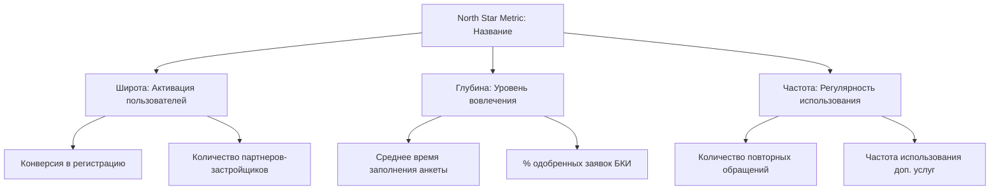

# СКИЛЛ: /north-star-metric

# Метрика Полярной Звезды (North Star Metric)

Создать продуктовую спецификацию фреймворка North Star Metric (NSM) для продукта. Помогает продакту сфокусировать команду на ключевом показателе, который одновременно отражает: ценность продукта для пользователя, уровень вовлечения в продукт и долгосрочные финансовые результаты бизнеса. Предотвращает оптимизацию тщеславных метрик (vanity metrics).

## Процесс

1. **Определи ценность продукта (Core Value).** В какой момент пользователь получает реальную ценность от продукта (например, доехал до места в такси, получил одобрение ипотеки, прослушал песню)?
2. **Сформулируй North Star Metric (NSM).** Метрика должна измерять частоту и глубину доставки этой ценности (например, количество успешных поездок в неделю, объем выданных кредитов в месяц, суммарное время прослушивания музыки).
3. **Декомпозируй NSM на опережающие метрики (Input Metrics).** Раздели на 3-4 ключевых драйвера:
   - *Широта (Breadth):* количество пользователей (активации, новые регистрации).
   - *Глубина (Depth):* уровень вовлечения (среднее число действий на сессию, утилизация фич).
   - *Частота (Frequency):* регулярность использования (DAU/MAU, частота сессий).
4. **Свяжи NSM с финансовыми результатами (Output Metrics).** Как рост NSM конвертируется в выручку, LTV или снижение Churn?
5. **Сохрани вывод** в текущей рабочей директории как `nsm-spec-[название-продукта].md`.

## Формат вывода

```
## Фреймворк North Star Metric: [Название продукта]

### 1. Ценность продукта и Кандидаты в NSM
- **Ядро ценности (Core Value Proposition):** [в чем главная польза продукта для пользователя]
- **Кандидаты в North Star Metric:**
  1. *[Кандидат 1, например: Количество активных пользователей]* — Плюсы/Минусы (почему это тщеславная метрика).
  2. *[Кандидат 2, например: Количество оформленных заявок]* — Плюсы/Минусы.
  3. *[Кандидат 3, выбранная NSM]* — Почему именно она лучше всего отражает ценность и качество.

### 2. Выбранная Метрика Полярной Звезды (NSM)
- **Формулировка NSM:** [название метрики с привязкой ко времени, например: Еженедельный объем успешно выданных ипотечных кредитов через платформу]
- **Почему это работает:** [как рост этой метрики гарантирует, что клиенты довольны, партнеры зарабатывают, а банк получает качественные активы].

### 3. Дерево метрик (Input Metrics)
Драйверы, которые команда может оптимизировать напрямую для роста NSM:



- **Драйвер 1: Широта (Breadth):** [метрики объема аудитории, притока новых пользователей].
- **Драйвер 2: Глубина (Depth):** [метрики качества использования фич, конверсии в ключевые действия].
- **Драйвер 3: Частота (Frequency):** [метрики возвращаемости, интервалы между действиями].

### 4. Связь с бизнес-результатами (Output Metrics)
- **Влияние на выручку (Revenue Link):** [как рост NSM увеличивает маржинальный доход/комиссии/проценты].
- **Влияние на удержание (Retention Link):** [как использование ценности снижает отток клиентов].

### 5. Метрики-ограничители (Guardrail Metrics)
Защитные метрики, которые не должны пострадать при оптимизации NSM:
- *Качество/Риски:* [например, уровень NPL (просрочки) не должен превысить 2.5% при росте выдач].
- *UX/Скорость:* [время ответа техподдержки или доля зависших заявок].
- *Экономика:* [предельная стоимость привлечения клиента CAC].
```

## Правила

- Запрещай использовать в качестве NSM финансовые метрики (выручка, прибыль, GMV) или количество зарегистрированных пользователей (MAU/регистрации). Выручка — это запаздывающий показатель (output), а MAU — тщеславный показатель. NSM должна измерять доставку ценности пользователю.
- Обязательно внедряй защитные метрики (Guardrail Metrics). Оптимизация NSM без ограничений ведет к фроду (например, можно выдать много кредитов, снизив требования к риску, но банк получит дефолтный портфель).
- Дерево метрик должно быть визуализировано через диаграмму Mermaid.
- Пиши на русском языке.

---

# СКИЛЛ: /hypothesis-tree

# Дерево гипотез (hypothesis-tree)

Построить структурированное дерево гипотез (Hypothesis Tree) для декомпозиции глобальной бизнес-цели на конкретные продуктовые ставки (bets) и эксперименты.

## Процесс
1. **Зафиксируй бизнес-цель (KPI/OKR).** (Например: увеличить выручку на 20% за квартал).
2. **Декомпозируй на математические драйверы.** `Выручка = Трафик × Конверсия × Средний чек`.
3. **Сформулируй продуктовые ставки (Bets) для каждого драйвера.**
4. **Опиши гипотезы и тесты.**

## Формат вывода
```
## Дерево гипотез: [Бизнес-цель]

### 1. Бизнес-цель (Core Goal)
- **Рост выручки направления ИЖС на +25% за Q3.**

### 2. Декомпозиция по драйверам
- **Драйвер 1: Рост конверсии из заявки в выдачу эскроу (CR)**
  - *Ставка:* Автоматизация проверки Росреестра.
    - **Гипотеза 1.1:** Если мы подключим СМЭВ для автопроверки сделки, то время согласования снизится с 5 дней до 1 дня, что повысит CR на 4%.
```

---

# СКИЛЛ: /jobs-to-be-done

# JTBD-исследования (Jobs-to-be-Done)

Создать детальную спецификацию требований для исследования потребностей пользователей на основе методологии Jobs-to-be-Done (JTBD). Помогает продакту понять глубинную мотивацию клиентов (на какую «работу» они «нанимают» продукт), спроектировать вопросы для Switch-интервью, разложить силы влияния на решение о покупке и составить карту шагов пользователя (Job Map).

## Процесс

1. **Определи основную «Работу» (Core Job).** Сформулируй главную задачу, которую пытается решить пользователь (не через функции продукта, а через его прогресс в жизни).
2. **Спроектируй структуру Switch-интервью.** Подготовь вопросы для выявления пути пользователя от первой мысли до покупки и смены старого решения на новое.
3. **Проанализируй силы влияния (4 Forces Framework).**
   - *Push (Толкающие силы):* проблемы с текущим решением.
   - *Pull (Притягивающие силы):* привлекательность нового решения.
   - *Anxiety (Тревоги):* страхи перед новым решением.
   - *Habit (Привычки):* привязанность к старому решению.
4. **Сформулируй формулы «Работы» (Job Statements).**
   - Шаблон: `Когда [ситуация/контекст], я хочу [действие/решение], чтобы [желаемый результат/прогресс]`.
5. **Построй карту выполнения работы (Job Map).** (Определение цели → Поиск вариантов → Подготовка → Запуск → Выполнение → Контроль → Завершение).
6. **Сохрани вывод** в текущей рабочей директории как `jtbd-spec-[контекст].md`.

## Формат вывода

```
## JTBD-анализ продукта: [Название продукта]

### 1. Главная работа пользователя (Core Job to be Done)
- **Формулировка Core Job:** [какой прогресс совершает пользователь с помощью продукта, например: «Надежно и без стресса купить загородный дом, не боясь потерять задаток из-за отказа банка»]
- **Составляющие работы:**
  - *Функциональный аспект:* [конкретное действие, сбор доков, расчет цен].
  - *Эмоциональный аспект:* [чувство безопасности, отсутствие паники при сделке].
  - *Социальный аспект:* [как пользователь выглядит в глазах семьи/коллег].

### 2. Сценарий Switch-интервью (Глубинное интервью)
Скрипт вопросов для интервью с клиентами, которые недавно купили/сменили продукт:
- **Точка старта (Timeline):** «Вспомните момент, когда вы впервые подумали о покупке... Что произошло в этот день?»
- **Поиск альтернатив:** «Какие варианты вы рассматривали? Что пробовали до нашего продукта?»
- **Момент покупки:** «Опишите день, когда вы совершили покупку. Где вы находились? Что вас подтолкнуло?»
- **Опыт использования:** «Как прошла первая сделка? Были ли моменты сомнений?»

### 3. Модель четырех сил (Forces of Progress)
Анализ факторов, влияющих на переход к нашему продукту:

| Силы перехода (Прогресс) | Силы сопротивления (Стагнация) |
|-------------------------|---------------------------------|
| **Push (Толкает старое):**<br>- [недовольство текущим банком]<br>- [ручная бумажная волокита] | **Anxiety (Тревога перед новым):**<br>- [страх сбоя в цифровом эскроу]<br>- [недоверие онлайн-оценке залога] |
| **Pull (Притягивает новое):**<br>- [быстрое онлайн-одобрение ИЖС]<br>- [интеграция застройщика в один клик] | **Habit (Привычка к старому):**<br>- [привык носить документы лично в отделение]<br>- [сложно менять паттерны поведения] |

### 4. Формулировки работ (Job Stories / Statements)
- **Job Story 1 (Новички):**
  - *Когда:* [описание ситуации]
  - *Я хочу:* [действие]
  - *Чтобы:* [желаемый результат]
- **Job Story 2 (Профессионалы/Партнеры):**
  - *Когда:* [описание ситуации]
  - *Я хочу:* [действие]
  - *Чтобы:* [желаемый результат]

### 5. Карта работы (Job Map)
Этапы, которые проходит пользователь для решения своей задачи (независимо от нашего продукта):
1. **Определение цели (Define):** [пользователь определяет критерии выбора дома].
2. **Поиск вариантов (Locate):** [поиск объявлений на классифайдах].
3. **Подготовка (Prepare):** [сбор первоначального взноса, документов].
4. **Запуск (Confirm):** [подача заявки на ипотеку, аккредитация застройщика].
5. **Выполнение (Execute):** [проведение сделки через СБР].
6. **Контроль результатов (Monitor):** [отслеживание раскрытия эскроу-счета].
7. **Завершение (Modify/Conclude):** [получение ключей, оформление собственности].
```

## Правила

- Запрещай формулировать «работу» через функции продукта (например, не «Я хочу калькулятор ипотеки», а «Я хочу понять, могу ли я позволить себе покупку этого дома»).
- Обязательно разделяй работу на функциональные, эмоциональные и социальные аспекты. Эмоциональные барьеры (страхи, неуверенность) часто мешают покупке сильнее, чем функциональные недостатки.
- Включай модель четырех сил в каждый анализ — без проработки тревог (Anxiety) и привычек (Habit) новый продукт не сможет перетянуть пользователей со старого решения.
- Пиши на русском языке.

---

# СКИЛЛ: /feature-flag-strategy

# Управление фича-флагами (Feature Flag Strategy)

Создать детальную спецификацию требований для релиза продукта с использованием фича-флагов (feature toggles). Помогает продакту и команде разработки безопасно раскатывать функционал, минимизировать риски сбоев на проде за счет канареечных релизов (canary deployment), настраивать таргетинг фич на отдельные сегменты пользователей и управлять техническим долгом по очистке старых флагов.

## Процесс

1. **Определи тип и жизненный цикл флага.** (Релизный флаг (временный для выкатки), операционный флаг (kill switch для нагрузки), экспериментальный флаг (для A/B тестов)).
2. **Спроектируй этапы раската (Rollout Phases).**
   - *Этап 1:* Внутренний тест (dogfooding / dev-окружение).
   - *Этап 2:* Альфа/Бета тест (закрытая группа лояльных пользователей).
   - *Этап 3:* Канареечный релиз (1% -> 5% -> 10% -> 25% -> 50% пользователей).
   - *Этап 4:* Полный раскат (100% General Availability).
3. **Опиши логику таргетирования (Targeting Rules).** По каким признакам разделяем пользователей? (Регион/гео, версия приложения, ID партнера/застройщика, платформа iOS/Android).
4. **Спроектируй план отката (Kill Switch & Emergency Plan).** Какие метрики стабильности мониторим (CPU, 5xx ошибки, краши приложения, падение целевых конверсий)? Кто и как имеет право мгновенно выключить флаг при аварии?
5. **Создай план очистки кода (Sunset & Clean-up Plan).** Как и когда удаляем флаг из кода после 100% раската фичи, чтобы не плодить технический долг.
6. **Сохрани вывод** в текущей рабочей директории как `feature-flag-[название-фичи].md`.

## Формат вывода

```
## Стратегия выкатки фичи через фича-флаги: [Название фичи]

### 1. Описание фича-флага и Классификация
- **Технический ключ флага:** `feature.mortgage.escrow.auto-release`
- **Тип флага:** Релизный (Release Toggle) / Экспериментальный / Операционный.
- **Состояние по умолчанию:** Выключен (FALSE) для всех пользователей.

### 2. Этапы выкатки и Расписание (Rollout Plan)
План постепенного раската фичи:

| Этап | Доля аудитории (%) | Целевая когорта / Ограничения | Длительность | Критерии перехода к следующему шагу |
|------|--------------------|-------------------------------|--------------|--------------------------------------|
| 1. Dogfooding | 100% (Dev) | Внутренние сотрудники банка | 3 дня | Отсутствие критических багов (Blockers) |
| 2. Beta | 5% | Пилотные застройщики региона X | 7 дней | Положительный фидбек, отсутствие ошибок API |
| 3. Canary 1 | 10% | Случайные пользователи РФ | 3 дня | Мониторинг логов и крашей |
| 4. Canary 2 | 50% | Случайные пользователи РФ | 3 дня | Метрики стабильности системы в норме |
| 5. GA | 100% | Все пользователи системы | Постоянно | Переход к фазе очистки кода |

### 3. Правила таргетирования (Targeting Rules)
- **Условия включения флага (Targeting Group):**
  - Версия приложения: `>= 4.12.0`
  - Гео: [только Москва и Московская область на этапах 1-3]
  - Тип застройщика: [аккредитованные партнеры с рейтингом А]

### 4. Аварийный план и Метрики стабильности (Kill Switch)
- **Метрики отката (Rollback Triggers):**
  - Рост 5xx ошибок на эндпоинтах `/api/v1/escrow/*` более чем на 0.5%.
  - Рост числа обращений в поддержку с темой «Ошибка раскрытия эскроу» более чем на 3 в час.
  - Рост крашей приложения на iOS/Android.
- **Инструкция экстренного отключения:** выключение флага в панели управления (например, LaunchDarkly/GitLab/собственный админ-кабинет) происходит мгновенно без повторного деплоя кода. Время реакции системы на смену флага — до 30 секунд.

### 5. План очистки кода (Sunset & Clean-up)
- **Владелец задачи по удалению:** [Продакт-менеджер совместно с Техлидом команды].
- **Критерии готовности к удалению:** фича работает на 100% пользователей в течение 14 дней без инцидентов.
- **План действий:** заведение задачи в Jira/Trello на удаление ветвления `if (feature.flag) {} else {}` и удаление самого ключа из базы конфигураций флагов. Срок — не позднее окончания следующего спринта после 100% раската.
```

## Правила

- Запрещай запуск крупных архитектурных или высокорискованных фич без фича-флагов. Любое изменение в критических воронках (оплата, регистрация, скоринг) должно иметь рубильник аварийного отключения (Kill Switch).
- Sunset-план (план очистки) обязателен. Накопление старых флагов в коде ведет к спагетти-коду, усложнению тестирования и росту технического долга.
- При планировании релизов требуй описания правил таргетирования по версиям приложений (особенно для мобильных платформ iOS/Android, где у пользователей могут быть установлены старые версии).
- Пиши на русском языке.

---

# СКИЛЛ: /competitive-moat

# Продуктовый ров (competitive-moat)

Провести аудит стратегической защищенности продукта от копирования конкурентами (Competitive Moat / Защитные барьеры). Скилл помогает продакту проанализировать сильные стороны бизнеса по классической классификации рвов (сетевые эффекты, издержки переключения, ценовые преимущества, нематериальные активы) и разработать дорожную карту усиления защиты продукта.

## Процесс

1. **Идентифицируй тип конкурентного рва (Moat Types).**
   - *High Switching Costs (Высокие издержки переключения):* насколько сложно клиенту уйти к конкуренту? (например, интеграция API банка в CRM застройщика делает уход крайне болезненным — нужно переписывать код).
   - *Network Effects (Сетевые эффекты):* увеличивается ли ценность продукта при росте числа пользователей? (например, больше покупателей на маркетплейсе привлекает больше продавцов).
   - *Data Moat (Защищенность данных):* уникальные данные, которые накапливает продукт и которые улучшают алгоритмы (например, история кредитных сделок улучшает скоринг, который не скопировать конкурентам).
   - *Brand / Systemic advantages:* лицензии ЦБ РФ, эксклюзивные партнерства.
2. **Оцени глубину рва (Moat Rating).** Оценка по шкале: Нет рва (No Moat), Узкий ров (Narrow Moat), Широкий ров (Wide Moat).
3. **Разработай стратегию укрепления защиты.** Что включить в роадмап для повышения лояльности и усложнения миграции клиентов (внедрение SSO, кастомная аналитика, долгосрочные контракты с дисконтом, проприетарные алгоритмы).
4. **Сохрани вывод** в текущей рабочей директории как `competitive-moat-[название-продукта].md`.

## Формат вывода

```
## Стратегический аудит защищенности: [Название продукта]

### 1. Карта Конкурентного рва (Moat Matrix)
Анализ защитных барьеров бизнеса:

| Тип рва | Текущее состояние в продукте | Сила барьера (Нет / Узкий / Широкий) | Как это мешает конкурентам копировать нас |
|---------|-----------------------------|--------------------------------------|-------------------------------------------|
| **Издержки переключения (Switching Costs)** | Прямая API-интеграция личного кабинета банка в ERP застройщиков | **Широкий ров** | Чтобы сменить банк-партнер, девелоперу нужно остановить продажи и переписать IT-контур интеграции смет. |
| **Сетевые эффекты (Network Effects)** | Двусторонняя база партнеров (банки <-> застройщики <-> оценщики) | **Узкий ров** | Привлечение новых оценщиков повышает скорость сделок, что привлекает новых застройщиков. |
| **Данные (Data Moat)** | Накопленная история оценки залогов и дефолтов подрядчиков за 5 лет | **Широкий ров** | Наша риск-модель скоринга одобряет кредиты на 20% точнее, так как у новых игроков нет этих данных для обучения ML. |
| **Системные преимущества** | Наличие лицензий ЦБ РФ, статус официального эскроу-агента | **Широкий ров** | Получение лицензии и статуса занимает годы и требует миллиардных капиталов. |

### 2. Оценка уязвимостей (Moat Vulnerabilities)
Где конкуренты могут пробить нашу защиту:
- *Технологическая уязвимость:* если конкурент предложит бесплатную интеграцию силами своих разработчиков, это снизит барьер переключения.
- *Ценовая уязвимость:* демпинг комиссий по эскроу со стороны крупнейших банков.

### 3. Дорожная карта укрепления рва (Strategic Recommendations)
1. **Повышение липкости (Stickiness):** разработать модуль автогенерации налоговой отчетности для застройщиков прямо внутри нашего кабинета. Это еще сильнее привяжет их к нашей системе.
2. **Эксклюзивность данных:** запатентовать алгоритм машинного зрения для проверки смет и сделать его закрытым API.
3. **Экосистемный бандлинг:** объединить ипотеку, страхование и оценку залогов в единый пакет с дисконтом, который невозможно повторить моно-сервисам.
```

## Правила

- Оспаривай иллюзию защищенности за счет «уникального интерфейса» или «лучшего дизайна». Любой интерфейс копируется конкурентами за 2-4 недели. Конкурентный ров должен строиться на системных факторах (данные, сетевые эффекты, интеграции, лицензии).
- Стратегия укрепления рва должна быть привязана к продуктовому бэклогу (конкретные фичи/интеграции), а не состоять из общих фраз маркетинга.
- Пиши на русском языке.

---

# СКИЛЛ: /localization-strategy

# Стратегия локализации (localization-strategy)

Спроектировать план адаптации продукта при выходе на новый зарубежный рынок или в новый регион РФ с учетом регуляторных, культурных и платежных особенностей.

## Процесс
1. **Проанализируй регуляторные требования (Compliance).** Локальные законы о персональных данных, налогах (НДС), лицензировании.
2. **Адаптируй интерфейс и месседжи.** Язык, форматы дат/времени, культурный контекст.
3. **Интегрируй локальные платежные методы.** Местные платежные шлюзы, валюты, налоги.

## Формат вывода
```
## План локализации продукта: [Целевой рынок]
- **Правовые требования:** хранение данных граждан на серверах внутри целевой страны.
- **Платежная интеграция:** подключение локальных платежных методов (например, Pix для Бразилии).
- **Адаптация UX:** изменение валюты по умолчанию, перевод личного кабинета.
```

---

# СКИЛЛ: /incident-pm-role

# Роль PM при инцидентах (incident-pm-role)

Создать регламент действий продакт-менеджера во время сбоя/аварии на проде (Incident Management) и шаблон разбора инцидента (Postmortem) для предотвращения повторений.

## Процесс
1. **Определи критичность инцидента (Severity).** Sev-1 (лежит авторизация или платежи — всё горит), Sev-2 (сломана важная фича), Sev-3 (косметический баг).
2. **Опиши регламент коммуникаций.** Внутренний чат инцидента, статус-апдейты для стейкхолдеров каждые 30 минут, внешнее информирование клиентов (status page).
3. **Создай Postmortem.**
   - Хронология событий.
   - Корневая причина (Root Cause).
   - Список задач на предотвращение в будущем (Action Items).

## Формат вывода
```
## Регламент инцидента и Постмортем: [Название сбоя]
- **Критичность:** Sev-1.

### 1. Хронология (Incident Timeline)
- **12:00:** Обнаружен всплеск ошибок 500 на платежном шлюзе.
- **12:10:** PM собрал инцидент-чат, подключили тимлида бэкенда.
- **12:45:** Выпущен хотфикс, баг устранен.

### 2. Корневая причина (Root Cause)
- Изменение структуры JSON в API банка-партнера без уведомления (ломающее изменение).

### 3. Список задач (Prevention Action Items)
- [ ] Настроить алерты в Grafana на рост ошибок API банка.
- [ ] Переписать интеграцию на отказоустойчивую с бэкап-сценарием.
```

---

# СКИЛЛ: /ai-feature-spec

# Спецификация AI-фичи

Создать структурированную спецификацию требований для интеграции искусственного интеллекта или машинного обучения в продукт. Цель — связать технические параметры модели с реальной продуктовой ценностью и минимизировать риски неопределённости AI.

## Процесс

1. **Разбери задачу.** Прочитай описание фичи. Выдели: какую пользовательскую проблему решает AI, почему нельзя решить эвристикой/кодом, и каков источник данных.
2. **Переведи продуктовую задачу в ML-задачу.** (Например: классификация, регрессия, ранжирование, генерация).
3. **Определи метрики качества.** Раздели на ML-метрики (Accuracy, F1-score, precision/recall, ROC-AUC) и продуктовые метрики (увеличение конверсии, сокращение времени, CTR).
4. **Спроектируй логику обхода ошибок (Fallback).** Что делает система, если модель выдает низкую уверенность, ошибается или недоступна?
5. **Опиши сценарий разметки / HITL (Human-in-the-loop).** Нужна ли ручная валидация ответов, как собирается обратная связь для дообучения модели?
6. **Сохрани вывод** в текущей рабочей директории как `ai-spec-[название-фичи].md`.

## Формат вывода

```
## Спецификация AI-фичи: [Название]

### 1. Продуктовая и ML-постановка
- **Какую боль решает AI:** [конкретно]
- **Почему именно ML:** [почему обычный алгоритм/правила не подходят]
- **Тип ML-задачи:** [например, бинарная классификация спама / генерация текста]
- **Входные данные (Inputs):** [какие данные подаются на вход модели]
- **Выходные данные (Outputs):** [что модель возвращает]

### 2. Метрики успеха (Метрики модели vs. Бизнес-метрики)
| Метрика | Тип | Целевое значение | Метод измерения |
|---------|-----|------------------|-----------------|
| [Бизнес-метрика, например, CTR] | Продуктовая | [например, +15%] | A/B-тест |
| [ML-метрика, например, Precision] | Модель | [например, >= 92%] | Offline validation |
| [ML-метрика, например, Latency] | Производительность | [например, p95 < 200ms] | Нагрузочный тест |

### 3. Fallback & Edge Cases (Логика обхода ошибок)
- **Порог уверенности (Confidence Threshold):** при каком значении скора модели мы доверяем результату (например, > 0.85).
- **Сценарий при низкой уверенности:** [что показываем пользователю — дефолтный ответ, скрываем фичу, просим ввести вручную]
- **Сценарий отказа (Service Downgrade/Offline):** что происходит, если ML-сервис недоступен (таймаут).
- **Ограничения модели (Guardrails):** фильтрация нежелательного контента, ограничение длины вывода, галлюцинации.

### 4. Данные и Обучение (Data & Feedback Loop)
- **Источник данных для обучения:** [где берем исторические данные]
- **Разметка данных:** [кто размечает данные и как — вендор, пользователи, разметчики]
- **Обратная связь (Feedback Loop):** как продукт собирает неявные (клики) и явные (лайки/дизлайки) сигналы от пользователя для улучшения модели.

### 5. HITL (Human-in-the-loop)
- **Где нужен человек:** [например, модерация сгенерированного ответа перед отправкой клиенту]
- **Интерфейс модератора:** [кратко — где человек видит и подтверждает действия AI]
- **SLA модератора:** [сколько времени есть на ручную проверку]

### 6. Чек-лист приемки (Acceptance Criteria)
- [ ] Модель протестирована на оффлайн-датасете, метрика [название] выше целевой.
- [ ] Отработаны сценарии падения ML-сервиса (сервер отвечает ошибкой/таймаутом).
- [ ] Настроена отправка логов предсказаний и фидбека пользователей в DWH.
- [ ] Модераторы обучены работе с интерфейсом проверки.
```

## Правила

- Не позволяй писать спецификации без Fallback-логики. AI ошибается всегда — PM обязан спроектировать поведение продукта при ошибке.
- Требуй разграничения ML-метрик и бизнес-метрик. Модель со 100% точностью бесполезна, если она тормозит интерфейс на 5 секунд и портит UX.
- Исключай фразы «модель должна работать идеально». Оперируй вероятностями и доверительными интервалами.
- Описывай сбор обратной связи как обязательную часть фичи. Без обратной связи модель нельзя будет улучшить.
- Пиши на русском языке.

---

# СКИЛЛ: /api-product-spec

# API как продукт (api-product-spec)

Создать продуктовую спецификацию для API или интеграционного решения (B2B API, open banking API, партнерские интеграции). Скилл помогает продакту спроектировать решение с точки зрения разработчиков-партнеров (Developer Experience - DX), определить уровни доступности и лимиты запросов (rate limits), прописать правила версионирования и требования к документации/песочнице (sandbox).

## Процесс

1. **Опиши сценарии разработчиков (Developer Use Cases).** Зачем внешние разработчики будут вызывать наши методы? Какую задачу их бизнеса это решает?
2. **Определи SLA и требования к производительности.**
   - *Доступность (Uptime):* целевой показатель (например, 99.9%).
   - *Время ответа (Latency):* требования к p95 / p99 времени отклика (например, < 200мс).
3. **Разработай лимиты запросов (Rate Limits & Throttling).** Сколько запросов может совершить один клиент в секунду/минуту (RPS/RPM) для предотвращения DDOS и перегрузки баз данных. Напиши логику обработки превышений лимитов (ошибка 429 Too Many Requests).
4. **Спроектируй правила версионирования и обратной совместимости.** Версионирование через URL (например, `/v1/`, `/v2/`) или заголовки. План поддержки устаревших версий (deprecation policy).
5. **Опиши требования к Developer Experience (DX).** Требования к интерактивной песочнице (Sandbox), тестовым данным, SDK, автогенерации документации Swagger / OpenAPI.
6. **Сохрани вывод** в текущей рабочей директории как `api-spec-[название-продукта].md`.

## Формат вывода

```
## Спецификация API-продукта: [Название API]

### 1. Сценарии использования (Developer Use Cases)
- **Основной сценарий:** [например, автопроверка статуса сделки Росреестра]
  - *Кто вызывает:* внешняя CRM застройщика.
  - *Частота:* при каждом изменении статуса сделки.
  - *Ценность:* застройщик видит факт регистрации онлайн и автоматически отправляет документы на раскрытие эскроу-счетов.

### 2. Метрики производительности и SLA
- **Целевая доступность (Uptime SLA):** 99.95% (не более 22 минут простоя в месяц).
- **Latency (Время отклика):**
  - p50: < 100 мс.
  - p95: < 300 мс.
  - p99: < 800 мс (максимально допустимое трение).

### 3. Лимиты запросов и Тарификация (Rate Limits & Quotas)
- **Базовый лимит (Rate Limit):** до 10 запросов в секунду (RPS) на одну организацию.
- **Действие при превышении:** возврат HTTP 429 Too Many Requests с заголовком `Retry-After`.
- **Квоты (Quotas):** до 100 000 вызовов в месяц включено в тариф Pro, далее 1.5 руб. за вызов.

### 4. Версионирование и Депрекация (Versioning Policy)
- **Формат версий:** Версионирование через URL пути (`https://api.bank.ru/v1/escrow/`).
- **Обратная совместимость:** добавление новых опциональных полей в JSON-ответ не считается ломающим изменением. Удаление полей или изменение типов — ломающее изменение (требует новой мажорной версии `/v2/`).
- **Срок поддержки старых версий (Deprecation window):** 6 месяцев с момента релиза новой мажорной версии.

### 5. Требования к Developer Experience (DX)
- **Песочница (Sandbox):** наличие изолированной тестовой среды с фиктивными данными (тестовые ИНН, тестовые сделки Росреестра) для проверки интеграции без реальных счетов.
- **Интерактивная дока:** автогенерация Swagger UI / Redoc на основе спецификации OpenAPI 3.0.
- **Коды ошибок:** стандартизированный формат ответов об ошибках:
  ```json
  {
    "error_code": "ESCROW_LOCKED",
    "message": "Счет эскроу заблокирован судебным решением",
    "timestamp": "2026-07-09T15:12:00Z"
  }
  ```
```

## Правила

- Запрещай запускать API без тестовой песочницы (Sandbox). Заставлять разработчиков интегрироваться и тестировать запросы сразу на реальных базах данных или деньгах — грубейшее нарушение DX, приводящее к сбоям и затягиванию интеграции на месяцы.
- Всегда явно прописывай лимиты запросов (Rate Limits). Без них любой кривой цикл в коде партнера положит ваши сервера базы данных.
- Пиши на русском языке.

---

# СКИЛЛ: /data-product-spec

# Продукты данных (data-product-spec)

Спроектировать спецификацию для внутреннего или внешнего Data Product (витрины данных, аналитические пайплайны, API данных).

## Процесс
1. **Определи потребителей данных (Data Consumers).** (Аналитики, ML-модели, бизнес-стейкхолдеры).
2. **Пропиши SLA по качеству данных (Data Quality SLA).** Допустимая задержка обновления (freshness), полнота (completeness), уникальность строк.
3. **Спроектируй Data Lineage.** Источники данных -> Пайплайн обработки -> Финальная витрина.

## Формат вывода
```
## Спецификация Data Product: [Название витрины]
- **Потребители:** Скоринговая ML-модель банка.
- **SLA по качеству данных:** Freshness < 15 минут, null-значения в ключевых полях < 0.01%.
- **Data Lineage:** [схема источников].
```

---

# СКИЛЛ: /ecosystem-design

# Проектирование экосистемы (ecosystem-design)

Разработать продуктовую стратегию объединения разрозненных сервисов компании в единую экосистему (SuperApp, единая подписка, кросс-продуктовый кэшбэк).

## Процесс
1. **Спроектируй ядро экосистемы.** Единая авторизация (Ecosystem ID), единый профиль и платежные данные.
2. **Сформулируй правила синергии.** Как использование сервиса А стимулирует конверсию в сервис Б (например: поездки на такси дают баллы на доставку еды).
3. **Минимизируй каннибализацию.**

## Формат вывода
```
## Дизайн экосистемы: [Название]
- **Ядро экосистемы:** Единый ID авторизации на базе ЕСИА/Номера телефона.
- **Механика лояльности:** Кросс-продуктовый кэшбэк баллами.
- **Экосистемный бандл подписки:** [описание состава подписки].
```

---

# СКИЛЛ: /hw-sw-roadmap

# Синхронизация HW и SW (hw-sw-roadmap)

Разработать интегрированную дорожную карту для IoT-продуктов или электроники, координируя циклы разработки физического устройства (Hardware) и прошивки/мобильного приложения (Software).

## Процесс
1. **Определи аппаратные ограничения (HW Constraints).** Заказ компонентов, производство плат (PCB), сертификация устройств.
2. **Синхронизируй фазы разработки.** EVT (инженерный тест), DVT (дизайнерский тест), PVT (предсерийный выпуск) с релизами прошивок и мобильного приложения.
3. **Опиши зависимости.** Какие фичи софта требуют наличия конкретных сенсоров в железе.

## Формат вывода
```
## Интегрированная IoT дорожная карта: [Название устройства]
- **Фаза железа (HW):** DVT тестирование плат (завершение к [Дата]).
- **Зависимость софта:** релиз функции Bluetooth-авторизации в приложении привязан к завершению прошивки v1.2.
```

---

# СКИЛЛ: /llm-product-design

# Проектирование LLM-продуктов

Создать детальную спецификацию требований для интеграции генеративного искусственного интеллекта на базе LLM (Large Language Models) в продукт. Скилл помогает продакту спроектировать надежный пользовательский опыт, выбрать правильную архитектуру работы с контекстом, сбалансировать стоимость запросов и скорость генерации, и настроить систему оценки результатов модели (LLM Eval).

## Процесс

1. **Определи юзкейс и его критичность.** (Внутренний саппорт-ассистент, умный поиск по базе знаний, генератор маркетинговых текстов, чат-бот для конечных клиентов).
2. **Спроектируй архитектуру данных (RAG vs. Fine-Tuning).** Как модель получает доступ к актуальным внутренним знаниям компании? (По умолчанию — RAG (Retrieval-Augmented Generation) как самый дешевый и надежный способ борьбы с галлюцинациями).
3. **Рассчитай экономику и производительность (Cost vs. Latency).**
   - Какая модель выбрана (проприетарная GPT-4/Claude vs. локальная Llama/YandexGPT)?
   - Оцени длину контекста (Context Window) и затраты на 1000 токенов.
   - Спроектируй UX для компенсации высокой задержки (Stream-вывод текста по токенам, лоадеры).
4. **Опиши Prompt-стратегию и системный промпт.** Какова роль (Persona) модели? Какие ограничения (System Instructions) и формат ответа (JSON/Markdown) задаются.
5. **Настрой метрики оценки качества (LLM Evaluation).** Как измерить, что модель отвечает корректно? Метрики: фактологичность (groundedness), релевантность запросу (answer relevance), токсичность/безопасность (safety).
6. **Сохрани вывод** в текущей рабочей директории как `llm-spec-[название-продукта].md`.

## Формат вывода

```
## Спецификация LLM-продукта: [Название]

### 1. Архитектура работы с контекстом (RAG Architecture)
- **Способ обогащения знаниями:** RAG (поиск релевантных кусков из векторной БД перед генерацией) / Fine-tuning (дообучение весов).
- **Источник знаний (Knowledge Base):** [база доков, API транзакций, история переписки].
- **Векторная БД и чанкинг:** [как разбиваем тексты на части (chunks) и где храним векторные представления (embeddings)].

### 2. Prompt-инжиниринг и Ограничения
- **Системные инструкции (System Prompt):**
  - *Роль (Persona):* [например, «Ты — вежливый ассистент поддержки банка...»]
  - *Правила ответа:* [«Отвечай только на основе предоставленного контекста. Если информации нет в контексте, ответь "Я не знаю"»]
  - *Ограничения безопасности:* [запрет на обсуждение конкурентов, раскрытие системного промпта, политических тем].
- **Форматирование вывода:** [Markdown-разметка, списки, ссылки на оригинальные источники доков].

### 3. Экономика и Производительность (Cost & Latency)
- **Модель генерации:** [например, GPT-4o-mini / YandexGPT Pro]
- **Расчет стоимости запроса:** [средний токенаж на входе (Input Tokens) + выходе (Output Tokens) × стоимость 1M токенов = стоимость одной сессии].
- **Борьба с задержкой (Latency UX):** streaming-вывод текста (token streaming), скелетоны, прогресс-бары.

### 4. Метрики качества генерации (LLM Evaluation)
Как оцениваем качество ответов в оффлайне и онлайне:

| Метрика оценки | Что измеряет | Как измеряется | Целевое значение |
|----------------|--------------|----------------|------------------|
| **Factuality / Groundedness** | Наличие галлюцинаций (соответствие контексту) | LLM-as-a-judge / Ручная проверка | >= 95% |
| **Answer Relevance** | Релевантность ответа исходному вопросу | Cosine similarity / LLM-as-a-judge | >= 90% |
| **Safety / Toxicity** | Отсутствие токсичности и вредных советов | Авто-фильтры модерации контента | 100% |

### 5. UI/UX Сценарии и Feedback Loop
- **Сбор явного фидбека:** кнопки 👍 / 👎 рядом с каждым ответом модели.
- **Сценарий доработки ответа (Human-in-the-loop):** [возможность переключить на оператора-человека, если пользователь ставит дизлайк или задает сложный вопрос].
- **Логирование ошибок:** отправка логов сессий с дизлайками в пул разметки для ручного анализа.
```

## Правила

- Запрещай использование LLM без жестких ограничений в системном промпте (System Prompt). Модель без ограничений начнет придумывать несуществующие тарифы или законы (галлюцинация). Инструкция «Отвечай только на основе предоставленного контекста» обязательна.
- Streaming (потоковый вывод по токенам) обязателен для любого пользовательского чат-интерфейса на базе LLM. Ждать 5-8 секунд пустой экран, пока модель сгенерирует весь ответ целиком — это критический дефект UX.
- Обязательно требуй разграничения ролей. Модель не должна обещать клиенту юридических решений или финансовых компенсаций.
- Пиши на русском языке.

---

# СКИЛЛ: /platform-strategy

# Стратегия Платформенного продукта

Создать продуктовую стратегию для инфраструктурного или платформенного продукта (API-платформа, ядро системы, LLM-gateway, MDM-система, внутренний фреймворк). Скилл помогает продакту спроектировать платформу как полноценный продукт для разработчиков (DX), выстроить правила API Governance, минимизировать риски обратной совместимости и измерить эффективность внедрения.

## Процесс

1. **Определи целевую аудиторию (Developers как пользователи).** Кто потребители платформы? (Внутренние команды разработки, внешние сторонние разработчики, партнеры).
2. **Определи ценность платформы (Value Proposition).** Как платформа помогает быстрее выпускать бизнес-фичи? (Сокращение Time-to-Market, экономия ресурсов на написание дублирующего кода, стандартизация безопасности).
3. **Опиши правила API Governance и версионирования.** Как платформа управляет изменениями контрактов API? Как предотвращаются ломающие изменения (breaking changes) и как устроен жизненный цикл устаревающих версий (sunset/deprecation policy).
4. **Спроектируй Developer Experience (DX).** Каковы требования к документации (Swagger/OpenAPI), песочнице (sandbox), SDK, процессу онбординга нового разработчика (Time-to-first-hello-world).
5. **Определи метрики платформы.** Фокус на Adoption Rate (какая доля команд перешла на платформу), Latency (производительность), uptime/SLA, и сокращение времени разработки бизнес-фич (time-to-market).
6. **Сохрани вывод** в текущей рабочей директории как `platform-strategy-[название-платформы].md`.

## Формат вывода

```
## Стратегия платформенного продукта: [Название]

### 1. Архитектура платформы и Ценность (Value Proposition)
- **Потребители платформы:** [какие команды/разработчики используют платформу, их технический стек и потребности]
- **Продуктовая ценность (The "Why"):** какую проблему решает платформа (например, заменяет разрозненные интеграции с LLM единым шлюзом с лимитами и логированием).
- **Метрика экономии ресурсов:** [сколько человеко-часов экономит платформа бизнес-командам, избавляя их от написания инфраструктурного кода]

### 2. API Governance и Контракты (API Strategy)
- **Стандарты проектирования API:** [REST, gRPC, GraphQL — обоснование выбора протокола]
- **Управление breaking changes:** правила обратной совместимости, версионирование (например, семантическое версионирование SemVer).
- **Политика устаревания (Deprecation & Sunset Policy):**
  - Срок поддержки старых версий API (например, поддержка v1 в течение 6 месяцев после релиза v2).
  - Процесс уведомления и автоматического мониторинга использования устаревших эндпоинтов.

### 3. Developer Experience (DX / Опыт разработчика)
- **Документация и автогенерация:** требования к OpenAPI/Swagger, наличие актуальных примеров кода (code snippets).
- **Time-to-First-Hello-World:** целевой SLA на то, чтобы новый разработчик получил доступ, настроил ключи в песочнице и сделал первый успешный тестовый запрос.
- **Инструменты отладки:** логирование запросов/ответов, понятные коды ошибок (API Error Codes) и песочница (mock-сервера) для независимого тестирования.

### 4. Стратегия миграции и Внедрения (Adoption Plan)
- **forced vs. organic adoption:** как мотивируем команды переходить на платформу (через административные требования регулятора/безопасности или через создание сверх-удобного DX).
- **Rollout по когортам:** [план перевода команд, начиная с пилотных до полного масштабирования]
- **Сценарий поддержки легаси:** как долго платформа тянет за собой старые легаси-интеграции и когда происходит полное отключение.

### 5. Метрики платформы (Platform KPIs)
- **Adoption Rate (Уровень внедрения):** % бизнес-команд или % систем компании, перешедших на использование платформы.
- **Производительность и Надежность:** SLA по доступности (uptime, например, 99.9%), p95/p99 latency (время ответа).
- **API Error Rate:** % неуспешных запросов (4xx и 5xx ошибок) от общего объема трафика.
- **Developer CSAT:** оценка удовлетворенности разработчиков качеством платформы и DX.

### 6. Риски платформенного продукта
- **Единая точка отказа (Single Point of Failure):** падение платформы останавливает работу всех бизнес-фич. План отказоустойчивости (redundancy, rate limiting).
- **Узкое горлышко (Bottleneck):** платформенная команда не успевает дорабатывать API под нужды быстро бегущих бизнес-команд (стратегия самообслуживания - self-service).
```

## Правила

- Запрещай запускать платформы без проработки Developer Experience (DX). Разработчик — это такой же пользователь. Если документация плохая, а песочница не работает, внутренние команды будут саботировать переход на платформу, и ROI проекта обнулится.
- Платформа должна иметь стратегию предотвращения «узкого горлышка» (Self-service). Опиши, как бизнес-команды могут сами дорабатывать нужные им фичи в платформе (например, через плагины или внутренний open-source).
- Rate Limiting и защита от перегрузок (circuit breaker) обязательны для любого общего платформенного API.
- Пиши на русском языке.

---

# СКИЛЛ: /superapp-strategy

# Стратегия Экосистемы и SuperApp

Создать продуктовую стратегию интеграции сервисов в единую экосистему или SuperApp (аналоги экосистем Яндекса, ВК, Сбера, Т-Банка). Этот скилл помогает продакту спроектировать синергию между разнородными продуктами, выстроить единую систему идентификации пользователей, разработать экономику общей подписки и оценить кросс-продуктовые метрики.

## Процесс

1. **Определи ядро экосистемы (Core App).** Какое приложение является точкой входа с наивысшей частотой использования (например, такси, мессенджер, банк)?
2. **Спроектируй бесшовную авторизацию (Ecosystem ID).** Как пользователь мигрирует между сервисами без повторного ввода паролей и карт (единый профиль, балансы, адреса доставки).
3. **Разработай механику экосистемного бандла / подписки.** Опиши экономику единой подписки (типа Яндекс Плюс, СберПрайм): что входит в базу, какие партнерские офферы добавляются, как распределяется выручка от подписки между внутренними сервисами.
4. **Сформулируй стратегию кросс-продаж (Cross-sell & Retention).** Как частотные сервисы (с низким чеком) проталкивают пользователя в маржинальные сервисы (с высоким чеком)? Как экосистема удерживает пользователя (ecosystem lock-in).
5. **Опиши компромиссы и риски каннибализации.** Не убьет ли появление нового сервиса аудиторию старого? Как решать конфликты позиционирования внутри бренда.
6. **Сохрани вывод** в текущей рабочей директории как `superapp-strategy-[название-экосистемы].md`.

## Формат вывода

```
## Стратегия экосистемы: [Название]

### 1. Ядро экосистемы и Карта сервисов
- **Главное приложение (Core App):** [какое приложение имеет максимальную частоту использования и долю рынка]
- **Связанные сервисы (Ecosystem Satellite Apps):** [какие продукты входят в экосистему и какую роль играют — частотные драйверы внимания или маржинальные генераторы кэша]
- **Целевая синергия:** [как объединение продуктов дает ценность, которой нет у каждого по отдельности]

### 2. Единый профиль пользователя (Ecosystem ID & Data Hub)
- **Флоу авторизации (SSO):** [как устроен сквозной вход, какие общие данные хранятся в ID — платежные карты, адреса, семья, документы]
- **Обмен данными (Data Sharing):** как профиль поведения в одном сервисе (например, заказы еды) обогащает скоринг или рекомендации в другом (например, банке или стриминге).

### 3. Экономика подписки и Лояльность (Ecosystem Bundle)
- **Концепт подписки:** [что получает пользователь, цена, структура бандла]
- **Распределение выручки (Revenue Allocation):** по какой модели распределяется доход от подписки между внутренними командами продуктов (например, пропорционально времени использования, по факту первой активации, или фиксированный трансферт).
- **Кэшбэк/Баллы (Ecosystem Currency):** единая валюта лояльности (например, баллы Плюса). Как пользователи копят баллы в транзакционных сервисах и тратят в развлекательных.

### 4. Кросс-продуктовый путь (Cross-Product Loops)
- **Петля удержания (Ecosystem Lock-in):** что мешает пользователю уйти к конкуренту (например, если он пользуется ID, умной колонкой, диском и подпиской, стоимость переключения огромна).
- **Воронка кросс-сейла:** сценарии перевода пользователя из частотного дешевого контакта (например, музыка) в дорогую транзакцию (например, покупка авиабилетов или страховка).

### 5. Метрики здоровья экосистемы
- **Ecosystem MAU / DAU:** количество уникальных пользователей, воспользовавшихся хотя бы двумя разными сервисами экосистемы за период.
- **Cross-product index (Индекс кросс-продуктовости):** среднее количество продуктов экосистемы, используемых одним клиентом.
- **LTV экосистемного клиента vs. Моно-клиента:** насколько выше ценность пользователя подписки/ID по сравнению с обычным пользователем.
- **Redemption Rate:** доля начисленных экосистемных баллов, которые пользователи реально тратят.

### 6. Конфликты и Каннибализация
- **Защита от каннибализации:** [как развести аудитории похожих продуктов, например, доставка продуктов экспресс vs. доставка впрок]
- **Правила брендинга (Monolithic vs. House of Brands):** как позиционируются сервисы — под единым брендом (СберМаркет, СберЗдоровье) или сохраняют независимость (Кинопоиск, Яндекс Go).
```

## Правила

- Требуй четкого описания модели трансфертного ценообразования для подписки. Если продакт не описывает, как делится выручка от подписки между музыкой, видео и такси — между продуктовыми командами начнется война за бюджеты, и экосистема развалится.
- Не позволяй проектировать экосистему ради экосистемы. Объединение продуктов должно давать пользователю реальную выгоду по сравнению с использованием разрозненных сервисов конкурентов (например, дешевле в пакете, единый адрес доставки, сквозной кешбэк).
- Обязательно учитывай конфиденциальность данных. Обогащение данных не должно нарушать требования регуляторов и приватность пользователей (пользователь должен явно дать согласие на шаринг данных внутри экосистемы).
- Пиши на русском языке.

---

# СКИЛЛ: /channel-mix

# Анализ каналов привлечения (Channel Mix)

Создать детальный анализ и приоритизацию каналов привлечения (Channel Mix) для продукта. Помогает продакту оценить сходимость юнит-экономики по разным источникам трафика, сравнить стоимость привлечения (CAC) с потенциальным доходом (LTV), выявить риски выгорания каналов и составить матрицу приоритетов дистрибуции (Now/Later/Never).

## Процесс

1. **Определи набор потенциальных каналов.** (Performance-реклама (Яндекс.Директ, VK), SEO-трафик, партнерские интеграции (cross-promo), реферальные петли, прямые B2B продажи).
2. **Оцени CAC и LTV по каждому каналу.** Какой канал требует больших первоначальных затрат? Какова окупаемость (Payback Period)?
3. **Оцени потенциал масштабирования (Scale Potential) и насыщение (Saturation).** Какова емкость канала? Насколько быстро вырастет цена привлечения при попытке удвоить трафик (эффект аукциона)?
4. **Спроектируй матрицу каналов (Now/Later/Never).**
   - *Now (Сейчас):* дешевые, быстрые или наиболее конверсионные каналы для текущего этапа.
   - *Later (Позже):* каналы с длинным циклом запуска (например, SEO, контент-маркетинг), требующие масштабирования после PMF.
   - *Never (Никогда):* неэффективные каналы, ломающие юнит-экономику.
5. **Сохрани вывод** в текущей рабочей директории как `channel-mix-[название-продукта].md`.

## Формат вывода

```
## Анализ и приоритизация каналов привлечения: [Название продукта]

### 1. Текущая юнит-экономика и Ограничения
- **LTV продукта (целевой):** [X] руб.
- **Предельно допустимый CAC (Max CAC):** [LTV / 3 = Y] руб.
- **Главное ограничение:** [например, ограниченный бюджет на платную рекламу, высокая конкуренция в аукционе].

### 2. Сравнительная оценка каналов привлечения
Анализ каналов по ключевым критериям:

| Канал привлечения | Прогнозный CAC | Потенциал масштабирования | Скорость запуска / Time-to-ROI | Риск насыщения (выгорания) | Приоритет |
|-------------------|---|---|---|---|---|
| **1. Партнерский канал** (Банки/Застройщики) | [Низкий] | [Высокий] | [Мид (нужна интеграция API)] | [Низкий] | **P0 (Now)** |
| **2. Контекстная реклама** (Яндекс.Директ) | [Высокий] | [Средний] | [Быстро (1-3 дня)] | [Высокий (аукцион перегрет)] | **P1 (Now)** |
| **3. SEO-маркетинг** (Блог, статьи) | [Низкий (вдолгую)] | [Высокий] | [Медленно (3-6 месяцев)] | [Низкий] | **P2 (Later)** |
| **4. Direct Sales** (Прямой обход мелких подрядчиков) | [Критически высокий] | [Низкий] | [Медленно] | [Высокий] | **Never** |

### 3. Матрица приоритизации каналов (Now / Later / Never)
- **Запускаем СЕЙЧАС (Now):**
  - *[Название канала и обоснование]:* быстрый запуск для получения первых платящих когорт (например, контекст по горячим ключевым словам «ипотека ИЖС застройщик»).
  - *Партнерское кросс-промо:* предложение сервиса текущим клиентам банка-эскроу агента (бесплатная база).
- **Запускаем ПОЗЖЕ (Later):**
  - *SEO и база знаний:* создание контентного хаба по законам ИЖС и эскроу для органического трафика. Начать подготовку сейчас, эффект — через 6 месяцев.
- **НЕ ЗАПУСКАЕМ (Never):**
  - *Платная реклама на широкую аудиторию (B2C соцсети):* слишком низкая концентрация целевых застройщиков в общей массе пользователей, CTR будет крайне низким, CAC превысит LTV в 5 раз.

### 4. Метрики контроля каналов привлечения
- **CAC by Channel:** стоимость привлечения клиента, детализированная по каждому источнику.
- **LTV / CAC by Channel:** сходимость юнит-экономики конкретного канала (цель > 3).
- **CAC Payback Period:** скорость возврата инвестиций в привлечение (цель < 6-12 месяцев).
- **Channel Share:** доля каждого канала в общем объеме новых регистраций/сделок.
```

## Правила

- Запрещай запускать каналы привлечения без учета LTV продукта. Если LTV равен 500 рублей, каналы с ручной обработкой заявок менеджерами по продажам (Direct Sales) категорически запрещены.
- Обязательно учитывай риск насыщения (выгорания) рекламных каналов. Контекстная реклама в перегретых аукционах быстро дорожает при попытке масштабировать трафик.
- Матрица приоритизации Now/Later/Never должна содержать четкие логические аргументы для каждого статуса.
- Пиши на русском языке.

---

# СКИЛЛ: /gtm-strategy

# Стратегия вывода на рынок (Go-to-Market)

Создать детальную стратегию вывода нового продукта или крупной фичи на рынок (GTM). Скилл помогает продакту структурировать запуск, синхронизировать команды маркетинга, продаж и продукта, определить наиболее эффективные каналы дистрибуции и поставить измеримые цели на первые 90 дней после старта.

## Процесс

1. **Определи целевую аудиторию (Ideal Customer Profile - ICP).** Для кого запускается продукт? Какие проблемы решает (pain points)?
2. **Сформулируй ценностное предложение (Value Proposition) и Месседжинг.** Каковы ключевые отличия нашего решения? Подготовь матрицу месседжей для разных сегментов клиентов и каналов.
3. **Разработай канальный микс (Distribution Channels).** Через какие каналы привлекаем пользователей? (Прямые B2B-продажи, контент-маркетинг, платная реклама, реферальная программа, PR/медиа).
4. **Спроектируй этапы раската (Launch Phases).**
   - *Soft Launch:* тестирование на узкой когорте пользователей для сбора фидбека и проверки стабильности.
   - *Hard Launch:* массовая маркетинговая кампания, публикации в СМИ, PR.
5. **Определи метрики успеха первых 90 дней.** (Количество регистраций/заявок, конверсия в первую покупку, CAC, окупаемость каналов, удовлетворенность первых клиентов CSAT/NPS).
6. **Сохрани вывод** в текущей рабочей директории как `gtm-strategy-[название-продукта].md`.

## Формат вывода

```
## Стратегия Go-to-Market: [Название продукта]

### 1. Целевой сегмент и Проблематика (ICP & Pain Points)
- **Идеальный клиент (ICP):** [описание компании/пользователя: сфера деятельности, размер бизнеса, стек технологий для B2B; демография и поведение для B2C]
- **Ключевые боли:** [какие 2-3 главные проблемы клиента решает продукт]
- **Альтернативы на рынке:** как клиенты решают эту проблему сейчас (конкуренты, ручные Excel-таблицы, обходные пути).

### 2. Матрица месседжинга (Messaging Matrix)
Как мы общаемся с разными сегментами:

| Сегмент аудитории | Ключевая боль | Уникальный месседж (Hook) | Reason to Believe (Доказательство) |
|-------------------|---------------|---------------------------|-----------------------------------|
| **Сегмент 1:** [например, Застройщики] | [Долгий возврат денег из эскроу] | «Раскрывайте эскроу-счета за 1 день автоматически» | Интеграция с ЕГРН/Росреестром через СМЭВ |
| **Сегмент 2:** [например, Покупатели] | [Страх недостроя дома] | «Безопасные расчеты с гарантией возврата средств» | Банк-эскроу агент с рейтингом ААА |

### 3. Каналы дистрибуции (Distribution & Marketing Channels)
- **Приоритетные каналы:**
  - *Канал 1 (например, B2B Direct Sales):* прямые продажи через личные встречи и презентации партнерам.
  - *Канал 2 (например, Content Marketing):* вебинары и статьи на профильных ресурсах (Habr, VC.ru, профильные конференции) про автоматизацию ИЖС.
  - *Канал 3 (например, Product-Led Loops):* приглашение застройщиком покупателя в личный кабинет (виральная петля).

### 4. План запуска по фазам (Launch Roadmap)
- **Фаза 1: Soft Launch (Пилот):** раскат на 5-10 лояльных партнеров в одном регионе. Цель — выявить баги API и собрать первые отзывы. Длительность — 3 недели.
- **Фаза 2: Hard Launch (Масштабирование):** официальный релиз, рассылка по всей базе партнеров банка, публикации в отраслевых Telegram-каналах и СМИ.
- **Фаза 3: Оптимизация (Day 30 - Day 90):** доработка воронки по результатам аналитики, масштабирование прибыльных каналов трафика.

### 5. Метрики успеха GTM (First 90 Days KPIs)
- **Активация:** количество застройщиков, совершивших хотя бы одну сделку через кабинет в первые 30 дней.
- **CAC (Cost of Customer Acquisition):** стоимость привлечения одного активного партнера по каналам.
- **Time-to-First-Value (TTFV):** среднее время от регистрации до первой успешной сделки.
- **CSAT первых пользователей:** оценка удовлетворенности личным кабинетом.
```

## Правила

- Запрещай запускать продукты по модели «сразу на всех на Hard Launch». Soft Launch обязателен — без него вы рискуете сжечь маркетинговый бюджет на продукт, который имеет критические баги в воронке онбординга или падает от нагрузки.
- Месседжинг должен отвечать на конкретные боли аудитории. Общие фразы типа «наш продукт инновационный, быстрый и удобный» должны быть исключены.
- Канальный микс должен учитывать экономику продукта. Если LTV продукта низкий (например, дешевая B2C подписка), дорогой канал прямых B2B продаж (direct sales) убьет юнит-экономику.
- Пиши на русском языке.